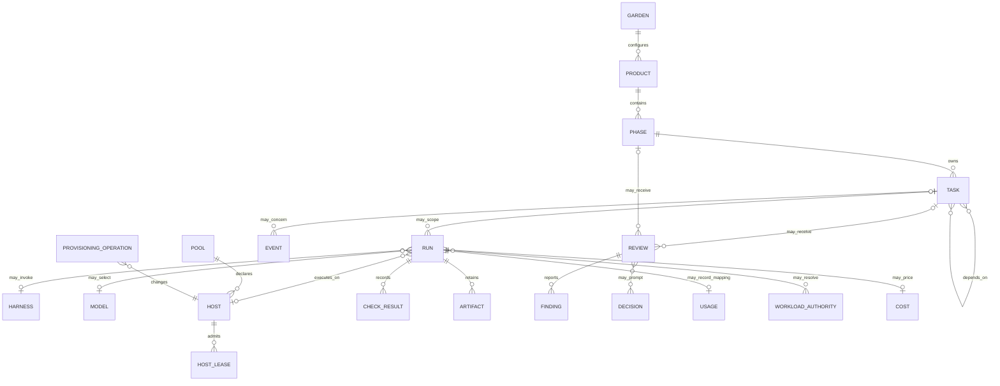
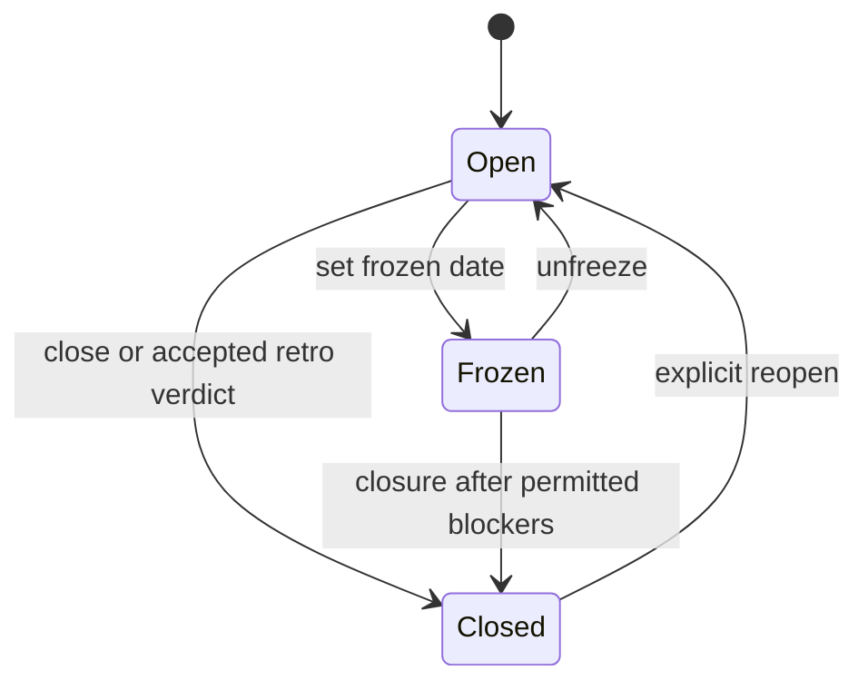
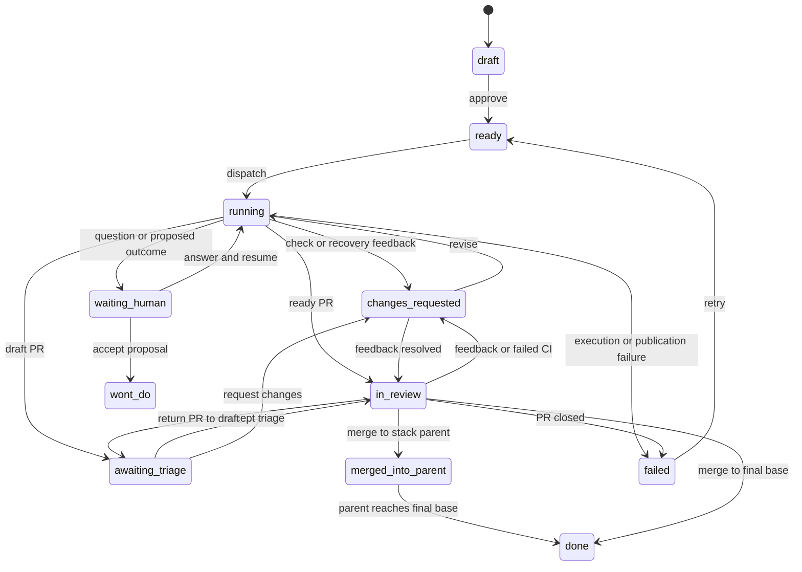

# Ontology specification

This is Garden's canonical domain-model reference. The ontologist persona authored the
specification from the accepted source identity recorded below; maintainers integrated it
without rewriting its substantive model. The [source brief](docs/ontology/ontologist-brief.md)
and [raw persona output](docs/ontology/ontologist-output.md) preserve the input, structured
findings, and authored output used here.

## Status and interpretive rule

I specify the canonical Garden ontology as implemented by commit `bcc8419c2dde10ff022621a8a73d37bebdb8d1bc` on branch `garden/cg-532-have-the-ontologist-author-a-top-level-ontology`.

I treat executable source as authoritative for current mechanics, explicit product specifications as authoritative for intended contracts, and documentation as explanatory. When these representations disagree, I preserve the disagreement below instead of inventing a unified meaning. The principal sources are `src/garden/model.py`, `store.py`, `graph.py`, `brief.py`, `runs.py`, `events.py`, `config.py`, `checks.py`, `harness.py`, `remote_worker.py`, `managed_worker.py`, `workload_identity.py`, `review.py`, `validation.py`, `src/garden/scheduler/`, `src/garden/hosts/`, `docs/architecture.md`, `docs/design.md`, `docs/worker-protocol.md`, `docs/host-lifecycle.md`, and `specs/README.md`.

## System boundary and authority

I define a **Garden** as a version-controlled repository of human-readable context plus a gitignored operational side store. A Garden contains principles, configured products, phases, task documents, and configuration. It coordinates product repositories but is not itself a general workflow engine or hosted multi-user database (`src/garden/model.py`; `docs/design.md`, “The idea,” “Non-goals”).

Four representations divide authority (`docs/architecture.md`, “Where state lives”):

| Representation | Authority | Persistence and retention |
|---|---|---|
| Product, phase, and task Markdown | Current declarative context and task state | Git-tracked; retained according to repository history |
| `.garden/state.json` | Scheduler controls and reconstructible bookkeeping | Atomic JSON side store; documented as deletable and rebuildable, although deletion loses some controls until reconciliation |
| `.garden/runs/<task>/<run>/` | Per-execution audit evidence and token/cost ledger | Mutable while active; terminal runs may move to `.garden/run-archive/` |
| `.garden/events.jsonl` | Historical event stream | Append-only except the explicit run-cost backfill rewrite in `EventLog.patch_run_costs` |

GitHub is authoritative for external pull-request, review, CI, and merge facts; the scheduler reconciles those facts into task and side-store state (`docs/architecture.md`; `src/garden/scheduler/poll.py`, `review.py`, `reap.py`).



## Product and phase

A **Product** is identified within one Garden by `Product.name`; its scope is its product directory and the corresponding `products.<name>` configuration. It has `path: Path`, optional `overview_path: Path | None`, zero or more phases, and a configuration mapping (`src/garden/model.py`, `Product`; `src/garden/store.py`). The overview is normally `<product>/product.md`. Repository, base branch, runner, setup, validation, and source-control routing are configuration rather than intrinsic product identity (`src/garden/config.py`).

A product is discovered from the filesystem; it has no stored lifecycle state of its own and no deletion protocol beyond repository/configuration removal. Removing it may orphan operational records; no referential cascade is defined.

A **Phase** is identified by the composite key `<product>/<phase>`, exposed as `Phase.key`. It has `product`, `name`, `path`, optional `goals_path`, ordered collections of specification and documentation paths, zero or more tasks, botanical `plant` and `plate` display values, and arbitrary goals-frontmatter `meta` (`src/garden/model.py`, `Phase`; `src/garden/store.py`).

`closed` and `frozen` are optional date-like values read from `goals.md` frontmatter and exposed as strings; the empty string means absent. A closed phase refuses task approval and dispatch. A frozen phase refuses them unless a task has both `freeze_exception: true` and a nonblank `freeze_exception_reason` (`src/garden/model.py`, `Phase.closed`, `Phase.frozen`, `Task.has_freeze_exception`, `phase_refusal`). `retro_blocking` tasks prevent closure until terminal, under the retro transition logic (`src/garden/scheduler/retro.py`).

Phase lifecycle is therefore metadata-based rather than an enum:



The phase’s optional `owner` or legacy `default_owner` is a stable logical identifier. It supplies a task default but cannot select credentials, permissions, runners, or approval gates (`src/garden/model.py`, `_owner_id`, `effective_owner`).

## Task, dependency, and stack

A **Task** is a Markdown document whose YAML frontmatter contains identity and state and whose body contains the worker goal, acceptance material, and an append-only-by-convention `## Log` (`src/garden/model.py`, `Task`; `src/garden/store.py`).

Identity is `Task.id`, required during parsing and expected to be Garden-wide for scheduler lookups. Filesystem path is storage location, not semantic identity. `product` and `phase` scope the task, with directory-derived fallbacks. Title is a mutable label. The derived key is the phase key, not a task key (`src/garden/model.py`, `Task.parse`, `Task.key`).

Material fields and semantics are:

- Required on parse: `id`.
- Defaulted: `title=""`, `status=draft`, `depends_on=[]`, `priority=3`, `difficulty=medium`, `reading=[]`, `attempts=0`; most routing and textual fields default to `""`.
- Nullable: `order: int | None`; absent and explicit null both become `None`.
- Optional nonempty overrides: `repo`, `branch`, `pr`, `runner`, `harness`, `model`, `owner`, and `discovered_from`.
- Boolean controls default false: `owner_unassigned`, `freeze_exception`, and `retro_blocking`.
- Unknown frontmatter is preserved in `extra`, giving task documents a forward-compatible extension envelope.
- `created` and `updated` serialize even when empty; many other false or empty values are omitted (`src/garden/model.py`, `Task.parse`, `Task.to_frontmatter`).

An owner is either a validated logical identifier, the serialized sentinel `unassigned`, inherited from the phase, or absent. The sentinel becomes `owner_unassigned=True` and `owner=""` in memory. Owner identity is explicitly non-operational (`src/garden/model.py`, `_UNASSIGNED_OWNER`, `effective_owner`).

A **Dependency** is a directed task-ID reference. Each task has zero or more prerequisites; each task may have zero or more dependents. A dependency serializes either as a string ID or `{id, after}`. `after` is absent/empty, `stack`, or `merge`; malformed entries and other values are rejected (`src/garden/model.py`, `Task.__post_init__`, `Task.parse`; `src/garden/graph.py`).

A task is ordinarily ready only when its dependencies are done. With stacking enabled, one open dependency with a stackable PR may supply the child’s base branch. Stack topology must be acyclic, references must resolve, and stacking has stricter parent selection than ordinary readiness (`src/garden/graph.py`; `src/garden/scheduler/dispatch.py`, `rebase.py`; `docs/design.md`, “The loop”).

Task ordering is `(priority, presence/order, order value, id)`: lower integer priority first, explicitly ordered tasks before unordered tasks in the same priority, then ID (`src/garden/model.py`, `dispatch_sort_key`).

Task status is persisted as one of:

`draft`, `ready`, `running`, `awaiting_triage`, `in_review`, `changes_requested`, `waiting_human`, `merged_into_parent`, `done`, `failed`, `wont_do`, or `cancelled`.

`blocked` is explicitly derived from unmet dependencies and is never a `Status` value (`src/garden/model.py`, `Status`; `src/garden/graph.py`). Terminal means `done`, `cancelled`, or `wont_do`; notably `failed` is not terminal. `ensure_open` protects only `done` and `cancelled`, so the implementation does not apply the same reopening guard to `wont_do` (`src/garden/model.py`, `Status.terminal`, `ensure_open`).

The following diagram shows the principal loop. It is intentionally a readable projection;
the table after it is the exhaustive ordinary transition relation.



### Allowed task transitions

Garden does not define a central transition validator: `_transition` records any target it
is given, and each scheduler action or reconciliation path checks its own preconditions. The
ordinary relation below is therefore the union of those guarded call sites. “Any open” means
every status except `done` and `cancelled`, matching `ensure_open`; it includes `wont_do`,
which `Status.terminal` calls terminal but `ensure_open` does not protect. Same-state calls
only append evidence or refresh control state and are omitted as non-transitions.

| From | To | Authority and condition |
|---|---|---|
| `draft` | `ready` | Human approval after phase and brief gates; an accepted retro-reopen verdict may also approve its generated drafts. |
| `ready` | `draft` | Human/web withdrawal before dispatch. |
| `draft`, `ready`, `failed` | `in_review` | Human attachment of a verified open external PR adopts its head and review state. |
| `ready`, `changes_requested`, `waiting_human` | `running` | Scheduler or human dispatch of work/revise, or answer dispatch of a resume run. Dispatch recovery may also restore a live task to `running`. |
| `running` | `ready` | Missing/dead run recovery, retryable work failure, environment recovery, or explicit human retry. |
| `running` | `waiting_human` | Worker question, proposed `wont_do`/`no_change`, publication condition needing intervention, or recoverable resume failure. |
| `running` | `changes_requested` | Pre-PR/check failure, restored revision/rebase feedback, stall, or other actionable recovery result. |
| `running` | `awaiting_triage`, `in_review` | A created or updated PR enters its draft-dependent PR status; manual/external completion with an open PR enters `in_review`. |
| `running` | `failed` | Exhausted/unrecoverable worker, dispatch, fence, push, revision, or manual-run failure. |
| `awaiting_triage` | `in_review` | Human/GitHub triage marks the PR ready, or current PR state is restored. |
| `awaiting_triage` | `changes_requested` | Human triage, persona review, automated review, PR feedback, CI, conflict, or explicit retry queues revision. |
| `in_review` | `awaiting_triage` | GitHub converts the PR back to draft, or a stopped task resumes to its prior draft-PR state. |
| `in_review` | `changes_requested` | Review/persona feedback, failed CI, conflict, explicit retry, or recovery queues revision. |
| `changes_requested` | `awaiting_triage`, `in_review` | A revision/no-change continuation updates the PR, feedback or checks resolve without a revision, or a human clears a stop; draft state chooses the target. |
| `changes_requested` | `ready` | Stale check recovery with no PR, or explicit human retry/reset when no revision context applies. |
| `waiting_human` | `changes_requested` | Human rejects a worker decision, accepts `no_change` without a PR, or recovery restores pending feedback. |
| `waiting_human` | `awaiting_triage`, `in_review` | Accepted `no_change` or cleared stop returns an existing PR to its draft-dependent state. |
| `waiting_human` | `wont_do` | Human accepts the worker's proposal. |
| `ready`, `awaiting_triage`, `in_review`, `changes_requested`, `waiting_human`, `failed` | `done` | Provider reconciliation observes the recorded PR merged to the final base. |
| `ready`, `awaiting_triage`, `in_review`, `changes_requested`, `waiting_human` | `failed` | Provider reconciliation observes the recorded PR closed without merge. (`failed → failed` only records the repeated fact and is omitted.) |
| `ready`, `awaiting_triage`, `in_review`, `changes_requested`, `waiting_human`, `failed` | `merged_into_parent` | Provider reconciliation observes a recorded stacked PR merged to its parent branch rather than the final base. |
| `merged_into_parent` | `done` | The parent result reaches the final base. |
| `failed` | `ready` | Human retry resets attempts when there is no open-PR revision context. |
| `failed` | `changes_requested` | Human retry retains or reconstructs feedback for an open PR. |
| `draft`, `ready`, `running`, `awaiting_triage`, `in_review`, `changes_requested`, `waiting_human`, `merged_into_parent`, `failed`, `wont_do` | `cancelled` | Explicit human cancellation; an active run is cancelled first. |
| Any open status | `done` | Explicit human completion. When a PR is recorded, its commits must be verified on the final base; `--force` bypasses that verification. Without a recorded PR, no ancestry check applies. |
| Any open status | `wont_do` | Explicit human status decision; an open PR is closed when possible. |

The `set-status` command is a provenance-recorded escape hatch, not part of the ordinary
relation: it can select any stored status from any source. Moving out of `done` or
`cancelled` requires `--force`; selecting `done` uses the completion/ancestry guard unless
forced, and selecting `wont_do` uses its PR-closing path. Consequently the enum alone is not
a state-machine contract, and integrations should invoke scheduler actions rather than write
status directly (`src/garden/scheduler/__init__.py`, `_transition`; `human.py`, `approve`,
`answer`, `accept_decision`, `reject_decision`, `triage`, `retry`, `resume_task`, `cancel`,
`mark_done`, `set_status`; `poll.py`, `_poll_pr`; `reap.py`; `src/garden/cli/state.py`).

The scheduler owns ordinary transitions and scheduler-owned task fields. `Store.save` performs a three-way field/body merge using an in-memory load snapshot, preventing unrelated concurrent edits from being overwritten (`src/garden/model.py`, `Task.snapshot`; `src/garden/store.py`; `src/garden/scheduler/__init__.py`, `edits.py`).

Task deletion has no domain tombstone or cascade. Normal outcomes retain the task document. Branch/worktree cleanup is separately classified and bounded (`src/garden/scheduler/cleanup.py`).

## Run and attempt

A **Run** is one bounded execution or token-free scheduler operation recorded under `.garden/runs/<task-id>/<run-id>/`. Its composite identity is `(task_id, run_id)`; `dir` is its storage location (`src/garden/runs.py`, `Run`, `RunStore`).

Modes include `work`, `revise`, `resume`, `trial`, `rebase`, `review`, `persona`, `compare`, `edit`, and `check`; scheduler sets additionally classify `investigation` as worker activity. Therefore a run is broader than a worker attempt (`src/garden/runs.py`, `Run.mode`; `src/garden/scheduler/__init__.py`, `WORKER_MODES`, `REVIEW_MODES`, `CHECK_MODES`).

A run records routing (`runner`, `execution_remote`, `harness`, `model`, `pool_member`, `difficulty`, `host`), source and branch coordinates, startup/process state, remote claim state, completion evidence, parsed result, usage, cost, errors, recovery evidence, and an optimistic `record_version`. Empty string and empty mapping/list are the dominant absence values; `pid`, `exit_code`, `cost_usd`, and legacy `execution_remote` use null. `status` defaults to `running`, while the documented startup sequence also uses `requested` and `preparing` (`src/garden/runs.py`, `Run`).

Run statuses used by the scheduler are `requested`, `preparing`, `running`, `waiting`,
`done`, `blocked`, `failed`, `timeout`, `cancelled`, `superseded`, `env_error`, `no_change`,
and `wont_do`.
`waiting` preserves an answered-or-decision run until its continuation is resolved;
`env_error` records an environment-owned stop that may be retried without author-attempt
accounting (`src/garden/scheduler/reap.py`, `_handle_result`, `_handle_quota_env_error`). The
stable control-plane projection `lifecycle_state` preserves only `requested`, `preparing`, and
`running` and collapses every other value to `finished` (`src/garden/runs.py`,
`Run.lifecycle_state`). This projection is broader than archival eligibility: the archive
accepts only `done`, `blocked`, `failed`, `timeout`, `cancelled`, and `superseded` with a finish
time, deliberately excluding `waiting` and `env_error` because they can retain recovery or
retry meaning; `no_change` and `wont_do` likewise remain outside that archival set while
their human decision is resolved (`src/garden/runs.py`, `RunStore.archive_terminal`;
`src/garden/scheduler/reap.py`, `_handle_result`).

An **Attempt** is not a separate persisted entity. `Task.attempts` is a count incremented for authoring attempts, while run records include activities that do not count as task attempts. Environment-owned admission failures are intended to occur before attempt accounting. Reviews and revisions have separate counters in side state (`src/garden/model.py`, `Task.attempts`; `src/garden/scheduler/dispatch.py`, `quota.py`, `review.py`; `docs/host-lifecycle.md`).

Run files may include `run.json`, `brief.md`, raw harness output, stderr, `final.md`, `exit_code`, execution/validation receipts, snapshots, and recovery artifacts (`docs/architecture.md`, run-directory table; `docs/worker-protocol.md`). Writes are process-safe and use `record_version` to reject obsolete claim generations (`src/garden/runs.py`, `Run.save`, `RunMutationConflict`).

Terminal runs with a finish time may be archived. Archive `index.json` remains the compact ledger used for run lists and costs; missing/corrupt archive indexes cause “history unavailable,” not silent partial totals. Storage cleanup is separately bounded and audited (`src/garden/runs.py`; `src/garden/scheduler/cleanup.py`; `docs/architecture.md`, run archive and storage cleanup).

## Brief, harness, model, and profile

A **Task Brief** (`src/garden/brief.py`, `Brief`) is the exact task-oriented prompt artifact
delivered to an authoring or task-review execution. It contains a task, rendered text,
per-section character counts, and lists of inlined, referenced, and missing paths. Character
and approximate token counts are derived; `fixed_tokens` counts the stable context sections.
Other auxiliary executions receive prompt text but not this `Brief` value: notably,
`phase_brief` constructs a phase persona prompt around a synthetic run bucket without a task
document (`src/garden/personas.py`; `src/garden/scheduler/persona.py`).

A brief is immutable evidence once written to a run directory, although a later resume or revision is a new run with new contextual material. Its result protocol is a final one-line `GARDEN_RESULT` JSON marker with status and optional question, reason, PR text, evidence, amendments, friction, and discovered work (`src/garden/brief.py`, `OPERATING_RULES`; `docs/worker-protocol.md`).

A **Harness** is an adapter named by configuration. It defines executable name, arguments, output format, tier-to-model mapping, optional review model, turn caps, and credential delivery boundary. Built-ins are merged with configured overrides. Unknown/custom harnesses are permitted where sandbox policy allows (`src/garden/harness.py`, `Harness`; `src/garden/config.py`).

A **Model** is represented as a string value, not an entity with an independent record. Selection is explicit task model first; otherwise the chosen harness maps `easy|medium|hard` to a model. `pool_member` preserves the selected configured harness/model member. Historical run records snapshot the resulting strings (`src/garden/harness.py`, `model_for`; `src/garden/scheduler/selection.py`; `src/garden/runs.py`).

A **Profile** is a named partial configuration overlay for an operating posture or observation feed. Built-in operating profiles include economy, balanced, and fast; configured profiles may extend them. `operating_profile=""` means use plain resolved configuration. Profiles influence workers, reviews, model routing, difficulty, retro, and observation settings but do not become persisted execution identities; resolved choices belong on runs (`src/garden/config.py`, defaults; `src/garden/profiles.py`).

## Review, finding, and decision

A **Review** is a run in `review` or `persona` mode. A PR review is bound to a task, change
request, and reviewed head. A phase persona review is instead scoped to a phase body of work:
it uses a synthetic run bucket such as `_<product>-<phase>`, has no corresponding task
document or PR, and writes a phase report. Automated review concludes through
`GARDEN_REVIEW` JSON; a persona review concludes through `GARDEN_PERSONA` JSON. Head-bound PR
evidence is valid only for its source head unless an explicit unchanged-patch rebase rule
preserves the verdict (`src/garden/review.py`; `src/garden/personas.py`;
`src/garden/scheduler/persona.py`, `review.py`, `rebase.py`).

A **Finding** is a structured value nested in a review, not a globally persisted entity. Persona findings use `severity`, `area`, `summary`, and `suggestion`; severity maps to task priority and every severity is retained. Automated-review findings additionally acquire stable identities used to detect recurrence and stop non-converging loops (`src/garden/personas.py`, `SEVERITY_PRIORITY`; `src/garden/scheduler/reap.py`, `review.py`; `src/garden/review.py`).

A **Decision** is a human-resolvable control record, represented chiefly through task side state and decision-kind events rather than one universal class. Examples include accepting `wont_do`/`no_change`, duplicate/cancel proposals, troubled-task continuation or investigation, triage, and retro verdict acceptance (`src/garden/scheduler/human.py`, `discovered.py`, `retro.py`; `src/garden/events.py`, `DECISION_KINDS`).

Retro phase decisions use verdict values `close`, `close_with_followups`, and `reopen`, plus status and acceptance provenance. A `reopen` stays pending until accepted and may generate current-phase blocking tasks; close-with-followups generates next-phase drafts (`src/garden/scheduler/retro.py`; `docs/design.md`, “Reflect”).

Reviews and findings are retained in run evidence, task side state, PR comments, and phase persona reports. There is no independent finding deletion API. Derived draft tasks may outlive the review that created them.

## Check and validation

A **Check specification** is trusted configuration naming either a shell command or `module:function` callable, with timeout and optional flaky/retry policy. A task may select a configured check but cannot inject its own command (`src/garden/checks.py`; `docs/worker-protocol.md`, “Review evidence”).

A **Check result** is a JSON mapping:

```json
{"name":"unit","status":"pass","summary":"ok","details":""}
```

Allowed result statuses are `pass`, `fail`, `flaky`, and `error`; `retry_command` is accepted only from trusted configuration, never branch-produced output. Details are truncated to a bounded size (`src/garden/checks.py`, `run_check`, `_trim`).

A **Validation** is the supervised execution of a heavy worker-issued pytest command inside the owning execution budget. Its policy fixes a hard timeout ceiling, excludes stress nodes unless explicitly opted in, rejects commands whose pytest nature cannot be proven, and writes versioned receipts. A timeout receipt translates exit code 124 into a stable check error (`src/garden/validation.py`).

A **Validation plan** is a head-bound derived mapping of checks, visual pages, interaction/scalability flags, reasons, affected visual paths, and capture infrastructure policy. It is decision support, not independent acceptance authority. Stale-head or contradictory evidence blocks; missing optional packaging metadata is advisory (`src/garden/review.py`, `validation_plan`, evidence-gap functions).

## Artifact

An **Artifact** is a retained file or referenced object that evidences a run, check, validation, review, recovery, or cleanup operation. It has no single dataclass or universal schema.

Concrete forms include capture paths, replay manifests, validation receipts, rebase-conflict manifests, run snapshots, recovery stash descriptors `{name, sha, at, run}`, cleanup receipts, and archived run files (`src/garden/review.py`; `src/garden/scheduler/reap.py`, `dispatch.py`, `rebase.py`, `snapshot.py`, `cleanup.py`; `docs/architecture.md`).

Artifact identity is therefore contextual: path within a run or evidence root, git object SHA for recovery stashes, or manifest key. Ownership and retention follow the containing run or audit facility. Web serving treats artifacts as inert bytes, applies `nosniff` and restrictive CSP, previews only allowlisted types, and forces unknown types to download (`src/garden/web/artifacts.py`; `docs/architecture.md`).

## Worker, host, and lease

A **Worker** is an execution process or independent managed consumer, not a durable domain record. Local/SSH workers are launched by runners; remote workers poll, claim, heartbeat, and finish over authenticated HTTPS (`docs/worker-protocol.md`; `src/garden/remote_worker.py`; `src/garden/managed_worker.py`).

A configured remote **Host** has a logical name, credential environment-variable reference, and capacity. The name is routing identity; secret values never enter claims, briefs, transcripts, or run representations (`src/garden/config.py`; `docs/worker-protocol.md`).

The scheduler-independent `garden.hosts/v1` ontology defines richer host entities (`src/garden/hosts/models.py`; `docs/host-lifecycle.md`):

- `EnvironmentProfile`: named/versioned image and bootstrap requirements plus CPU, memory, disk, endpoint, workspace, and enrollment attributes.
- `PoolDeclaration`: stable name, owner, purpose, provider, profile, provider options, enablement, desired/minimum/maximum capacity, runtime estimate, and spend limit.
- `HostDeclaration`: desired logical host.
- `HostFacts`: observed provider state and safe provider facts.
- `HostReadiness`: workspace/revision/provisioning/harness/smoke readiness.
- `HostRequirements`: activity, routing aliases, capabilities, headroom, heavy-capacity flag, probe age, and lease duration.
- `HostAdmission`: eligibility, measurement, capabilities/resources, lease identity/expiry, and safe detail.
- `HostPlan` and `HostEvent`: proposed actions/cost and observed lifecycle history.

Host states are explicit provisioning, bootstrapping, ready, busy, draining, interrupted, failed, stopped, and terminated states (`src/garden/hosts/models.py`; `docs/host-lifecycle.md`).

A **remote run lease** is the current claim generation embedded in `Run`: host, claim and heartbeat times, expiry/recovery deadlines, unique `lease_token`, request replay identity/response, claim history, and lease-specific staging ref. It is one-to-one with the current claimed generation of a run; historical generations remain in `claim_history`. Heartbeat and finish must present the current token. Expiry returns work to the queue and fences late workers from task-branch promotion (`src/garden/runs.py`; `src/garden/remote_worker.py`; `src/garden/scheduler/reap.py`; `docs/worker-protocol.md`).

A **host admission lease** is distinct: it is issued by the host-local admission authority and coordinates capacity across controllers. It must be renewed through setup/execution and explicitly released. Losing it is environment-owned and must not consume an author attempt (`src/garden/hosts/core.py`, `models.py`; `docs/host-lifecycle.md`).

A third lease concept protects in-place canonical checkouts across runs, and git force-with-lease protects branch publication. These share the word “lease” but not identity or protocol (`docs/architecture.md`; `src/garden/scheduler/reap.py`, `fence.py`).

## Workload identity and authority

A **Workload identity reference** is trusted, fenced local configuration that names an
identity provider and bounds one operation. A reference fixes the provider, operation,
audience, maximum scopes, maximum lifetime, delivery method and target, and bindings. A
separate boundary configuration selects the reference and bounded request for a host-owned
target such as `worker`; repository and claim data cannot select provider code, bindings, or
broaden authority (`src/garden/workload_identity.py`, `WorkloadIdentityResolver`;
`src/garden/config.py`; `docs/worker-protocol.md`, “Workload identity at operation
boundaries”).

An **Authority request** is the immutable value `(reference, operation, audience,
run_identity, lifetime_seconds, scopes, target)`. The logical `run_identity`, normally
`automation:<run-id>`, is membership identity rather than a credential. The provider returns
a secret `ProviderAuthority` containing values, issuer, expiry, exact scopes, audience,
membership, and an optional opaque renewal token. Provider adapters declare interface version
1 and exact capabilities. Resolution rejects mismatched audience, scope, lifetime, membership,
provider version, capability, target, or delivery (`src/garden/workload_identity.py`,
`AuthorityRequest`, `ProviderAuthority`, `IdentityProvider`).

A **Resolved authority** is an ephemeral operation object. A supervised operation normally
resolves one for its configured boundary, but the resolver does not enforce uniqueness per
run and repeated resolution creates distinct authority objects. Its public
`AuthorityMetadata` contains issuer, expiry, audience, sorted scopes, `principal_kind` set to
`automation`, automation identity, and provider name. Secret values and renewal tokens are
excluded from representations and `repr`; values can be bound only into the configured named
subprocess environment or request headers. The operation context closes and clears authority
after use. Run evidence may retain `workload_identity.json` public metadata or a redacted
`identity_error.json`, never provider registration, authority values, or renewal tokens
(`src/garden/workload_identity.py`, `ResolvedAuthority`, `AuthorityMetadata`;
`src/garden/run_supervisor.py`).

While the operation is active, its owner validates current authority and renews only when the
provider declares renewal. Expiry, revocation, failed validation/renewal, or use after close
fails closed. Because a running process environment cannot be replaced, renewal that rotates
an environment-delivered value terminates that process; stable renewal may continue. Local and
remote supervisors redact stdout, stderr, final text, heartbeat transcripts, and finish
payloads with a split-safe filter before persistence or transport (`src/garden/workload_identity.py`,
`AuthorityRedactor`, `AuthorityStreamRedactor`; `src/garden/run_supervisor.py`;
`src/garden/remote_worker.py`).

`WorkloadIdentityError` is an environment failure, not an authoring failure. It must not become
a revision, consume an author attempt, or fall back to ambient credentials. Remote hosts build
the resolver from their own trusted local configuration, so claims and briefs remain free of
provider registration and authority material (`src/garden/remote_worker.py`;
`src/garden/managed_worker.py`; `docs/worker-protocol.md`).

## Event, usage, and cost

An **Event** is a schemaless JSON object whose emitter always writes the fields `at`, `kind`,
and `task`, plus kind-specific data. `task` is structurally present but semantically optional:
garden-wide events use the empty string. In-memory `Event` also returns a falsy empty string
for missing keys. Its stable identity for consumers is the append-only JSONL line number,
optionally exposed as `_line_number` (`src/garden/events.py`, `Event`, `EventLog`).

Representative serialization:

```json
{"at":"2026-09-10T14:00:00+00:00","kind":"run_finished","task":"CG-532","run":"20260910-140000","mode":"work","usage":{"input_tokens":1200,"output_tokens":340},"cost_usd":0.08}
```

Events are append-only except `patch_run_costs`, which rewrites matching `run_finished` lines to prevent double-counting during a historical correction. Malformed lines are skipped rather than failing the read (`src/garden/events.py`, `EventLog.read`, `patch_run_costs`).

**Usage** is a provider/harness-produced mapping stored on the run and copied into run-finished events. Its schema is intentionally open because providers report different token categories. **Cost** is `cost_usd: float | None`; null means unavailable, not zero. Attribution derives from run mode, model, difficulty, phase, and acceptance cohort rather than from a separate cost entity (`src/garden/runs.py`; `src/garden/events.py`; `src/garden/costs.py`; `src/garden/outcomes.py`).

Operator spend is a separate JSONL source and is combined in reporting rather than represented as a worker run (`docs/design.md`, “The operator seat”; `src/garden/costs.py`).

## Provisioning operation

A **Provisioning Operation** exists in `garden.hosts/v1`, despite the absence of the brief-named legacy files `src/garden/provisioning.py` and `src/garden/managed_worker.py`’s containing no infrastructure lifecycle.

Its identity is a stable operation alias combined with owner, pool, and logical host labels. Repeated requests and controller restarts must rediscover the first provider request instead of launching duplicates (`src/garden/hosts/core.py`, `provider.py`; `docs/host-lifecycle.md`).

Lifecycle operations are `plan`, `provision`, `reconcile`, `inspect`, `stop`, `start`, and `destroy`; command-backed acquisition additionally uses `inspect`, `inspect-one`, `acquire`, `ready`, `release`, `start`, `retire`, `admit`, `renew-admission`, and `release-admission` (`src/garden/hosts/core.py`, `command.py`; `docs/host-lifecycle.md`).

`plan` and configuration loading are read-only. Mutation requires explicit enablement, bounded desired/minimum/maximum capacity, provider capability agreement, policy approval, and estimated spend within `spend_limit_usd`. `destroy` is the explicit retirement boundary. Persistent workspace deletion is a separate consumer decision; reducing desired capacity does not imply data deletion (`docs/host-lifecycle.md`; `src/garden/hosts/models.py`, `core.py`).

Provider facts and events persist through `JsonStateStore` using atomic JSON. Provider contracts declare `garden.hosts/v1`; compatible additive fields may be introduced within v1, but breaking semantics require a new contract version and explicit adapter (`src/garden/hosts/core.py`, `provider.py`; `docs/host-lifecycle.md`).

## Representative task and run serializations

```yaml
---
id: CG-532
title: Author canonical ontology
status: ready
product: context-garden
phase: ontology
depends_on:
  - id: CG-531
    after: merge
priority: 1
order: 2
difficulty: hard
reading:
  - src/garden/model.py
owner: architecture
created: "2026-09-10T12:00:00+00:00"
updated: "2026-09-10T12:00:00+00:00"
extension_example: retained
---

## Goal

Define the canonical ontology.
```

```json
{
  "task_id": "CG-532",
  "run_id": "20260910-140000",
  "dir": ".garden/runs/CG-532/20260910-140000",
  "runner": "remote",
  "execution_remote": true,
  "mode": "work",
  "harness": "codex",
  "model": "example-model",
  "difficulty": "hard",
  "host": "build-1",
  "status": "running",
  "queued_at": "2026-09-10T13:59:00+00:00",
  "lease_expires_at": "2026-09-10T14:02:00+00:00",
  "result": {},
  "usage": {},
  "cost_usd": null,
  "record_version": 3
}
```

## Compatibility and extension rules

1. Task frontmatter is additively extensible because unknown keys round-trip through `Task.extra`. New core fields must not reinterpret an existing unknown field incompatibly (`src/garden/model.py`).
2. Event consumers must branch on `kind`, tolerate absent and additional fields, and use line number when identity matters (`src/garden/events.py`).
3. Run readers must tolerate legacy null/absent capability fields; writers use `record_version` and must not overwrite a newer claim generation (`src/garden/runs.py`).
4. Result, review, persona, command-provider, and host-admission protocols require their marker/version and structural validation. Additive optional fields are preferable; breaking host-provider semantics require a new contract version (`src/garden/brief.py`, `review.py`, `personas.py`, `hosts/command.py`, `docs/host-lifecycle.md`).
5. Configuration merges mappings recursively while lists and scalars replace; precedence is defaults, `garden.yaml`, environment overlay, then local overlay. Explicit null can carry policy meaning, notably unlimited review rounds (`src/garden/config.py`).
6. Paths are storage references, not portable identities. Protocols crossing hosts must replace controller-local paths and exclude credentials, configured secret-bearing arguments, and private authority values (`docs/worker-protocol.md`; `src/garden/workload_identity.py`).
7. Workload-identity extensions must preserve provider interface version checks, exact
   capability declaration, least-authority request validation, bounded delivery, metadata-only
   persistence, output redaction, and fail-closed environment-error semantics. New delivery
   methods or provider semantics require explicit versioned adapters
   (`src/garden/workload_identity.py`; `docs/worker-protocol.md`).
8. Derived projections—blocked state, readiness, validation plans, lifecycle-state collapse, costs, and UI cards—must not be written back as competing authorities.

## Discrepancies and findings

### High — “Task” is documented as one session and one PR, but implemented as many runs

`docs/design.md` defines a task as “one markdown file; one agent session; one pull request.” `Run.mode`, resume, revisions, reviews, personas, checks, rebases, trials, and investigations permit many sessions and sometimes multiple contender PRs for one task (`src/garden/runs.py`; `src/garden/scheduler/trials.py`). Maintainers should rely on task-as-work-item, with zero or one canonical delivery PR at a time and zero-to-many runs. The vocabulary document should stop asserting one session and qualify the PR cardinality.

### Medium — Priority has two incompatible stated scales

`Task.priority` says “1 = highest” and defaults to 3, while `PRIORITY_SCALE` defines `0` as “first,” followed by 1–4, and `dispatch_sort_key` accepts arbitrary integers (`src/garden/model.py`). Runtime ordering makes lower numbers authoritative, including 0. Validation should define the accepted domain, and the field comment should match it.

### Medium — Terminal semantics and mutation guard disagree

`Status.terminal` includes `wont_do`, but `ensure_open` refuses mutation only for `done` and `cancelled` (`src/garden/model.py`). Either `wont_do` is terminal and requires the same explicit reopen/force boundary, or it is a resolved-but-reopenable state and should not satisfy `terminal`.

### Medium — “state.json is rebuildable” overstates recoverability

`docs/architecture.md` says `.garden/state.json` is safe to delete and rebuild from GitHub, but it also contains pending feedback, question/session resume coordinates, review identities, retro verdicts, continuation allowances, and other controls that are not necessarily reconstructible from GitHub alone (`src/garden/scheduler/state.py`, `human.py`, `review.py`, `retro.py`). The specification should distinguish reconstructible cache keys from durable control records and provide a recovery contract.

### Medium — Artifact is an overloaded role without canonical identity

Review captures, manifests, receipts, recovery stashes, rebase conflicts, snapshots, archives, and cleanup audits are all called artifacts but have unrelated schemas and retention (`src/garden/review.py`; `src/garden/scheduler/reap.py`, `rebase.py`, `snapshot.py`, `cleanup.py`). Introduce a small artifact reference envelope—kind, owner run/operation, location or content identity, created time, media type, retention class—without forcing payloads into one schema.

### Low — “Append-only events” has an intentional mutation exception

Architecture calls `events.jsonl` append-only, while `EventLog.patch_run_costs` rewrites historical `run_finished` records (`docs/architecture.md`; `src/garden/events.py`). Documentation should say “append-only except explicit versioned repair,” and repair receipts should make the exception auditable.

### Low — Lease is not one concept

Remote claim leases, host-admission leases, canonical-checkout leases, watcher leases, and git force-with-lease share terminology but have different subjects, issuers, fencing tokens, renewal rules, and release semantics (`src/garden/runs.py`; `src/garden/hosts/`; `src/garden/scheduler/fence.py`; `docs/architecture.md`). Names should always be qualified in APIs and documentation.
