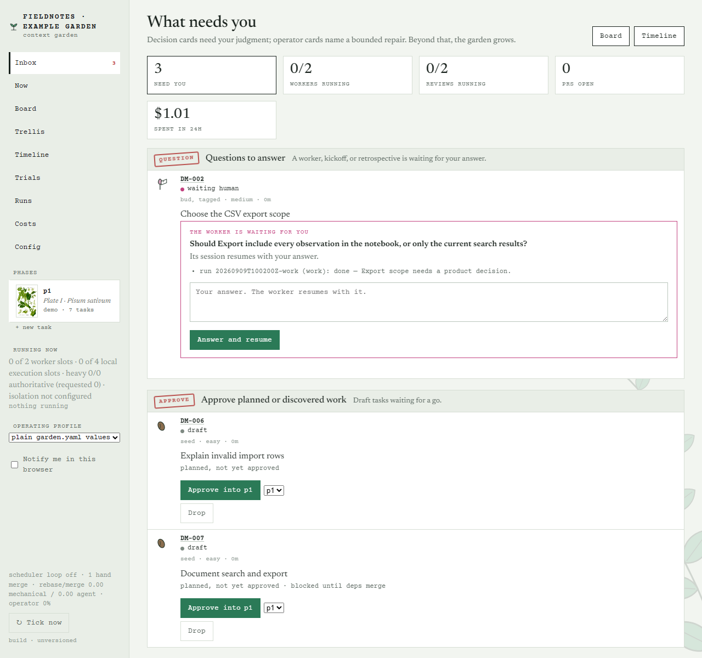
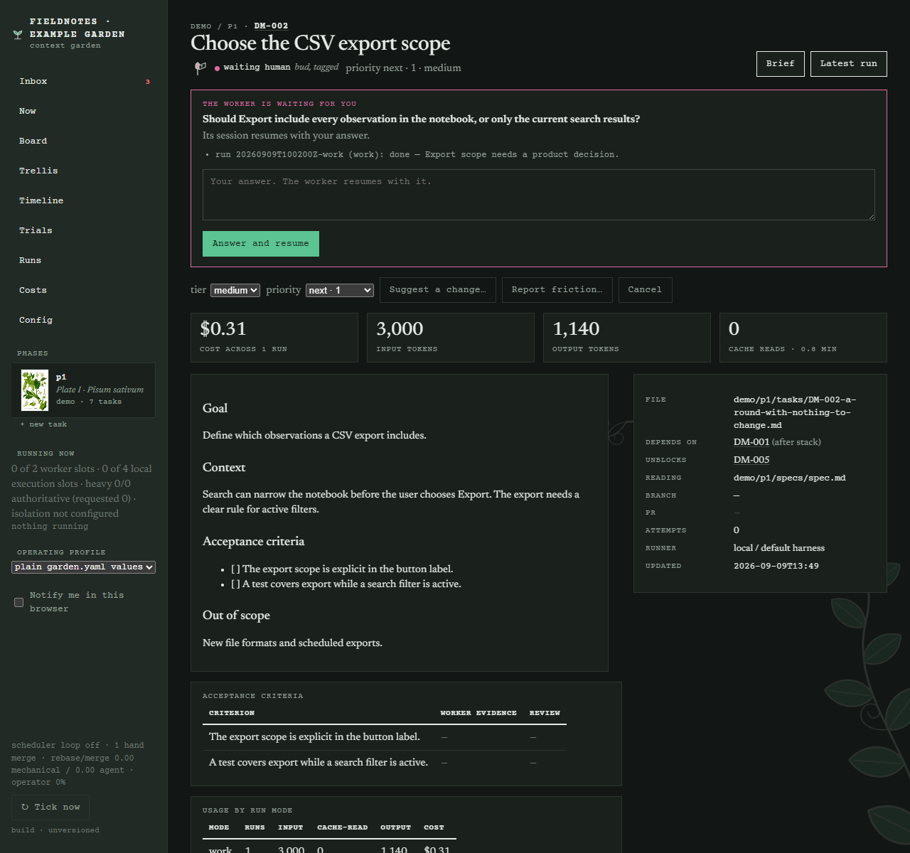
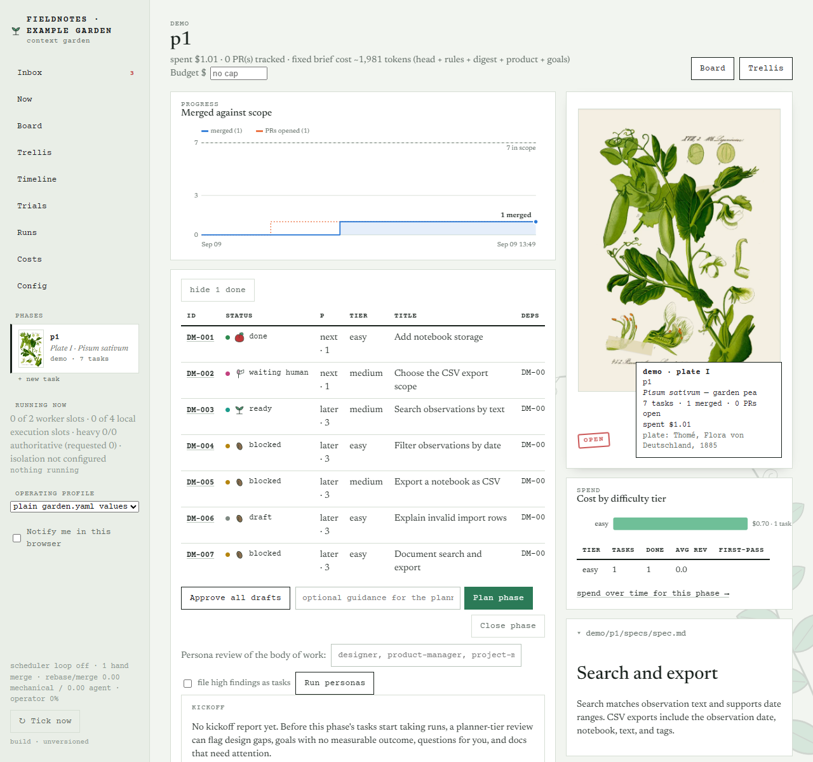
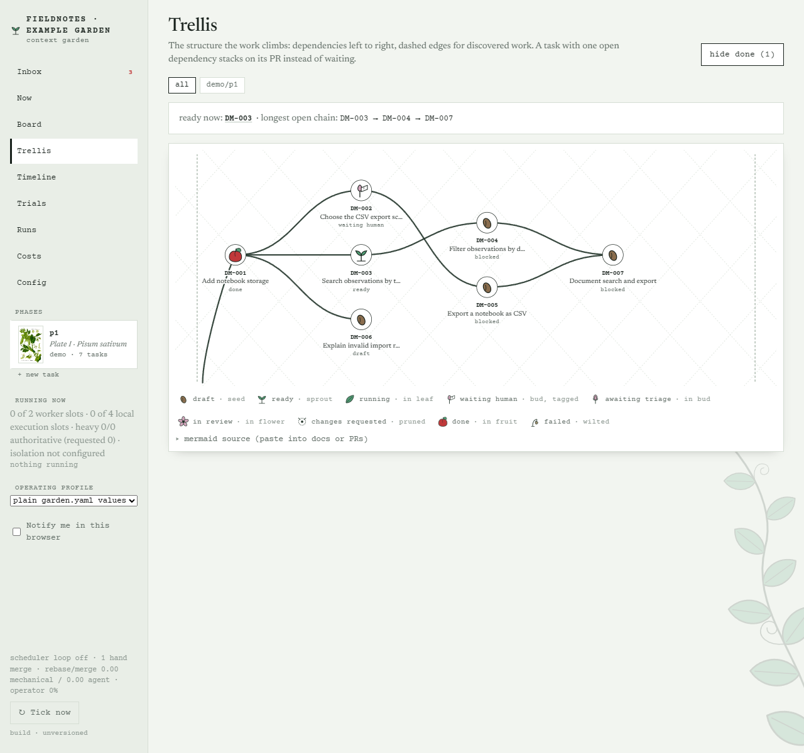

# context-garden

Drive agent development by tending a context garden.

You write **principles**, **product overviews**, **phase goals** and **specs** as markdown.
A planner turns a phase into **task files**. A token-free **scheduler** dispatches headless
agent workers (Claude Code, Codex, or any CLI harness; locally or on remote hosts over
ssh), pushes their branches, opens PRs, runs an **automated review pass**, and
re-dispatches when you or the reviewer leave comments. A local **web UI** and a **TUI**
show the board, the dependency graph, every tracked PR, and where the tokens went.

The human's job is: write goals and specs, approve the plan, review PRs, merge.
Everything else is the loop.

```
 you                          garden (python, no LLM)                    claude -p (tokens)
 ───                          ──────────────────────                    ──────────────────
 write goals/specs  ──────▶   garden plan ────────────────────────────▶  planner: 1 call
 approve drafts     ──────▶   ready set from the dependency graph
                              tick: dispatch into free slots ─────────▶  worker in a worktree
                              tick: reap ─ push branch, open PR ────────▶  review run: 1 call
                              tick: reap review ─ comment; changes? ───▶  revise run
 review the PR      ──────▶   tick: poll ─ new comments / red CI ─────▶  revise run
 merge              ──────▶   tick: poll ─ merged ─ done, unblock deps
```

Only four steps spend tokens: planning, working, reviewing, revising. Waiting is a
Python process sleeping, not an agent session polling. The model for each run is picked
from the task's difficulty, so easy tasks run on cheap models.

## The look

Every phase carries a plant, drawn as a pressed specimen: the garden pea for bootstrap, the
bramble for friction, then foxglove, fern and poppy for the phases that follow. Task
states keep their names, and each also has a growth-stage drawing beside it: seed, sprout,
leaf, bud, flower, fruit. The web UI is set like a herbarium sheet, with typed labels and
small stamps for decisions, in Newsreader and Courier Prime, and one faint climbing vine
behind the page; titles and copy stay plain.
`garden plants` prints the key.

## Screenshots

The Inbox is the home page: one row per decision, with its action inline.



A task page: triage bar for the draft PR, usage across runs, the automated review, discovered work, and the timeline. Dark theme is designed separately, not inverted.



A phase: burn-up of merged work against scope, cost by difficulty tier, every tracked PR.



The trellis: dependencies left to right, dashed edges for discovered work.



The garden that drives this tool's own development lives at
[joshmarcus/garden](https://github.com/joshmarcus/garden).

## Install

Python 3.11+.

```bash
git clone https://github.com/joshmarcus/context-garden && cd context-garden
uv venv && uv pip install -e ".[dev]"      # or: pip install -e ".[dev]"
.venv/bin/garden doctor                    # checks claude, gh / GITHUB_TOKEN, repos, graph
```

Requirements on the machine that runs the loop: `git`, the harness CLI (`claude` and/or
`codex`), and either the `gh` CLI (logged in) or a `GITHUB_TOKEN`.

**Windows:** the local runner requires a POSIX shell (`sh`). Run garden in WSL (Windows
Subsystem for Linux) instead; `garden doctor` reports this if Windows is detected.

## Quick start

```bash
garden init my-garden && cd my-garden
garden new-product widget --repo ../widget --base-branch main   # any local path or git URL
garden new-phase widget phase-01
$EDITOR principles/00-index.md widget/product.md widget/phase-01/goals.md widget/phase-01/specs/*.md

garden plan widget/phase-01            # one model call -> task files, ready to dispatch
garden trellis                          # look at the plan: dependencies and stacks (edit files, or `garden plan --draft` to gate on approval)

garden serve                            # web UI at http://127.0.0.1:8765 + the scheduler loop
# or: garden watch                      # scheduler loop only
# or: garden tick                       # one pass, e.g. from cron
```

PRs open as drafts. Each gets an automated first review (acceptance criteria,
correctness, scope, and a PR description that gives broader context with no scar
tissue) while it waits for your first look. The **Inbox** (`garden serve` home page,
`garden inbox`, the TUI's Inbox tab) lists everything that needs you: draft PRs to
triage (ready for review, or send back), questions from workers, PRs ready to review and
merge, stalled tasks, work to approve. Comments you leave become the next revise run's
brief; merging marks the task done and unblocks its dependents.

## Layout

```
garden.yaml                       config (runner, parallelism, products)
principles/
  00-index.md                     the digest: inlined into every brief, keep it short
  *.md                            long-form principles, cited from reading lists
<product>/
  product.md                      what it is, how to run/test it, conventions (every brief)
  <phase>/
    goals.md                      why now, goals, non-goals, definition of done (every brief)
    specs/*.md                    designs; planner input; on reading lists
    docs/*.md                     supporting docs; planner input
    tasks/<ID>-<slug>.md          one task = one PR; frontmatter is state, body is the brief
.garden/                          gitignored: runs, worktrees, clones, state.json
```

### A task file

```markdown
---
id: WID-003
title: Add rate limiting to the ingest endpoint
status: ready                 # draft | ready | running | in_review | changes_requested | done | failed | cancelled
product: widget
phase: phase-01
depends_on: [WID-001]         # `blocked` is derived, never stored
priority: 2                   # 1 = highest
estimate: M
difficulty: medium            # easy | medium | hard -> picks the model tier
reading:                      # garden-relative files (or dirs) inlined into the brief
  - widget/phase-01/specs/rate-limits.md
---

## Goal
## Context
## Acceptance criteria
## Out of scope
## Log                        # appended by the scheduler
```

`branch`, `pr`, `attempts`, `last_dispatched_at` and the `## Log` section are written by
the scheduler.

### The brief a worker sees

`garden brief WID-003` prints exactly what the worker gets: operating rules, the
principles digest, the product overview, the phase goals, the task body, and the reading
list inlined. `garden brief WID-003 --stats` shows the size of each section. A typical
brief is 2-4k tokens; that is the whole point.

Workers end with one line, `GARDEN_RESULT: {"status": "done" | "needs_input", "summary":
..., "question": ..., "pr_title": ..., "pr_body": ..., "discovered": [...]}`. They never
push; the runner does.

## Commands

| Command | What it does |
|---|---|
| `garden init [dir]`, `new-product`, `new-phase`, `new-task` | scaffold |
| `garden status` / `ls` / `show ID` / `ready` / `trellis [--format mermaid]` / `validate` | read the garden |
| `garden brief ID [--stats] [--revise]` | the exact worker prompt |
| `garden plan product/phase [--dry-run] [--import plan.json] [--guidance ...] [--draft]` | goals + specs -> tasks (ready by default) |
| `garden approve ID... ` / `--all product/phase` | draft -> ready |
| `garden prs [product/phase]` | every tracked PR: review decision, CI, failed checks, revisions |
| `garden review ID` | start an automated review round now |
| `garden inbox` | everything that needs you, with the command that resolves it |
| `garden triage ID --ready` / `--changes "..."` | your first look at a draft PR |
| `garden answer ID "..."` | answer a `waiting_human` task; the worker resumes |
| `garden trial ID -c h:m -c h:m` / `trials` | run a task with several models; leaderboard |
| `garden persona-review TARGET -p name` / `personas` | persona review of a PR or a phase |
| `garden check ID [--stage ci]` | run the token-free checks by hand |
| `garden digest [--since 24h]` / `metrics [product/phase]` / `events [ID]` | what happened, how it's going, the timeline |
| `garden tick [--no-dispatch]` / `watch` / `serve [--no-watch]` / `tui` | run the loop, UIs |
| `garden dispatch ID [--mode revise] [--force]` | start a worker now |
| `garden take ID [--worktree]` / `finish ID --result '{...}'` | human-driven session path |
| `garden pr ID URL` / `cancel ID` / `retry ID` / `set-status ID STATUS` | manual state changes |
| `garden usage [ID or product/phase] [--by-mode]` | tokens and cost per task |
| `garden runs [ID]` / `log ID` / `doctor` | run records, cost, diagnostics |

## The scheduler

One `tick` is deterministic (details in `docs/architecture.md`):

1. **Reap** finished workers: parse the result, push the branch, open or update the PR,
   `in_review`. No result or a crash retries up to `max_attempts`; a `blocked` report or
   an empty branch fails the task with the reason in its log.
2. **Poll** PRs: merged -> `done` (worktree removed, dependents unblock); closed ->
   `failed`; new review comments from humans or a red CI -> `changes_requested`, and a
   revise run is queued with just the new feedback (bounded by `max_revisions`).
3. **Dispatch** into free slots: revise runs first, then `ready` tasks whose dependencies
   are `done`, by priority.

Run it however you like: `garden watch` in a terminal, `garden serve` (loop + web UI),
or `garden tick` from cron/launchd every minute. Ticks are idempotent and safe to overlap
with the UIs.

## Design documents

- `docs/design.md`: the idea, vocabulary, architecture, the loop, bounded loops, extension points.
- `docs/architecture.md`: how the pieces fit: processes, where state lives, one tick, the state machine, git and PRs, every kind of run, interfaces.
- `docs/worker-protocol.md`: how the scheduler and a worker it spun up communicate, step by step, with the failure modes.
- `docs/roadmap.md`: shipped, next, later, not planned.

## Coordination

Borrowed from graph-based agent systems; all deterministic:

- **Stacked dependencies.** A task whose dependency has an open PR starts on top of that
  branch instead of waiting for the merge; its PR targets the parent branch and is
  retargeted and rebased when the parent merges. Conflicts become a revise run.
- **Pause and resume.** A worker that needs a decision reports `needs_input`; the task
  waits (holding no slot) until `garden answer ID "..."`, then the same session resumes.
- **Discovered work.** Workers list out-of-scope work they noticed; it becomes task files
  with `discovered_from`, ready immediately when blocking. `garden ls --discovered`.
- **Stall detection and budgets.** A revise round that changes nothing, or a review
  finding that repeats, stops the loop and flags the task for you. Per-phase dollar
  budgets pause dispatch.
- **Automerge (off by default).** With `github.automerge: true`, the scheduler merges a
  PR it opened once every gate the loop already has is green: the automated review's last
  verdict is `approve`, at least `automerge_min_review_rounds` review rounds ran, no
  feedback is pending and no revise run is in flight, the PR's checks rollup is green,
  GitHub reports it `MERGEABLE`, no human review requests changes, the task's difficulty
  is in `automerge_tiers` (so `hard` still waits for a person), and the phase is under
  budget. It merges with `automerge_method`, deletes the branch, comments on the PR, and
  lets the next poll move the task to `done` and restack children; the digest counts
  garden merges. Any failing gate leaves the PR in review with the reason on the task
  page. A task-level `automerge: false` in its frontmatter opts one task out; all these
  keys take a per-product override under `products.<name>`. PRs you opened by hand are
  never touched.
- **Event log, digest, metrics.** `.garden/events.jsonl` feeds `garden digest --since
  24h` (what needs you, PRs opened/merged, cost), `garden metrics` (lead time, revise
  rounds, first-pass approval and cost per difficulty tier), and the Timeline page.

## Personas, trials, and token-free checks

- **Persona reviews.** Persona files describe reviewers (designer, project-manager,
  staff-engineer, usability-expert, user, security by default; add your own under
  `personas/*.md` in the garden). Run one against a phase's body of work
  (`garden persona-review product/phase -p user`; the report lands in the phase's
  `docs/reviews/`, where the planner reads it) or against a PR
  (`garden persona-review ID -p security`; posted as a comment). `review.personas`
  runs chosen personas on every new PR.
- **Model trials.** `garden trial ID -c claude:sonnet -c claude:opus` runs the task once
  per contender on separate branches, has one comparison run score the PRs, keeps the
  winner, closes the rest, and records scores. `garden trials` is the leaderboard.
- **Checks without tokens.** `checks.pre_pr` commands gate PR creation in the worktree;
  with none configured they default to the product's own `setup.test` and `setup.lint`
  commands (run with `setup.env`), so a product's checks follow its stack, not a venv
  assumption. `checks.ci` scripts or Python callables analyse red CI, feed the revise
  brief with the lines that matter, and rerun flaky jobs instead of spending a round. A
  GitHub Actions analyser ships as an optional plugin; per-environment overlays swap it
  for whatever CI you run elsewhere. Checks run with `GARDEN_EXEC_ROOT` set to the live
  garden's root (e.g. for `$GARDEN_EXEC_ROOT/.venv/bin/python`); `GARDEN_ROOT` is always
  a non-existent sentinel, same as for workers, so a check command cannot act on the live
  garden either.

## Harnesses and models

A harness is how the garden runs an agent CLI headlessly. `claude` and `codex` are built
in; add any other CLI under `harnesses:` with a `command:` template. Pick one per garden,
product or task (`harness:`). Each harness maps task **difficulty** (`easy | medium |
hard`, assigned by the planner and editable) to a model, so cost follows difficulty:

```yaml
harnesses:
  claude: {models: {easy: haiku, medium: sonnet, hard: opus}}
  codex:  {models: {easy: gpt-5-mini, medium: gpt-5, hard: gpt-5}}
```

An explicit `model:` on a task wins. Every run records harness, model, usage and cost.

## Automated review

With `review.enabled` (default on), every PR round gets one review run: a worker in a
worktree of the branch, given the task brief, the PR title and body, and the diff. It
checks acceptance criteria with evidence, correctness, scope, principle violations, and
the PR description: it must give broader context (what and why, how it fits the phase
goals, what was verified) and carry no scar tissue (no "as requested in review", no
process narration, no leftover debug or commented-out code). The verdict is posted as a PR
comment; `request_changes` feeds the revise loop, and the revise run's `pr_body` replaces
the description. Bounded by `review.max_rounds`.

## Runners

- **`local`** (default): the harness runs in `.garden/worktrees/<ID>` on this machine,
  detached from the scheduler.
- **`ssh`**: the harness runs on a remote host from `ssh.hosts`, each holding a clone of
  the product repo. The run refreshes the clone, works in a worktree there, and pushes;
  the garden opens the PR from local. Least-loaded host with capacity wins.
- **`manual`**: a human-driven session. `garden take ID --worktree` claims the task and
  prints the brief; `garden finish ID --result '{...}'` pushes and opens the PR through
  the same code path. Set `runner: manual` on a task or product to keep the
  scheduler from auto-dispatching it.

Adding a runner: subclass `garden.runner.base.Runner` (`start`, `collect`) and register
it in `garden/runner/__init__.py`.

## Skills

`garden init` writes four skills to `.claude/skills/`: `garden-take` (pick up a task,
do the work, hand it back through `finish`), `garden-plan` (turn goals and specs into
task files from an interactive session), `garden-review` (review a task's PR against its
brief), and `garden-operate` (watch a live loop, read where its state lives, and clear
the stall patterns operators actually hit). They let a person pair with an interactive
Claude Code session anywhere in the loop instead of leaving it for a headless run.

## Web UI and TUI

`garden serve` (default port 8765, localhost only). The home page is the **Inbox**: the
human's desk, one row per decision with its action inline (answer, ready for review, send
back, approve, continue, cancel), plus a burn-up of merged work against scope and cost by
difficulty tier. Then the Board, the Trellis (dependencies and stacks as an inline SVG),
task pages with every action and a timeline, phase pages with goals, specs, tracked PRs,
persona reports and charts, the Timeline, Trials and Runs. Light and dark themes; no build
step; fonts fall back to system faces when the font host is unreachable.

`garden tui`: an Inbox tab and a Tasks tab (`i` switches). Keys: `w` answer, `y` ready
for review, `n` send back, `a` approve, `d` dispatch, `e` continue, `x` cancel, `t` tick,
`b` brief size, `l` last log, `f` toggle done/cancelled, `r` refresh, `q` quit.

## Configuration (`garden.yaml`)

```yaml
name: my-garden
runner: local               # local | ssh | manual
work_dir: ""                # where product clones and task worktrees go; empty = .garden. Set a directory
                            # outside the garden so workers cannot reach the garden, its venv or its state
harness: claude             # claude | codex | a name under harnesses:
max_parallel: 10            # concurrent detached runs (work + revise + review)
max_attempts: 2             # work runs before failed
max_revisions: 3            # auto revise rounds per PR before a human must step in
timeout_minutes: 90
tick_interval: 60           # seconds, for watch/serve
auto_dispatch: true
auto_revise: true
plan:
  auto_approve: true        # planner output is ready immediately
stack: true                 # start on a dependency's open PR branch; restack on merge
stall:
  enabled: true             # flag revise loops that stop converging
budgets:
  widget/phase-01: 50.0     # usd cap per phase (or products.widget.budget_usd)
review:
  enabled: true
  max_rounds: 2
  max_diff_chars: 60000
  difficulty: ""            # reviewer tier; empty = the task's
  personas: [security]      # persona reviews on every new PR round
checks:
  pre_pr: [{name: tests, command: "pytest -q -x"}]
  ci: [{name: ci-log, python: "garden.checks:local_command_check", command: "scripts/ci_failures.sh"}]
brief:
  inline_max_chars: 24000   # bigger reading files are referenced, not inlined
  total_max_chars: 120000
harnesses:
  claude:
    bin: claude
    # max_turns: 60               # optional hard turn cap, off by default; timeout_minutes and budgets are the guards
    permission_mode: acceptEdits   # or bypass (--dangerously-skip-permissions)
    allowed_tools: [Bash, Read, Edit, Write, Glob, Grep, MultiEdit]
    models: {easy: haiku, medium: sonnet, hard: opus}
  codex:
    bin: codex
    permission_mode: full-auto     # or bypass
    models: {}
ssh:
  hosts:
    - {name: box1, host: user@box1, repos: {widget: /srv/repos/widget}, max_parallel: 4}
github:
  use_gh: true              # gh CLI first, REST with GITHUB_TOKEN otherwise
  draft_pr: true            # PRs open as drafts; your triage marks them ready
  reviewers: []
  automerge: false          # let the scheduler merge a PR once every loop gate is green (off by default)
  automerge_method: squash  # squash | merge | rebase
  automerge_min_review_rounds: 1   # require at least this many automated review rounds
  automerge_tiers: [easy, medium]  # only these difficulty tiers automerge; hard waits for a person
  bot_logins: []            # accounts whose PR comments are ignored, e.g. [dependabot]; every other
                            # bot counts as a reviewer (a Codex or Copilot review app is one you installed)
  bot_notice_patterns:      # a bot comment matching one of these (case-insensitive substring) is a
                            # status notice, not a finding, unless it's on a diff line or carries a
                            # finding marker like [P1]/[P2]; logged on the task and otherwise ignored
    - "usage limit"
    - "no issues"
    - "looks good"
    - "reviewed and found nothing"
                            # To post garden comments (reviews, verdicts, persona reviews)
                            # under a separate identity (bot) instead of your user login:
                            # - set GITHUB_TOKEN to a fine-grained personal access token or app token
                            #   (separate from the gh CLI's authentication)
                            # - all comments will be prefixed with a visible marker identifying
                            #   the garden and the run, and the HTML comment (for detection) will
                            #   remain to exclude the garden's own comments from feedback
products:
  widget:
    repo: ../widget         # path relative to the garden, or a git URL (cloned under .garden/repos)
    base_branch: main
    id_prefix: WID
    runner: local           # per-product overrides
    harness: claude
    # github: owner/name    # only if the origin remote isn't a github.com URL
    setup:                  # how this product's working environment is prepared (all keys optional)
      command: "uv sync --extra dev"   # run once in a fresh worktree before the worker; "" = nothing
      env: {UV_PROJECT_ENVIRONMENT: .venv}   # added to the worker, the setup command and the checks
      test: "uv run pytest -q -x"      # the brief tells the worker this; checks.pre_pr uses it
      lint: "uv run ruff check src tests"
      timeout_seconds: 600             # cap for the setup command
```

The `setup` block is where "how do I install dependencies and run the checks" lives, per
product. It assumes nothing about the stack: a Node product uses `command: npm ci` with
`test: make test`; one whose dependencies come from a company tool uses that tool's bootstrap
(see `examples/garden.work.yaml`). The runner runs `setup.command` once in a fresh worktree —
again only when the command changes, tracked by a marker file beside the worktree — with
`setup.env` added; a setup failure fails the run with the log attached, so it reads as an
environment problem, not a worker fault. The brief tells the worker the environment is already
prepared and gives it the exact `test` and `lint` commands. `setup` can be overridden in an
environment overlay, and per host under `ssh.hosts[].setup`.

## Environments: home and work

`garden.yaml` is the shared config. Two overlays are merged on top of it, in order:
`garden.<GARDEN_ENV>.yaml` (for example `GARDEN_ENV=work garden serve` loads
`garden.work.yaml`) and then `garden.local.yaml`, which is per machine and gitignored.
Dictionary keys merge; lists and scalars replace. `examples/garden.work.yaml` shows a
work overlay that moves workers to ssh hosts, swaps the CI analyser for a Jenkins script,
and uses a cheaper model map. `garden doctor` prints which files were loaded.

This repository's own CI is GitHub Actions, and the home config points the CI analyser at
it. The tool itself never assumes Actions exists: the analyser is an ordinary plugin, and
an overlay replaces it with whatever CI the environment runs.

## Tokens and cost per task

Every run records input, output and cache tokens plus cost. `garden usage` rolls them up
per task (with `--by-mode` to split work, revise, review, persona and trial runs);
`garden usage ID` shows one task; `garden usage product/phase` one phase. Task pages show
the same as a KPI row, phase pages carry tokens and cost per row, and `garden metrics`
gives cost per difficulty tier. Trials record tokens per contender and show **$ per
point** (cost divided by comparison score), which is the number that picks a model.

## Keeping tokens down

- `garden brief ID --stats` before approving a phase. The digest + product + goals are
  paid on every task; keep them dense. Reading lists should be what the worker needs.
- Difficulty picks the model. Most tasks in a well-specified phase are `easy` or
  `medium`; reserve `hard` (and the expensive tier) for judgment-heavy work.
- One PR per task, workers never push or poll. Retries, revisions and review rounds are
  capped.
- Revise briefs carry only the comments since the last dispatch, not the whole thread.
- Planning is one call that emits JSON; humans edit files, not chat.
- `garden runs` and the Runs page show cost and input/output tokens per run, so context
  bloat shows up as a number, not a feeling.

## Prior art

Ideas borrowed from beads (git-backed issues with a ready command), spec-kit and
task-master (spec -> plan -> task DAG), Backlog.md (markdown task files with a board),
and Claude Code's headless mode. Heavier DAG engines (Temporal, Airflow, Dagger) would
work but bring a server and a mental model this doesn't need.

## License

MIT. See `LICENSE`.

## Development

```bash
.venv/bin/pytest -q            # tests use tests/fake_claude.py and a local bare git remote
.venv/bin/ruff check src tests
```
