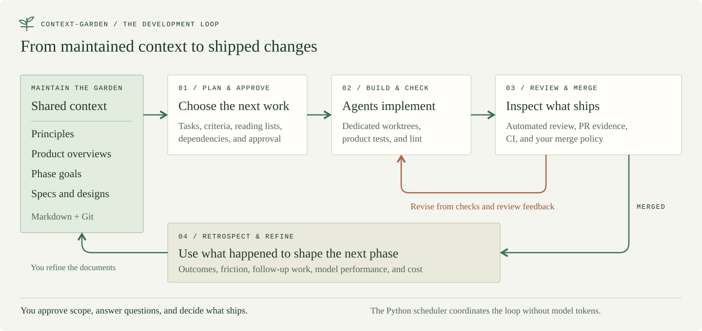
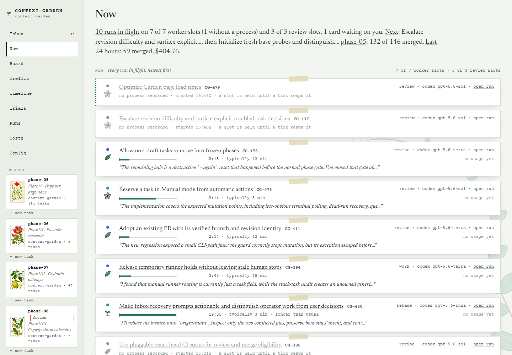
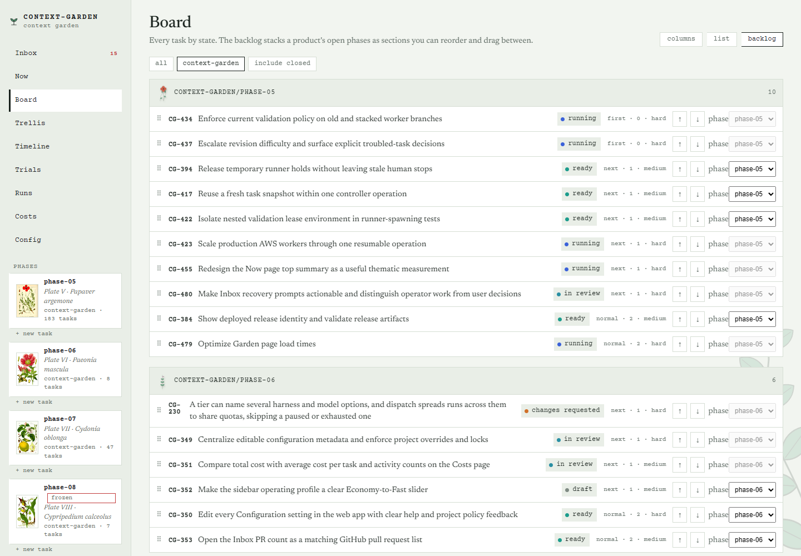
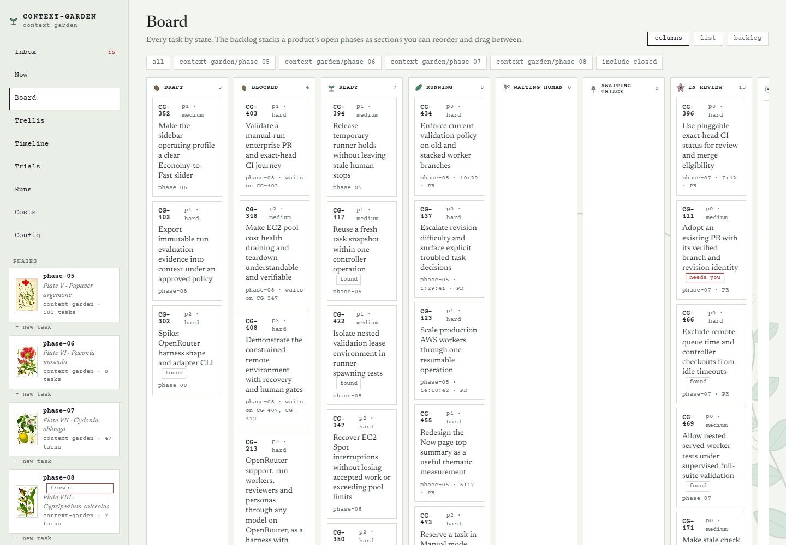
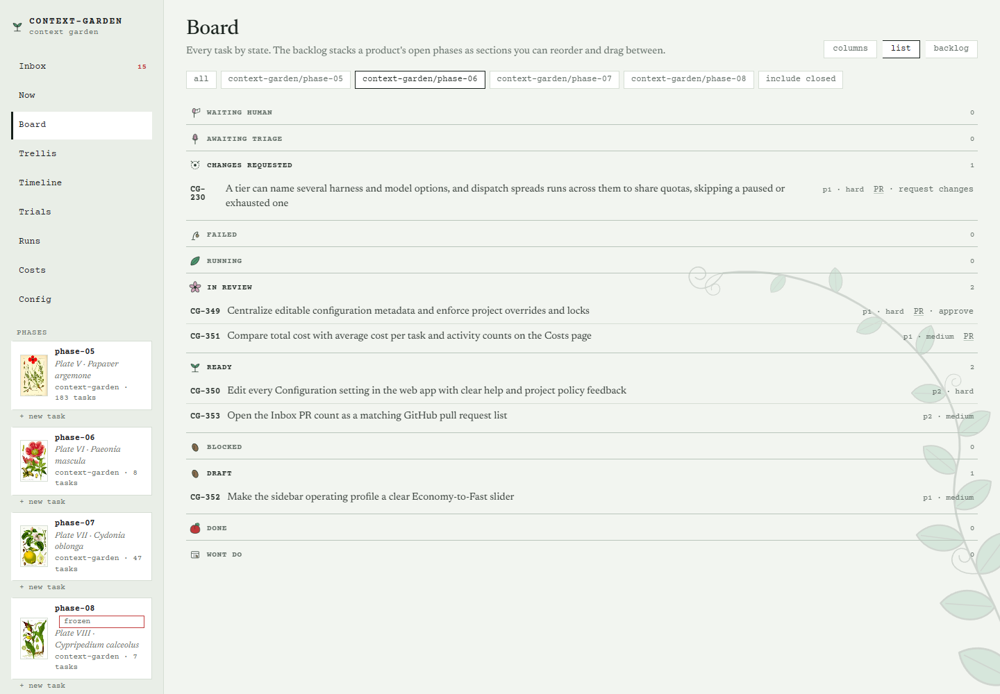
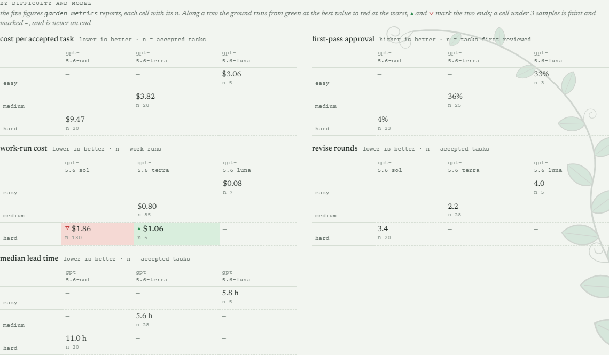
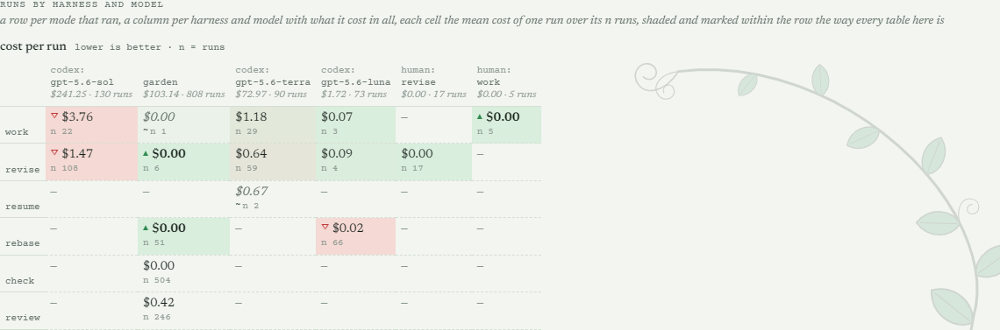

# context-garden

**Drive autonomous agent development by tending a context garden.** You maintain principles, product overviews, phase goals, and specs as Markdown; context-garden turns that context into plans, working code, and reviewed pull requests. As your project grows, you refine the documents that guide the agents, and the agents carry the work through implementation, checks, review, and revision. Your job is to shape the goals, make decisions, and choose what ships.

You can change the direction of the project in the same place you define it. Each worker gets a focused brief built from the shared context, and each phase leaves evidence you can use to improve the next one: what shipped, where agents got stuck, how reviewers responded, and what the work cost.

[Features](#what-you-can-do) · [See it in action](#feature-tour) · [Install](#install) · [First project](#your-first-project) · [CLI](#use-the-cli) · [Operating guide](docs/operations.md)



## What you can do

- **Keep context useful as the project changes.** Maintain principles, product overviews, goals, and specs in Git. Each worker's brief includes the shared context and its task's reading list, so the direction you set reaches the work being done.
- **Turn goals into coordinated work.** Plan a phase as tasks with acceptance criteria and dependencies. Run agents in parallel worktrees; stack related PRs and advance dependent tasks as changes merge.
- **Close the review loop.** Configured tests and lint gate PR creation. Automated reviewers check the task's criteria, and failed checks or review feedback drive bounded revisions. Add persona reviews for another perspective.
- **Handle decisions without losing the thread.** Answer a worker's question, approve scope, send a PR back, or recover a stopped task. The task keeps its brief, run output, review evidence, and history together.
- **Watch autonomous work as it happens.** Now shows runs in flight, progress excerpts, what is queued next, and where the phase stands. The Board gives you columns, a task list, and a backlog you can reorder across phases.
- **Compare models by the work they get accepted.** Inspect cost per accepted task, first-pass approval, revision rounds, and lead time by model and difficulty. Compare per-run costs, run model trials, set budgets, and account for delegated operator spend.
- **Use each phase to improve the next.** Retrospectives bring together outcomes, friction, costs, and persona reviews. They can propose follow-up work or identify blockers before a phase closes; you refine the context for what comes next.
- **Bring your existing project and tools.** Onboarding drafts context and a first phase from your repository. Use Claude Code, Codex, or a custom CLI harness with your project's setup, test, and lint commands; choose local, SSH, remote lease-based, or manual workers.

The scheduler itself uses **no model tokens**: it polls, orders tasks, collects results, and advances state in Python. Models do the planning, implementation, reviews, agent-assisted revisions, and retrospectives. A delegated operator session also uses tokens. Waiting for CI does not require an agent to sit in a chat polling it.

## Feature tour

### Watch the work move

**Now** is the live view of the loop: workers and reviewers in flight, progress from their output, the next tasks, and phase progress. Open a run to inspect its evidence. Below is the garden developing context-garden itself.



### Shape the plan across phases

The **Board** backlog puts upcoming work in phase order, with controls to change priority and move tasks between phases. Switch to columns for state or to the list for a compact view of tasks and PRs.



<details>
<summary>See the Board's columns and list views</summary>

**Columns:** scan the work by state, from draft and blocked through running and review. The board scrolls horizontally to show the remaining states.



**List:** read task titles, state, priority, difficulty, and PR links together.



</details>

### See which models work well for your tasks

The comparison charts lower down **Now** connect model choices to outcomes. Cost per accepted task, first-pass approval, revision rounds, and lead time are broken out by difficulty. Cells include sample counts; sparse results are marked so a small sample does not look like a reliable winner.



The per-run comparison separates work, revision, review, and other activities by harness and model. Use it alongside the outcome charts when tuning model assignments and the amount of review a task needs. The **Costs** page provides spending history and additional filters.



*These are snapshots of this project's development history over the selected 24-hour window, not controlled model benchmarks or estimates for your project.*

### Keep the context and decisions within reach

The **Trellis** makes dependencies visible. Task pages keep the brief, acceptance criteria, worker questions, and recorded usage together. The **Inbox** gathers the decisions that need you. Phase pages connect the work to goals and specs; closed phases remain available in the **Herbarium**.

<details>
<summary>Explore the Trellis, task page, Inbox, and phase page</summary>

These four captures use a small fictional Fieldnotes project to make the individual features easy to read.


</details>

## What you maintain

Your **garden** is a git repository of Markdown files. It holds the context and task history; each product points to its code repository. The garden driving this tool lives at [joshmarcus/garden](https://github.com/joshmarcus/garden).

```text
my-garden/
  garden.yaml                    # products, harnesses, capacity, checks
  principles/00-index.md          # shared rules included in every brief
  widget/
    product.md                   # product context and development conventions
    phase-01/
      goals.md                   # outcomes, scope, definition of done
      specs/                     # designs and requirements
      tasks/                     # task briefs and scheduler-managed state
  .garden/                       # local run records and working state (gitignored)
```

Edit and version the context in your usual editor. Use garden commands or the UI for task status changes.

## Install

You need **Python 3.11+**, **git**, a logged-in **Claude Code or Codex CLI**, and GitHub access through authenticated `gh` or `GITHUB_TOKEN`. Use a POSIX environment; **on Windows, run garden inside WSL**. Your product repository needs a committed base branch, a GitHub remote you can push to, and a configured git author identity.

```bash
git clone https://github.com/joshmarcus/context-garden
cd context-garden
uv venv
uv pip install -e .
source .venv/bin/activate
garden --help
```

Without uv, create the environment with `python3 -m venv .venv`, activate it, and run `python -m pip install -e .`. Keep that environment active when you move into your garden directory.

## Your first project

### 1. Create a garden and choose a harness

From the tool checkout, with its environment active:

```bash
garden init ../my-garden --name my-garden
```

The default harness is Claude. To use Codex, set `harness: codex` in `../my-garden/garden.yaml` before onboarding. See [Codex setup](docs/codex.md) for authentication and model configuration.

Workers use a private HOME and a scrubbed environment. Saved harness credentials are copied into private directories for each dispatch. If your credentials live elsewhere, configure `worker_env.config_dirs`; individual approved tool files use `worker_env.config_files`. Keep secrets out of tracked YAML. See [worker environment and configuration](docs/architecture.md#configuration-and-environments).

### 2. Draft context from your repository

Replace the path below with your project's local checkout:

```bash
garden onboard /absolute/path/to/widget --into ../my-garden
cd ../my-garden
git init
```

Onboarding attempts GitHub discovery and calls the configured planner, so **this step uses a model**. It infers a product name and creates `phase-01` with draft tasks. The examples below assume that name is `widget`.

Read `widget/docs/onboarding.md` to see what was found, inferred, or left unresolved. Review `widget/product.md`, the principles, phase goals, and tasks. Correct the scope and the product's `setup.command`, `setup.test`, and `setup.lint` in `garden.yaml`. Onboarding does not install project dependencies or prove those commands work; validate them in a disposable checkout before approving work.

<details>
<summary>Prefer to write the context yourself?</summary>

After `garden init`, enter your garden and scaffold the product and phase:

```bash
cd ../my-garden
garden new-product widget --repo /absolute/path/to/widget --base-branch main
garden new-phase widget phase-01
```

Fill in `principles/00-index.md`, `widget/product.md`, `widget/phase-01/goals.md`, and the specs under `widget/phase-01/specs/`. Configure the product's setup, test, and lint commands, then run:

```bash
garden plan widget/phase-01 --draft
```

Planning attempts a kickoff review first if none exists. `--dry-run` prints the planning prompt without calling a model. The onboarding path already creates drafts; it does not need this extra planning call.

</details>

### 3. Review the plan before starting work

Merge these settings into the generated `garden.yaml`, keeping its product and harness configuration. They make approval explicit and start with one work slot and one review slot:

```yaml
max_parallel: 1
review_parallel: 1
plan:
  auto_approve: false
discovered:
  auto_approve_blocking: false
review:
  enabled: true
github:
  draft_pr: true
  automerge: false
```

These are suggested first-run settings, not package defaults: planning and blocking discovered work otherwise default to automatic approval. `--draft` overrides that behavior for one planning call. A phase budget is optional: `garden budget widget/phase-01 50` pauses new dispatch at $50; it does not cancel work already running.

```bash
garden doctor
garden trellis
garden validate
```

`doctor` checks configuration, repositories, the graph, and worker logins. It sends a small harness prompt and executes a configured notification command, so it is not an offline check. Resolve its failures before continuing. `validate` checks the graph and reading lists; approval also rejects incomplete briefs. Use `garden brief ID --stats` to inspect a task's context size.

### 4. Approve work and follow the first PR

```bash
garden approve --all widget/phase-01
garden serve
```

Use `garden approve ID` instead of `--all` to start with a single task. Open **http://127.0.0.1:8765**. `serve` starts the web UI **and the scheduler**: approved, unblocked work can now dispatch. For a look around before launching work, use `garden serve --no-watch` instead.

Follow the task's runs and evidence, answer any questions in the **Inbox**, and inspect the resulting draft PR and automated review. Mark it ready with the UI or `garden triage ID --ready`; send it back with `garden triage ID --changes "feedback"`. Once review and CI are satisfactory, merge on GitHub. The next poll records the merge and advances dependent work.

From another terminal with the same environment active, run `garden status`, `garden inbox`, or `garden observe --profile quiet`. `garden watch` runs the scheduler without the web UI; `garden tui` opens the terminal interface.

## Use the CLI

The CLI operates the same garden as the web UI and TUI. Inspect a plan, follow the workers, handle decisions, and compare outcomes from your terminal:

```bash
garden status
garden observe --profile quiet
garden inbox
garden brief WID-003 --stats
garden runs WID-003
garden costs --since 24h --by model
garden metrics widget/phase-01
```

Run commands from your garden directory with the installed environment active. Replace `WID-003` and `widget/phase-01` with your task and phase. `garden watch` runs the scheduler on its own; `garden observe --follow` follows progress alongside an existing controller. `garden --help` lists the command groups.

The [CLI guide](docs/cli.md) walks through planning and approval, following runs, answering workers, reviewing PRs, recovering tasks, and exporting JSON for scripts.

## Keep the loop running

A dispatch pause still allows collection, checks, reviews, and merges. Installation maintenance uses a separate drain-and-resume protocol. Run one long-lived controller per garden and keep its UI on loopback or behind authenticated access.

The **Config** page shows effective settings and pending configuration changes.

The [operating guide](docs/operations.md) covers merge policy, capacity, remote workers, recovery, maintenance, configuration reloads, GitHub Enterprise, and operator handoffs. The [architecture guide](docs/architecture.md) explains the full behavior and configuration boundaries.

## Development and documentation

- [CLI guide](docs/cli.md): day-to-day commands, control modes, and scripting.
- [Design](docs/design.md): vocabulary and the development loop.
- [Architecture](docs/architecture.md): modules, state, scheduling, configuration, and merge policy.
- [Worker protocol](docs/worker-protocol.md): briefs, results, transports, and failure recovery.
- [Codex setup](docs/codex.md): harness configuration and interactive workflows.
- [Test suites](docs/test-suites.md) and [worker CI](docs/worker-ci.md): focused checks and the full regression gate.
- [Screenshot capture](docs/screenshots/README.md): reproduce this README's example garden and images.

For development, install `uv pip install -e ".[dev]"` into the active environment. Follow the focused serial test selections, lint with `ruff check src tests scripts`, and run `python3 scripts/check_ci.py` on an authorized, committed `codex/` or `garden/` branch to push it and await its exact-commit CI. Tests use fake harnesses and spend no model tokens.

MIT licensed. See [LICENSE](LICENSE).
