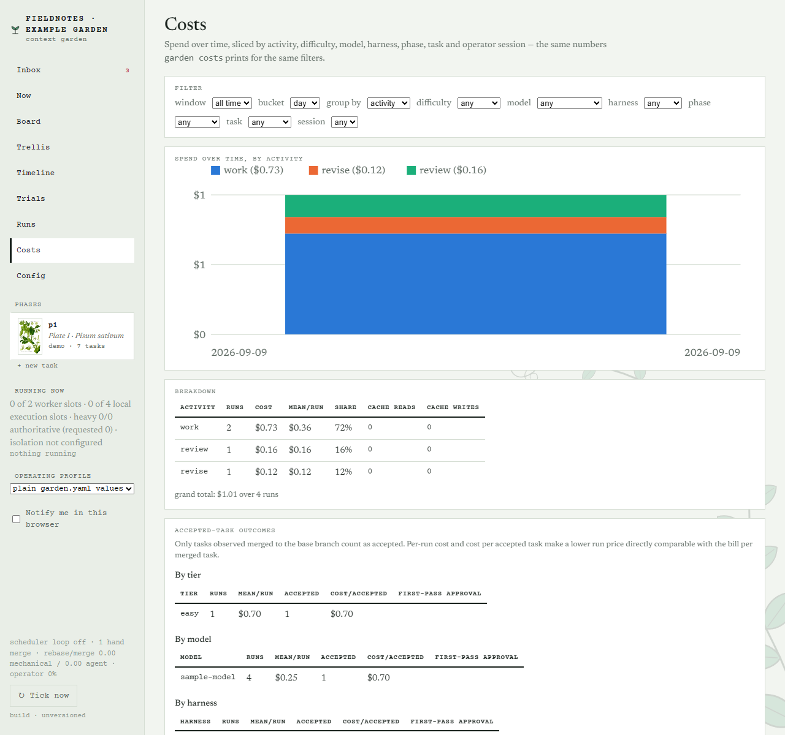

# context-garden

**Drive autonomous agent development by tending a context garden.** You maintain principles, product overviews, phase goals, and specs as Markdown; context-garden turns that context into plans, working code, and reviewed pull requests. As your project grows, you refine the documents that guide the agents, and the agents carry the work through implementation, checks, review, and revision. Your job is to shape the goals, make decisions, and choose what ships.

Built for developers and small teams working on existing projects. Use Claude Code, Codex, or a custom CLI harness with your project's own setup, test, and lint commands. Run the loop locally, on prepared remote hosts, or alongside an interactive coding session.


*The Inbox collects decisions that need you. Screenshots throughout this page show the current app with a fictional example project; tasks and costs are illustrative.*

[Features](#what-you-can-do) · [Install](#install) · [First project](#your-first-project) · [Feature tour](#feature-tour) · [Operating guide](docs/operations.md)

## What you can do

- **Start from an existing repository.** Onboarding reads project docs, metadata, and backlog, then drafts product context, setup commands, and a first phase for you to inspect.
- **Plan work with enough context to finish it.** Each task carries acceptance criteria, a reading list, dependencies, and a difficulty tier. Shared principles and phase goals become part of its worker brief; you can inspect that brief before approving.
- **Run several tasks at once.** Workers get dedicated git worktrees. Dependencies control ordering, and stacked PRs let related work start before its parent merges. Set work and review capacity separately.
- **Get checked changes and review evidence.** Tests and lint gate PR creation. Automated reviewers check the task's criteria; feedback and failed checks feed a bounded revision loop. Add persona reviews for another perspective.
- **Make decisions where the work is.** Answer a worker's question, approve a draft, send a PR back, or recover a stopped task from the Inbox and task pages. Runs preserve prompts, output, results, and usage.
- **See what the work costs.** Break spend down by task, phase, activity, model, or harness. Set phase budgets, inspect brief size, and compare models with trials. Record delegated operator spend alongside worker costs.
- **Carry lessons into the next phase.** Retrospectives bring together outcomes, friction, costs, and persona reviews, with follow-up work or blockers when a phase is not ready to close.
- **Choose how much to automate.** Merge PRs yourself, or enable the merge queue's review and CI gates. Use local, SSH, remote lease-based, or manual workers; operate through the CLI, web UI, or TUI.

The scheduler itself uses **no model tokens**: it polls, orders tasks, collects results, and advances state in Python. Planning, implementation, reviews, agent-assisted revisions, and retrospectives use models. A delegated operator session also uses tokens. Waiting for CI does not require an agent to sit in a chat polling it.

## How the work moves

```text
Goals + specs → draft tasks → approval → work + checks → draft PR
                                             ↑             ↓
                                         revision ← review feedback
                                                           ↓
                                                     merge → next task
```

Your **garden** is a git repository of Markdown files. It holds the context and task history; each product points to its code repository. The garden driving this tool lives at [joshmarcus/garden](https://github.com/joshmarcus/garden).

```text
my-garden/
  garden.yaml                    # products, harnesses, capacity, checks
  principles/00-index.md          # shared rules included in every brief
  widget/
    product.md                   # product context and development conventions
    phase-01/
      goals.md                   # outcomes, scope, definition of done
      specs/                     # designs and requirements
      tasks/                     # task briefs and scheduler-managed state
  .garden/                       # local run records and working state (gitignored)
```

You can version and edit the context in your usual editor. Use garden commands or the UI for task status changes.

## Install

You need **Python 3.11+**, **git**, a logged-in **Claude Code or Codex CLI**, and GitHub access through authenticated `gh` or `GITHUB_TOKEN`. Use a POSIX environment; **on Windows, run garden inside WSL**. Your product repository needs a committed base branch, a GitHub remote you can push to, and a configured git author identity.

```bash
git clone https://github.com/joshmarcus/context-garden
cd context-garden
uv venv
uv pip install -e .
source .venv/bin/activate
garden --help
```

Without uv, create the environment with `python3 -m venv .venv`, activate it, and run `python -m pip install -e .`. Keep that environment active when you move into your garden directory.

## Your first project

### 1. Create a garden and choose a harness

From the tool checkout, with its environment active:

```bash
garden init ../my-garden --name my-garden
```

The default harness is Claude. To use Codex, set `harness: codex` in `../my-garden/garden.yaml` before onboarding. See [Codex setup](docs/codex.md) for authentication and model configuration.

Workers use a private HOME and a scrubbed environment. Saved harness credentials are copied into private directories for each dispatch. If your credentials live elsewhere, configure `worker_env.config_dirs`; individual approved tool files use `worker_env.config_files`. Keep secrets out of tracked YAML. See [worker environment and configuration](docs/architecture.md#configuration-and-environments).

### 2. Draft context from your repository

Replace the path below with your project's local checkout:

```bash
garden onboard /absolute/path/to/widget --into ../my-garden
cd ../my-garden
git init
```

Onboarding attempts GitHub discovery and calls the configured planner, so **this step uses a model**. It infers a product name and creates `phase-01` with draft tasks. The examples below assume that name is `widget`.

Read `widget/docs/onboarding.md` to see what was found, inferred, or left unresolved. Review `widget/product.md`, the principles, phase goals, and tasks. Correct the scope and the product's `setup.command`, `setup.test`, and `setup.lint` in `garden.yaml`. Onboarding does not install project dependencies or prove those commands work; validate them in a disposable checkout before approving work.

<details>
<summary>Prefer to write the context yourself?</summary>

After `garden init`, enter your garden and scaffold the product and phase:

```bash
cd ../my-garden
garden new-product widget --repo /absolute/path/to/widget --base-branch main
garden new-phase widget phase-01
```

Fill in `principles/00-index.md`, `widget/product.md`, `widget/phase-01/goals.md`, and the specs under `widget/phase-01/specs/`. Configure the product's setup, test, and lint commands, then run:

```bash
garden plan widget/phase-01 --draft
```

Planning attempts a kickoff review first if none exists. `--dry-run` prints the planning prompt without calling a model. The onboarding path already creates drafts; it does not need this extra planning call.

</details>

### 3. Review the plan before starting work

Merge these settings into the generated `garden.yaml`, keeping its product and harness configuration. They make approval explicit and start with one work slot and one review slot:

```yaml
max_parallel: 1
review_parallel: 1
plan:
  auto_approve: false
discovered:
  auto_approve_blocking: false
review:
  enabled: true
github:
  draft_pr: true
  automerge: false
```

These are suggested first-run settings, not package defaults: planning and blocking discovered work otherwise default to automatic approval. `--draft` overrides that behavior for one planning call. A phase budget is optional: `garden budget widget/phase-01 50` pauses new dispatch at $50; it does not cancel work already running.

```bash
garden doctor
garden trellis
garden validate
```

`doctor` checks configuration, repositories, the graph, and worker logins. It sends a small harness prompt and executes a configured notification command, so it is not an offline check. Resolve its failures before continuing. `validate` checks the graph and reading lists; approval also rejects incomplete briefs. Use `garden brief ID --stats` to inspect a task's context size.

### 4. Approve work and follow the first PR

```bash
garden approve --all widget/phase-01
garden serve
```

Use `garden approve ID` instead of `--all` to start with a single task. Open **http://127.0.0.1:8765**. `serve` starts the web UI **and the scheduler**: approved, unblocked work can now dispatch. For a look around before launching work, use `garden serve --no-watch` instead.

Follow the task's runs and evidence, answer any questions in the **Inbox**, and inspect the resulting draft PR and automated review. Mark it ready with the UI or `garden triage ID --ready`; send it back with `garden triage ID --changes "feedback"`. Once review and CI are satisfactory, merge on GitHub. The next poll records the merge and advances dependent work.

From another terminal with the same environment active, run `garden status`, `garden inbox`, or `garden observe --profile quiet`. `garden watch` runs the scheduler without the web UI; `garden tui` opens the terminal interface.

## Feature tour

### Follow the plan and its dependencies

The **Board** groups tasks by state. The **Trellis** shows which tasks depend on each other, so you can inspect the plan before approving it and see what is holding up the next piece of work.


### Read the brief, answer questions, inspect the result

A task page keeps its acceptance criteria, worker question, run history, and usage together. Review and triage actions appear when the task reaches those stages. Light and dark themes are available throughout the app.


### Track a phase from scope to completion

Phase pages put goals, specs, progress, and tasks in one place. Kickoff reviews help examine the plan; retrospectives assess the outcome and propose the next work. Closed phases remain available in the **Herbarium**.


### Compare spending across the work

**Costs** groups recorded spend by activity, difficulty, model, harness, phase, task, or operator session. Use it to understand where revisions and reviews add cost, then inspect the underlying runs. The figures below are sample data, not a price estimate.



## Keep the loop running

| When you need to… | Start here |
| --- | --- |
| See what needs attention | `garden observe --profile quiet`, `garden inbox` |
| Answer a worker | `garden answer ID "answer"` |
| Inspect a stopped task | Its task page and runs; fix the cause, then `garden retry ID` |
| Request another review | `garden review ID` |
| Stop new work from dispatching | `garden pause`; resume with `garden unpause` |
| Inspect spending | `garden costs --by model`, `garden usage`, `garden metrics` |
| Work on a task interactively | `garden take --help`, `garden finish --help` |

A dispatch pause still allows collection, checks, reviews, and merges. Installation maintenance uses a separate drain-and-resume protocol. Run one long-lived controller per garden and keep its UI on loopback or behind authenticated access.

The **Config** page shows effective settings and pending configuration changes.

The [operating guide](docs/operations.md) covers merge policy, capacity, remote workers, recovery, maintenance, configuration reloads, GitHub Enterprise, and operator handoffs. The [architecture guide](docs/architecture.md) explains the full behavior and configuration boundaries.

## Development and documentation

- [Design](docs/design.md): vocabulary and the development loop.
- [Architecture](docs/architecture.md): modules, state, scheduling, configuration, and merge policy.
- [Worker protocol](docs/worker-protocol.md): briefs, results, transports, and failure recovery.
- [Codex setup](docs/codex.md): harness configuration and interactive workflows.
- [Test suites](docs/test-suites.md) and [worker CI](docs/worker-ci.md): focused checks and the full regression gate.
- [Screenshot capture](docs/screenshots/README.md): reproduce this README's example garden and images.

For development, install `uv pip install -e ".[dev]"` into the active environment. Follow the focused serial test selections, lint with `ruff check src tests scripts`, and run `python3 scripts/check_ci.py` on an authorized, committed `codex/` or `garden/` branch to push it and await its exact-commit CI. Tests use fake harnesses and spend no model tokens.

MIT licensed. See [LICENSE](LICENSE).
