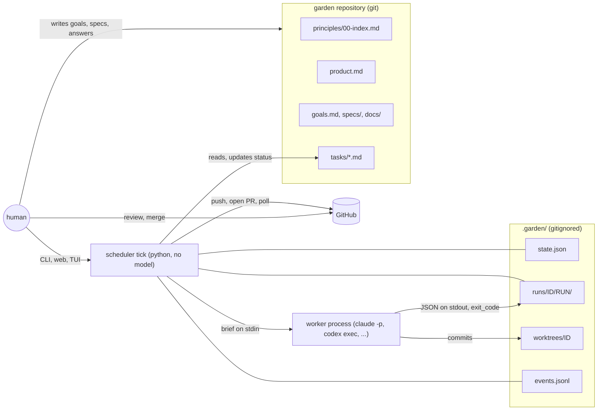
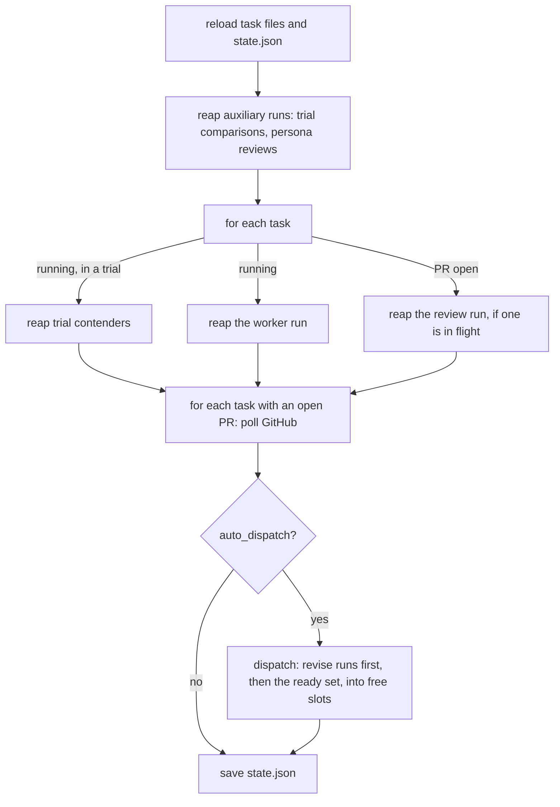
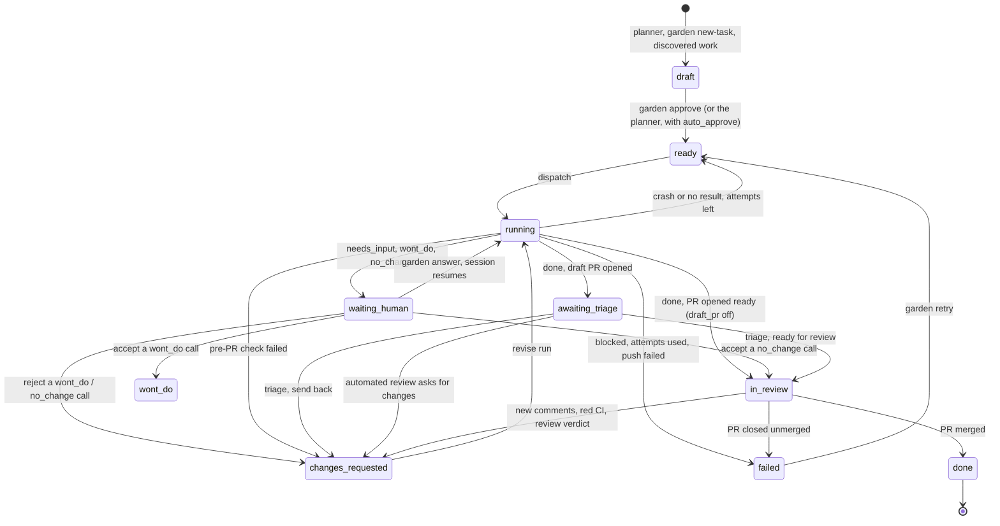

# context-garden: architecture

How the pieces fit, and how a task moves through them. `docs/design.md` says *why* the
tool is shaped this way; this page says *how* it works; `docs/worker-protocol.md` walks
through the one conversation that matters most, between the scheduler and a worker it
spun up. Per-mechanism specs live under `context-garden/phase-01-bootstrap/specs/`.

Everything on this page is what the code does today (`src/garden/`), not a plan.

## The shape of it

Three kinds of process, one shared filesystem, one external service.



- **The scheduler** is one Python function, `Scheduler.tick()` in `scheduler/__init__.py`,
  with no model behind it (the class is assembled from one module per tick phase; see the
  module map below). It is called by `garden tick` (one pass), `garden watch` (a loop that
  sleeps `tick_interval` seconds between passes), `garden serve` (the same loop in a
  background thread beside the web server) and the TUI's `t` key. Every call starts by
  re-reading the task files and `state.json` from disk — and `garden.yaml` (with its
  `garden.<env>.yaml` / `garden.local.yaml` overlays) when any of them has changed since the
  last read — so any number of these can run against one garden, the UIs can change state
  between passes, and an edit to the config takes effect within one tick without a restart
  (see "Configuration and environments" for the few keys that still need one).
- **Workers** are separate operating-system processes started by a *runner*: a headless
  agent CLI (`claude -p`, `codex exec`, or any CLI described under `harnesses:` in
  `garden.yaml`) running on this machine or on a host reached over ssh. They are
  detached: the scheduler keeps no handle to them and they outlive whichever process
  started them. The same transport carries reviewers, persona reviewers and trial
  comparisons; they are workers with a different brief.
- **GitHub** holds the pull requests and the review conversation. Only the scheduler talks
  to it, through the `gh` CLI when it is installed and logged in, otherwise the REST API
  with `GITHUB_TOKEN`. Workers never push and never open PRs.
- **The filesystem** carries everything between those three: the garden's markdown, the
  run directories, the git worktrees, the JSON side-store and the event log. There is no
  queue, no database and no socket.

## Module map

`src/garden/`, thin to thick: `cli`, `web`, `tui` render and forward; `scheduler` owns
every status change; `store`, `graph`, `brief`, `model` are offline. The two packages that
every feature used to edit in one place are split so that two changes in different parts
of the loop touch different files.

| module | what it holds |
|---|---|
| `model.py`, `store.py`, `graph.py`, `brief.py` | task frontmatter and statuses; discovery of products, phases and tasks on disk; the dependency graph and ready set; the worker brief and `GARDEN_RESULT` parsing |
| `scheduler/__init__.py` | `Scheduler`: construction, the shared helpers (runner, model, repo, worktree, slots), `tick()` (which times each phase into the report and warns over `tick.warn_seconds`) and `_transition()`; `WORKER_MODES`, `REVIEW_MODES`, `CHECK_MODES` |
| `scheduler/state.py`, `scheduler/report.py` | `State` (the `state.json` side-store with dirty-key merging) and `TickReport` (per-pass duration and slowest step) |
| `scheduler/reap.py` | `reap`, `finalize`, `_after_push`, `_open_or_update_pr`, retry-or-fail, the stall, the dead-run sweep (`reap_dead_runs`); starts the pre-PR check as a detached check run rather than running the suite in-tick |
| `scheduler/checkruns.py` | checks as run records (CG-182): dispatch a `check` run and route its results through the pre-PR → base-probe → rebase-re-check state machine, so the tick never runs a product's suite itself |
| `scheduler/fence.py` | the worktree fence: snapshot at dispatch, check and revert at reap |
| `scheduler/discovered.py` | discovered tasks (deduplicated against open tasks in the phase and the next one), duplicate/cancel decision cards, friction and notes a worker reports |
| `scheduler/review.py` | the automated review round (dispatch, reap the verdict, route it), superseding a still-running review on a new dispatch, and the orphan sweep |
| `scheduler/edits.py` | the edit run that folds pending suggestions into a task body |
| `scheduler/poll.py` | `poll`: merged, closed, triage on GitHub, feedback, CI; the automerge gate; stacking, restack and conflicts |
| `scheduler/rebase.py` | rebase as its own mode: mechanical first, an agent only on a real conflict, verdict kept when the diff is unchanged, the automerge queue |
| `scheduler/queue.py` | the one writer of the merge queue's `state.json` facts (`automerge_candidate`, `automerge_ready_at`, `merge_head`, `automerge_blocked`): `_queue_join` / `_queue_head` / `_queue_drop_head` / `_queue_leave` / `_queue_hold`; `tests/test_queue_state.py` asserts no other module writes them (CG-202) |
| `scheduler/dispatch.py` | `dispatch_ready`, the stuck audit, `_stack_for`, `dispatch` |
| `scheduler/human.py` | `approve` (the one draft→ready gate the CLI, web and TUI share), answer, accept or reject a worker decision, `mark_wont_do`, triage, cancel, retry, resume, `finish_manual` |
| `scheduler/budget.py` | phase budgets, the dispatch pause, live config overrides |
| `scheduler/quota.py` | harness-level pause: a quota/spend-limit `env_error` (Harness.parse) pauses dispatch for that one harness instead of failing the task; a cheap synchronous probe (`Runner.probe`) resumes it |
| `scheduler/upgrades.py` | the pinned tool install: note a merge, upgrade, auto-upgrade on an idle tick |
| `scheduler/aux.py`, `scheduler/trials.py`, `scheduler/persona.py`, `scheduler/retro.py` | auxiliary runs tracked in `_aux`; model trials; persona reviews; the phase retro |
| `harness.py`, `runner/` | harness definitions and output parsing; the `local`, `ssh` and `manual` runner backends |
| `review.py`, `criteria.py`, `events.py`, `trials.py`, `personas.py`, `checks.py`, `checkrun.py`, `retro.py`, `friction.py`, `suggestions.py` | the review brief and verdict; acceptance-criteria parsing and the reconciliation of a worker's `verified` evidence with a reviewer's `criteria` verdict (the PR body's Verification section, the task page, metrics); the event log, digest and metrics; trial records; persona briefs and reports; token-free checks and the detached job that runs them (`checkrun.py`, shared by the check run and the synchronous helper); the retro brief and documents (including the phase's "Numbers": worker cost against the operator's, CG-223); friction harvesting; task suggestions |
| `observe.py` | `garden observe`'s feed: the status line, inbox cards trimmed to one line each, stuck-run detection, a scan for an unhandled traceback in a recent run's stderr, and `garden digest`'s summary trimmed down — plus the built-in profiles and `observe.events`' kind/alias matching that `--follow` streams by |
| `costs.py`, `charts.py`, `operator_spend.py` | `cost_series`, the aggregation behind `garden costs` and the Costs page; server-side SVG charts (a burn-up, per-tier bars, the cost stack with its compaction annotations); the operator's own session spend — `docs/operator-spend.jsonl`'s format, turning cumulative heartbeats into `operator`-activity cost events, and the `garden operator-spend` CLI |
| `walkthrough.py` | render the live web app's pages to screenshots, HTML and text with an `index.md`; a phase persona review adds the newest capture to its brief |
| `gitops.py`, `github.py` | git worktrees and pushes; pull requests through `gh` or the REST API |
| `planner.py`, `plants.py`, `notify.py`, `upgrade.py`, `config.py` | the planning prompt and import; the botanical drawings; `notify.command`; the pinned install; configuration layering |
| `web/app.py`, `web/common.py`, `web/trust.py` | `create_app` and the template environment; the `Hub` (its `lock` held only by `tick()`, a separate `action_lock` held only by an action so a button press never waits for a pass), the `Site` (base template context, board data) and shared helpers; the HTML sanitiser behind `render_md` and the origin check on POSTs |
| `web/pages/` | one module per page family (`inbox`, `board`, `task`, `runs`, `trellis`, `trials`, `events`, `phase`, `config`, `api`), each registering its GET routes |
| `web/actions/` | the task-action registry (`tasks.py`: one function per action, registered by name) and the other POST routes (`control`, `phases`, `decisions`, `friction`) |
| `tui/` | the Textual TUI |
| `qa/` | `garden qa`: the throwaway garden, its fake worker and pretend GitHub (`sandbox.py`, `worker.py`), the flows as one table that is both the agent's script and the scripted run (`flows.py`), and the run itself with its report (`__init__.py`) |
| `canary.py` | `garden canary`: install a pinned build into a throwaway venv and drive it (the scripted QA flows plus a stacked-PR and a merge-queue scenario against the in-memory GitHub) before the pin is trusted with real PRs (CG-180) |

## Where state lives

Git is the database. The split between the four stores is deliberate.

| store | what it holds | written by | why it is separate |
|---|---|---|---|
| `<product>/<phase>/tasks/*.md` | one task per file: YAML frontmatter is the state (`status`, `depends_on`, `priority`, `difficulty`, `branch`, `pr`, `attempts`, `last_dispatched_at`), the body is what the worker reads, `## Log` is one line per transition | humans (everything but the scheduler-owned fields), the planner, the scheduler | reviewable in git, readable by people, the source of truth for *state* |
| `.garden/state.json` | per-task bookkeeping that would be noise in a task file (below) | the scheduler and the UIs | machine detail; safe to delete and rebuild from GitHub, at the cost of one poll; concurrent writers are safe (see below) |
| `.garden/runs/<task>/<run>/` | one directory per worker run: the exact brief, raw output, exit code, usage and cost | runners and the scheduler | the audit trail and the token ledger |
| `.garden/events.jsonl` | append-only history: every transition, dispatch, run completion, review verdict, question, answer, stall, budget event | the scheduler | the source of truth for *history*; feeds timelines, `garden digest` and `garden metrics` |

Also under `.garden/`: `worktrees/<task>` (one git worktree per task, on the task's branch),
`repos/` (clones of products given as URLs), `trials.jsonl` (model trial records).
Persona reviews of a phase are written into the garden itself, under
`<phase>/docs/reviews/`, where the planner reads them next time.

### Committing task state

The scheduler edits task files in place (status transitions, attempt counters, log lines).
Those edits accumulate in the main checkout and are not committed automatically, because
committing on the user's behalf would interfere with their own git workflow. Workers branch
from `origin/main`, so state must be committed and pushed to be visible to them across
machines.

Run `garden commit` after each session (or whenever the scheduler has made edits) to stage
every modified task file and create one commit on the current branch:

```
garden commit
```

The commit message is always `garden: update task state`. `garden status` warns when task
files have uncommitted changes.

### Concurrent writes to `state.json`

`State.save()` acquires an exclusive `fcntl.flock` on a companion lock file
(`.garden/state.json.lock`), re-reads the on-disk JSON, and merges only the
keys that this process actually wrote on top of what is currently on disk.  Two
concurrent writers that touch **different keys** of the same task entry will both
survive: `garden serve` polling GitHub and `garden triage` clearing a draft flag
can run simultaneously without either change being silently lost.

If two writers change the **same key** of the same task concurrently, the last
writer wins for that key — which is fine, because individual keys are small and
owned by a single code path (e.g. only `poll()` writes `pr_updated_at`).

### What `state.json` remembers per task

| group | keys | meaning |
|---|---|---|
| the PR | `pr_number`, `pr_draft`, `pr_base`, `pr_state`, `pr_updated_at`, `head_sha`, `review_decision`, `checks`, `failed_checks`, `ci_failed_at`, `ci_reruns`, `last_polled` | what the last poll saw; `pr_updated_at` lets the poll skip PRs nothing has touched |
| the revise loop | `pending_feedback`, `pending_feedback_rebase`, `revisions`, `needs_human`, `last_diff_hash`, `force_push` | feedback waiting for a revise run, whether that round only resolves a stale-base rebase conflict (CG-131, exempt from `max_revisions`), how many ordinary rounds were used, why the loop stopped |
| automated review | `review_run`, `review_rounds`, `last_round_rebase`, `last_review`, `last_findings` | the review run in flight, rounds used, whether the last dispatched round was a rebase round (its review does not count toward `review.max_rounds`), the last verdict and its blocking findings (for stall detection) |
| rebase and automerge | `rebases`, `rebase_pending`, `rebase_base`, `rebase_files`, `rebase_hunks`, `automerge_candidate`, `automerge_ready_at`, `merge_head`, `automerge_blocked`, `automerged` | rebase rounds used (its own counter, shared with a hand-resolved stale-base conflict), a pending agent rebase and its hunks, whether the PR is a merge-queue candidate and since when, whether it is the in-flight queue head (rebased, waiting for its rollup), why automerge is held, and the record of a garden merge |
| stacking | `stack_parent`, `restack_pending` | the dependency this branch is built on, and whether to rebase when the current run ends |
| questions | `question`, `question_run`, `session_id`, `session_host`, `session_harness`, `qa` | enough to resume the paused session, and every earlier answer |
| trials, discovered work | `trial`, `worktree`, `discovered_ids` | contenders and their scores; a worktree override for the winning contender; tasks this one reported |
| suggestions | `edit_run`, `edit_attempts` | the edit run folding pending suggestions into the task body, and how many edit runs failed (capped) |

Two special entries: `_phase:<product>/<phase>` records when a budget was hit, and `_aux`
lists comparison and persona runs still in flight. `_retro` tracks the in-flight retro,
`_decisions` the pending duplicate/cancel cards, and `_retro_verdicts` the phase verdicts
keyed by phase (verdict, status, who accepted it and when, and the ids of the tasks it filed).

### A run directory

| file | written by | content |
|---|---|---|
| `run.json` | scheduler | task, mode, runner, harness, model, host, pid, branch, base, timestamps, status, parsed result, usage, cost |
| `brief.md` | runner | the exact prompt the worker received |
| `command.txt` | local and ssh runners | the shell command that was started |
| `remote.sh` | ssh runner | the script piped to the remote host |
| `stdout.json`, `stderr.log` | the worker process | raw harness output |
| `final.md` | harness or scheduler | the worker's final message (the `GARDEN_RESULT` line is its last line) |
| `exit_code` | the shell wrapper (or `garden finish`) | the completion signal the scheduler waits for |
| `result.json` | `garden finish` | the result of a human-driven run |

## One tick



Each step is deterministic and every branch is a plain condition on files and GitHub
responses. Errors inside one task's step are caught and reported in the tick summary so
one bad task never stops the loop.

### Reap: what a finished run turns into

The scheduler reads the run's `exit_code` file (or checks the pid) and parses the
output. Details of the transport are in `docs/worker-protocol.md`; the decisions are:

| what came back | the scheduler does | the task becomes |
|---|---|---|
| exit code not 0 and no result line | marks the run failed | `ready` again while `attempts < max_attempts`, else `failed` |
| output without a `GARDEN_RESULT` line | same | same |
| `status: blocked` | records the reason in the task log | `failed` |
| `status: needs_input` | stores the question, session id, host and harness | `waiting_human` (holds no slot) |
| `status: wont_do` or `no_change` | stores the reason and the worker's final message as a decision for the person | `waiting_human`; Accept ends a `wont_do` in the terminal `wont_do` status (closing any PR) or resumes a `no_change` to the PR/review; Reject sends it back to a revise run with the person's note |
| `status: done` but no commits ahead of the base | marks the run failed | `ready` or `failed`, as above |
| `status: done` with commits | files discovered work as tasks, commits leftovers, pushes, runs token-free pre-PR checks, opens or updates the PR, starts the automated review | `awaiting_triage` (draft PR) or `in_review`; `changes_requested` if a pre-PR check failed |
| still running after `timeout_minutes` + 5 | kills the process group | `ready` or `failed` |
| no output or worktree change for `idle_kill_minutes` | shown as "idle N min" past `idle_minutes`, then kills the process group like a timeout | `ready` or `failed` |

A failed *revise* run goes straight to `failed` (there is a PR to look at, and retrying the
same feedback rarely helps). Remote (ssh) runs are the same except that the worker pushed
the branch itself; the scheduler fetches it, checks for commits and materialises a local
worktree so review and revise runs have one.

### Poll: what GitHub tells the scheduler

For every task with an open PR:

| GitHub says | the task becomes |
|---|---|
| merged | `done`; stacked children are retargeted and rebased; the worktree is removed |
| closed without merging | `failed`; stacked children are flagged for a human |
| draft PR marked ready on GitHub | `awaiting_triage` becomes `in_review` (triage done outside the tool) |
| ready PR converted back to draft | `in_review` becomes `awaiting_triage` |
| reviews or comments newer than the task's last dispatch, from anyone but the garden's own login and bots | feedback is stored; `changes_requested` |
| the checks rollup is red | `checks.ci` analysers run; if every failure is judged flaky, the job is rerun once instead; otherwise the failing check names and the analysers' findings join the feedback; `changes_requested` |

The poll returns early when the task is already `changes_requested` (a revise run is
queued) or when the PR's `updated_at` has not changed since the last look, so an idle PR
costs one request per tick. Once `max_revisions` rounds are used, new feedback still lands
in `changes_requested`, but flagged `needs_human`: the inbox shows it and no revise run
starts until `garden retry`.

### Dispatch: filling the slots

The queue is revise runs first (tasks in `changes_requested` with feedback waiting, not
flagged for a human, under `max_revisions`), then the ready set from `graph.ready()`:
approved tasks whose dependencies are all `done`, or, with `stack: true`, whose single
unfinished dependency has an open PR to build on. Order is priority, then id. Each
candidate is skipped when no slot is free (`max_parallel` minus every active run that is
not human-driven, review and persona runs included), when its phase is over budget, or when
its runner is `manual` (a person takes those with `garden take`).

Dispatching one task means: choose the runner (task, then product, then garden default),
the harness (same order), the model (an explicit `model:`, else the harness's tier map by
`difficulty`), the base branch (a stack parent's branch or the product base), prepare the
worktree, build the brief, write the run record, start the process, then record
`attempts`, `last_dispatched_at` and the `running` transition.

## The task state machine



`blocked` is never stored; it is computed from `depends_on` for display. `cancelled` is
reachable from anywhere with `garden cancel`. `wont_do` is terminal, counted as neither done
nor failed (nor in the inbox): a person accepted a worker's call that the task should not be
done. Only the scheduler writes `status` (the CLI and UIs go through it), which is why task
files under `tasks/` must not be hand-edited.

## Git and the pull request

- **Repositories.** A product's repo is a path relative to the garden or a URL; URLs are
  cloned once under `.garden/repos/`. The GitHub slug comes from the `origin` remote
  unless `products.<name>.github` overrides it.
- **The garden as its own product.** A product may point at the garden's own repo
  (`products.<name>: {repo: <the garden's origin>, self: true}`). Its tasks change the
  garden's own files — a phase's friction document, the next phase's goals, the product
  overview, `garden.yaml` — and are dispatched like any other task: the worker gets a
  worktree of the garden repo under `work_dir`, edits there, and the change comes back as a
  PR to the garden repo, with the same fence, checks and review. **The live garden is never
  edited by a worker; changes to it arrive by PR like everything else**, and the running
  garden picks them up when the person merges and `garden sync` pulls. Two guards keep the
  worktree apart from the live checkout: `garden doctor` refuses a `work_dir` inside the
  live garden (and a `self` repo that resolves to the live garden root), so the clone and
  worktrees sit outside it; and the fence (`find_root`) resolves a worker's garden worktree
  to that worktree's own `garden.yaml`, never the enclosing live garden. On top of the
  HEAD/working-tree snapshot of the two guarded git repos, the fence hashes the live garden's
  `garden*.yaml` and `.garden/state.json` at dispatch and re-checks them at reap, so a worker
  write to the config or the scheduler's own side-store (where an approve verdict lives) is
  caught even though those files are gitignored or the scheduler's own — closing the
  self-approve-then-automerge path (`docs/worker-protocol.md` §2a).
- **Branches and worktrees.** A task's branch is `garden/<id>-<slug>`. Its worktree is
  created from `origin/<base>` (or the local base when there is no remote) and reused
  across runs of the same task. The worker only ever commits in the worktree; the
  scheduler pushes with `git push -u origin HEAD:refs/heads/<branch>`, force-with-lease
  only after a rebase.
- **Draft first.** With `github.draft_pr` (default on) every PR opens as a draft and the
  task waits in `awaiting_triage` for the human's first look, while the automated review
  and any configured personas run against it. Triage marks it ready (on GitHub too) or
  sends it back with a note that becomes the next revise brief. When a review round is
  still coming, the triage notification (see `notify.command` below) waits for that
  verdict instead of firing the moment the draft opens, so the ping arrives with the
  review's read on the PR already attached.
- **Stacking.** A task whose one unfinished dependency has an open PR starts from that
  branch, its PR targets that branch, and `state.json` records `stack_parent` and
  `pr_base`. When the parent merges, the child's PR is retargeted to the product base and
  its branch rebased and force-pushed; a textual conflict starts a rebase round (below). A
  parent closed without merging flags the children for a human.
  - **Automerge only into the product base.** Automerge (see below) merges a PR only when
    its base is the product's base branch. A stacked child (its base is the parent's
    branch) is held with the reason `stacked on <parent>; waits for the restack`: it must
    wait for the parent to merge and for its own branch to be restacked onto the base
    before it can automerge. Merging a child into the parent's branch would put commits
    there that the parent's worktree does not have, and the parent's next rebase round
    would force-push them away.
  - **A self or tool product needs a second round.** A PR against a product with `self: true`
    (the garden's own repo) or `provides_tool: true` (the product that ships the `garden`
    binary) can change the loop that merges it, so `automerge_min_review_rounds` is 2 there
    by default — one approving LLM review is not enough (`_needs_second_review_round`). An
    explicit per-product `automerge_min_review_rounds` overrides the default; otherwise the
    PR waits for a second approving round or a person merging it by hand.
  - **A rebase round keeps remote-only commits.** A rebase round rewrites a branch in the
    worktree and force-pushes it, so before rebasing the scheduler folds in any commits
    that exist only on `origin/<branch>` by rebasing the worktree's commits onto it first.
    This means a force-push never discards work that reached the remote branch by another
    route (someone merged into it). If those commits conflict, the round resolves them like
    any other conflict.
- **Rebase is its own mode** (`scheduler/rebase.py`). A PR that falls behind its base is
  brought forward by the cheapest thing that works, tracked as its own kind of run, and
  never re-reviewed for code the reviewer already approved. Three rules:
  - **Mechanical first, an agent only on a real conflict.** When a PR conflicts (GitHub
    reports `CONFLICTING`, a parent merged, or the merge queue is about to land it) the
    scheduler runs `git rebase origin/<base>` in the worktree with no model. A clean apply
    is the whole round: a `rebase` run record with no harness call, a force-push with a
    lease and a re-run of the pre-PR checks. Only a textual conflict starts an agent, on the
    easy tier, with a minimal brief carrying the conflicting hunks, the task's goal and the
    rule "resolve the conflict, change nothing else". Every mechanical path — a conflict
    rebase, the pre-merge rebase, a stacked-child restack and a moved-base re-check — goes
    through one recorded helper (`RebaseMixin._rebase_and_record`) so each records a `rebase`
    run (marked `how="mechanical"`) and none is left uncounted. A rebase round has its own
    counter (`state[task].rebases`), its own line in `garden metrics` (rebases per merge,
    rebase cost, and mechanical vs agent counted separately, all scoped to the phase filter),
    and never counts against `max_revisions` or `review.max_rounds`.
  - **No re-review when the diff is unchanged.** After any rebase, `gitops.patch_id` — the
    branch's `git patch-id --stable` against its merge-base, a hash of the diff's own +/-
    content that is blind to the hunk-header line numbers and context that shift whenever an
    unrelated commit lands on the base near the branch's hunks — is compared before and after
    (CG-210). When they match, the last verdict is kept, `rebased; patch id unchanged; verdict
    kept` is logged, and no review is dispatched. A hash of the raw diff text would flag such a
    rebase as changed too (the incident this fixes: every queued PR came back changed on a
    plain merge nearby); patch id is reviewed again only when it actually differs — a textual
    resolution, or a rebase that folds the branch's own commit away as already-applied
    elsewhere.
  - **Automerge is a queue that keeps its head.** Approved candidates are ordered
    oldest-approved-first; only the head is rebased, checked and merged, and the next candidate
    is taken once the head is off the queue. A branch already on the base's tip is merged as it
    stands — not rebased or pushed. A rebase that has to move the branch restarts its rollup, so
    the head goes **in flight** (`merge_head`, holding its `automerge_ready_at`): the queue does
    not pick another head while one is in flight, and it merges the head the moment the rollup
    goes green. The pre-merge checks run as a detached check run (CG-182), so the head is chosen
    a tick before its `merge_head` marker is set (the reap sets it); while that check run is in
    flight the queue treats the task as the head all the same and picks no other candidate, so
    the one-head invariant holds across the detach window too. A head leaves the queue only on a
    conflict, a failed check, a changed diff that needs a review, a closed PR or a human change
    request — the reason is logged and the next-oldest candidate becomes head. So each PR is
    rebased at most once, right before it merges, and a pending rollup never rotates the head.
  - **The hard tier merges after two rounds and a scratch-merge check.** With
    `github.automerge_hard_tier` on (the default), a `hard`-tier PR is an automerge candidate
    too, but with two extra gates on top of the usual ones: at least **two** approving review
    rounds, and the garden's **own scratch-merge check** — the pre-PR suite run on the branch
    rebased onto the base tip in a throwaway worktree, not trusting the GitHub rollup alone. The
    check is dispatched (as a detached `scratch_merge` check run) once every other gate is green,
    and its result is recorded keyed to the reviewed diff: a clean rebase keeps the pass, a revise
    round (a changed diff) re-runs it, and a failure holds the merge until the diff changes. With
    no pre-PR checks configured there is nothing to run, so the check is satisfied at once. Set
    `automerge_hard_tier: false` to keep hard-tier merges by hand.
  - **A diff that touches the loop's own rules is held for a person.** The automerge gate
    refuses (with `automerge_blocked` naming the paths) when the PR's diff touches
    `garden*.yaml`, any `**/tasks/` file, `.github/` or `principles/`, so a self-approved PR
    cannot quietly rewrite the config, the task files, the CI or the principles unattended;
    those merge by hand.
- **A broken base parks, then continues on its own** (`scheduler/reap.py`). When a pre-PR
  check fails, the scheduler probes the branch's base commit before spending a revise round.
  If the same check fails at the base too and the base branch has **not** moved, the base is
  itself broken: the task parks with a `base_broken` stop (recording the base branch and its
  probed tip) — no revise round, no worker, no spend. Every following tick re-probes: while
  the base tip is unchanged it just waits, but the moment the base branch goes green the
  scheduler rebases the branch onto it mechanically (a no-cost `rebase` run, the same path as
  above), force-pushes so any stale CI on the branch runs again, re-runs the pre-PR checks and
  — on green — clears the stop and opens or updates the PR, all without a worker. A rebase that
  does not apply, or checks that still fail after it, fall through to the normal revise path
  (and only then); a base that moved but is still red simply re-parks against the new tip. The
  event is `rebased_stale_base`.
  - **That same stale-base path shares the rebase exemption.** When the mechanical rebase
    onto the moved base does not apply cleanly, the revise round dispatched to resolve it by
    hand is flagged `pending_feedback_rebase`: it adds to the same `rebases` counter, is
    exempt from `max_revisions` and `needs_human` exactly like a conflict rebase, and the
    review that follows it does not count toward `review.max_rounds` either.
- **Feedback detection.** Reviews, line comments and issue comments newer than the task's
  `last_dispatched_at` count, minus the garden's own comments (recognised by a hidden
  marker) and the accounts in `github.bot_logins`, so the scheduler's own review comments
  never trigger a revise run. The revise brief carries only those new items, not the whole
  thread.
- **Only trusted authors prompt a worker.** A comment is text a worker would carry out, and
  on a public repo anyone can leave one. `GitHub.is_trusted` admits the login the garden
  authenticates as, `github.trusted_authors` and the `github.reviewers` it requests. A
  `[bot]` account is trusted only when `github.trusted_bots` names it (empty by default), so
  an app relaying untrusted comment text does not steer a worker until the owner opts that
  app in by login. Everything else, a `CHANGES_REQUESTED` review included, is returned as
  `ignored` with the reason `untrusted`, logged once on the task with a `feedback_ignored`
  event, and never reaches a brief. The GitHub review decision still gates automerge, so an
  untrusted request for changes blocks a merge without steering a worker.
- **CI.** The scheduler reads the checks rollup on the PR head, whichever system posts
  it. Log analysis is whatever `checks.ci` names; nothing assumes GitHub Actions.

## Every kind of run

All of these go through the same runner transport; they differ in the brief they get and
the marker line the scheduler looks for at the end of their output.

| mode | started by | brief | ends with | model | what happens with the output |
|---|---|---|---|---|---|
| `work` | dispatch | `build_brief`: rules, principles digest, product overview, phase goals, task, reading list | `GARDEN_RESULT` | task difficulty tier | push, PR, review run |
| `revise` | dispatch, when feedback is pending | the same, plus a "Revision round" section and the new feedback | `GARDEN_RESULT` | task tier | push, PR title and body updated, a comment on the PR, review run |
| `resume` | `garden answer` | the answer, into the paused session (`--resume`); a fresh brief with every Q&A when the harness cannot resume | `GARDEN_RESULT` | task tier | as `work` |
| `rebase` | a real (textual) rebase conflict; the mechanical rebase runs with no model and needs no worker | a minimal brief: the conflicting hunks, the task's goal, "resolve the conflict, change nothing else" | `GARDEN_RESULT` | easy | push (lease), re-run checks; the verdict is kept when the diff is unchanged, else a review runs. Own counter; never counts against `max_revisions` |
| `review` | after a PR is opened or updated | the task brief without rules, the PR title and body, the diff | `GARDEN_REVIEW` | `review.difficulty`, or the harness's `review_model`, else the task tier | verdict posted as a PR comment; `request_changes` becomes feedback for a revise run; a repeated blocking finding stalls the loop |
| `edit` | dispatch, when a draft/ready task has pending `## Suggestions` (or `garden integrate`) | the task body and the suggestions, planner-style | `GARDEN_EDIT` | `review.difficulty`, else the task tier | the task body is rewritten to fold in the suggestions, they are marked `- [x]`, the old body is kept for the diff |
| `persona` | `garden persona-review`, or `review.personas` on every PR round | the persona file plus the phase's body of work, or plus one PR's description and diff | `GARDEN_PERSONA` | `retro.difficulty` (default `hard`) | a report under `<phase>/docs/reviews/`, or a PR comment; high findings can become tasks or a revise run |
| `trial` | `garden trial` | as `work`, once per contender on its own branch | `GARDEN_RESULT` | the contender's model | each contender pushes and gets a PR |
| `compare` | when every contender has finished | the task brief, every contender's PR description and diff | `GARDEN_COMPARE` | review tier | the winner's branch and PR become the task's; the others are closed with the ranking posted |
| `retro` | `garden retro`, once the phase's persona reviews are in | the harvested PR-body friction, the phase's own `## Reported` friction log, friction still sitting in marked PR comments, the persona reports (including the built-in product-manager), the phase's task list with statuses, the merged PR titles | `GARDEN_RETRO` | `retro.difficulty` (default `hard`) | the retro document (with a `## Verdict` section), the next phase's goals draft, and a draft task per ranked feature (`discovered_from: retro:<phase>`, duplicates skipped) are rendered from the report and opened as a PR to the garden's own (`self`) repo. The report also carries a phase **verdict** (`close`/`close_with_followups`/`reopen`): the reap files its `followups` (drafts in the next phase) and `blocking` (live tasks in this phase, `retro_blocking: true` + freeze exception), closes the phase at once for a `close`, or records a pending decision for a `reopen` (in `_retro_verdicts` state; `retro_decide` accepts/changes it, `close-phase` follows it) |
| planner | `garden plan` | goals, specs, docs, persona reports, existing tasks | a JSON array | `hard` | task files; the only synchronous call, made from the garden root, not a worktree |

## Interfaces

All three are thin. They read `Store`, `State`, `RunStore` and `EventLog`, call methods on
`Scheduler` (`dispatch`, `answer`, `triage`, `cancel`, `retry`, `start_trial`,
`dispatch_persona_*`, `tick`) and render.

- **CLI** (`cli/`, Typer): every operation, scriptable; `garden inbox` and `garden
  digest` are the text versions of the home page, and `garden observe` (below) is the one
  feed that combines them for an operator or an agent's heartbeat. Split by command family, one module
  each — `scaffold`, `views`, `state`, `loop`, `planning`, `diagnostics` — over a shared
  `common` (the `app`, the consoles and the store/task/target helpers); `__init__`
  imports them so their `@app.command()` decorators register and re-exports `app`/`main`.
- **Web** (`web/`, FastAPI and Jinja templates): the Inbox, Board, Trellis, Timeline,
  Trials, Runs, task and phase pages. `web/app.py` builds the app and the template
  environment; each page family under `web/pages/` and each action module under
  `web/actions/` registers its own routes (`register(app, site)`), and the task actions
  are a registry (`web/actions/tasks.py`: one function per action, `@action("name")`,
  and `POST /tasks/{id}/{action}` is a table lookup). No build step and no CDN: charts
  and the trellis are server-rendered SVG, live regions poll a partial every few seconds.
  `garden serve` runs the scheduler loop in a background thread unless `--no-watch`.
  Two checks sit at its edges (`web/trust.py`): every piece of markdown a page renders
  (task bodies, PR feedback, review verdicts, persona reports, specs) is reduced to an
  allowlist of tags and attributes with safe link targets, since much of it was written by
  an agent or a commenter; and a POST whose `Origin` (or `Referer`) is not the address the
  server binds to is refused with 403, so a page open elsewhere in the same browser cannot
  press the buttons. The allowlist is `server_origins(host, port)` plus `web.trusted_origins`
  (for a reverse proxy that presents another origin); the request's own `Host` is never
  consulted, so a page whose name was rebound to the loopback address is refused too.
- **TUI** (`tui/app.py`, Textual): an Inbox tab and a Tasks tab with the same actions,
  refreshing every few seconds so it can sit beside a `garden watch`.
- **Skills** (`.claude/skills/`, written by `garden init`): `garden-take`, `garden-plan`
  and `garden-review` let an interactive Claude Code session act as a worker, planner or
  reviewer through the manual runner; `garden-operate` is the operator's playbook for a
  running loop. A person can pair on a task, or run the loop, without leaving it.

## Configuration and environments

`Config.load` merges `DEFAULTS` (in `config.py`), then `garden.yaml`, then
`garden.<GARDEN_ENV>.yaml`, then a gitignored `garden.local.yaml`. Dictionaries merge and
lists and scalars replace, so an overlay can swap the whole `checks.ci` list or the ssh
host list without touching the shared file. Per-product blocks under `products:` override
`repo`, `base_branch`, `id_prefix`, `runner`, `harness`, `budget_usd` and `github`.
`garden doctor` prints which files were loaded and what it found.

**Live reload.** `Store.invalidate` (called at the top of every tick) re-reads these files
when any of them has changed on disk since the last read, comparing their mtimes, so an edit
to `garden.yaml` takes effect within one tick and the changed top-level keys are logged (a
`config_reloaded` event). A handful of keys are consumed once at startup and so are *not*
picked up live — `config.RESTART_KEYS`: `work_dir` (fixes the `.garden` paths), `tick_interval`
(the watch/serve loop reads it once), and the `github.*` client and `upgrade.*` installer
settings that are built when the scheduler is constructed. The Configuration page names both
sets, and changing a restart key needs a restart of `garden watch` / `garden serve`.

Every automatic loop has a cap here: `max_attempts`, `max_revisions`,
`review.max_rounds`, `timeout_minutes`, `idle_kill_minutes`, `budgets`, `stall.enabled`.
Hitting a cap flags the task for a human instead of retrying.

**`notify.command`** (`src/garden/notify.py`) is a shell command the scheduler runs
whenever a task needs a human: `awaiting_triage` (once a pending review's verdict is
known — see "Draft first" above), `waiting_human`, `failed`, `changes_requested` past
`max_revisions`, plus `stalled`, `needs_human` and `budget` events. It gets the task in
environment variables — `GARDEN_TASK_ID`, `GARDEN_STATUS`, `GARDEN_MESSAGE`, `GARDEN_PR`
— and `notify.timeout_seconds` (default 30) bounds how long it may run. It is empty by
default (no notifications); see `notify:` in `examples/garden.work.yaml` for a working
example to copy. `garden doctor` runs the configured command for real, with a synthetic
`GARDEN_TASK_ID=DOCTOR-TEST` payload, and reports whether it exited zero — a broken
command (typo, missing binary, unreachable webhook) is caught there rather than the first
time a task actually needs a human. At runtime, a command that exits non-zero, times out
or fails to start does not stop the scheduler, but is logged as a warning (logger
`garden.notify`) instead of failing silently.

## `garden observe`: the operator's feed

One command replaces a hand-rolled heartbeat script and a firehose event tail: `garden
observe` prints a status line (service pulse, worker slots, spend, and counts per status for
the open phases), then only what needs a hand (inbox decision cards, one line each with the
task, its kind and the action that clears it — from `inbox.py`'s decision table), stuck runs
(no output for longer than `stuck_after`, or a process that finished without being reaped),
tracebacks (an unhandled exception in a recent run's stderr — a bug in the harness or
scheduler, not an ordinary task failure), and a digest of the window; a section that has
nothing to say is omitted. `--json` emits the same fields as one object, for an agent that
parses. `garden observe --follow` repeats every `observe.interval` and, between passes,
prints one line for each event whose kind is in `observe.events` as it lands.

Every knob lives under `observe:` in garden.yaml (`config.DEFAULTS["observe"]`):

| key | default | meaning |
|---|---|---|
| `interval` | `30m` | `--follow`'s sleep between passes (`Nm`/`Nh`/`Nd`/`Nw`, or a bare number of seconds) |
| `digest_window` | `30m` | how far back each pass's digest and traceback scan look |
| `events` | `[question, needs_human, failed]` | the kinds (or aliases, below) `--follow` streams between passes |
| `stuck_after` | `15m` | a running run idle this long (no output, no worktree change) is a stuck card |
| `line_width` | `160` | wrap width for the text output |
| `phases` | `open` | `"open"` (every phase that is not closed) or a list of `product/phase` keys, scoping the status line's counts |
| `profile` | `""` | a name from the built-ins or `profiles`, applied on top of the fields above |
| `profiles` | `{}` | name -> partial override of any of the fields above (only the fields it names change) |

`observe.events` names either a literal event kind (as `events.py` emits them: `transition`,
`dispatch`, `review`, `needs_human`, `stall`, `decision`, `budget`, ...) or one of a few
aliases for a kind that only means something with one more field checked (`garden.observe.
EVENT_ALIASES`): `question` (a worker's question is a `waiting_human` event, not a `decision`,
which is a wont_do/no_change call), `failed` (a `transition` to `failed`), `phase`
(`phase_closed`/`phase_reopened`), `retro` (any `retro_*` event), `review_changes_requested`
(a `review` event whose verdict is `request_changes`), and `merge` (`merge_head`,
`automerged`, or a `transition` to `done`).

**Profiles** are named presets: `observe.profile` (or `--profile` for one invocation) picks
one, and a same-named entry under `observe.profiles` replaces a built-in outright. Three
ship built in (`garden.observe.BUILTIN_PROFILES`):

| profile | interval | events | notes |
|---|---|---|---|
| `quiet` | 30m | question, needs_human, failed | the default: cheap to run beside a long loop |
| `watch` | 10m | quiet's events, plus decision, stall, budget, phase, retro, review_changes_requested | more of the loop's own decisions, still not the firehose |
| `debug` | 5m (stuck_after 5m) | transition, dispatch, review, merge | every transition, worth it only while chasing something |

Profile selection is live, like `max_parallel`: `garden set observe.profile <name>` (or the
Config page's Profile select, which posts to `/config/observe-profile`) stores it in
`state.json` under `_control.overrides` the same way (`Scheduler.set_override`/`effective` in
`scheduler/budget.py`), so a running `garden observe --follow` picks up the switch on its next
pass without a restart — the same mechanism that lets a garden.yaml edit to `observe.profile`
take effect within one tick.

## Extension points

| to add | provide | code needed |
|---|---|---|
| a harness (another agent CLI) | a block under `harnesses:` with `bin`, `command` or argument shape, `output` format, a tier-to-model map, optional `resume_command` | none |
| a runner (another place to run) | a subclass of `runner.base.Runner` with `start` and `collect`, registered in `runner/__init__.py` | one class |
| a check (token-free) | `{name, command}` or `{name, python: "module:function"}` under `checks.pre_pr` or `checks.ci`; helpers in `checks.py` for log analysers | none, or one function |
| a persona | a markdown file under `personas/` | none |
| context | markdown under the garden; the planner and the briefs pick it up | none |

## How it is tested

`tests/fake_claude.py`, `fake_codex.py` and `fake_ssh.py` stand in for the real
binaries: the fake harness takes the brief, commits something in the worktree and returns
a `claude -p --output-format json` shaped result, with an environment variable choosing
the scenario (done, crash, no result line, blocked, needs a decision, discovered work, a
revise round that changes nothing, a rebase conflict). The scenarios are two tables in
that file: `SPECIAL` for runs that are not a worker round (crash, stall, the planner, a
comparison, a persona, a retro, an edit, the `review-*` verdicts) and `WORKERS` with one
row per worker mode; a new scenario is a new row.

No test drives a subprocess worker. `tests/inprocess.py` is a `LocalRunner` whose launch
step calls the fake harness as a Python function instead of spawning it: it prepares the
same setup, brief, environment and resolved argv, writes the same `stdout.json`,
`stderr.log`, `command.txt` and `exit_code` beside the run record, and returns with the
run already finished. An autouse fixture in `tests/conftest.py` puts it in the runner
registry under `local` for every test, so a test ticks once to dispatch and once to reap,
with nothing to wait for and nothing left running; a `stall` worker is a run with no
`exit_code`, which is what the idle and timeout checks look for. The local runner's own
launch mechanics are tested by constructing `LocalRunner` with `subprocess.Popen` stubbed;
the ssh end-to-end test is the one place a real command runs (its remote script is shell),
and it waits on that child directly rather than polling.

The `garden` fixture in `tests/conftest.py` builds a garden with one product whose repo is
a local git repo with a bare `origin`, and a fake GitHub records PRs, comments and feedback
in memory. That is enough to drive every state transition end to end without a network.
The scheduler's own tests sit under `tests/scheduler/`, one file per tick phase
(`test_reap.py`, `test_poll.py`, `test_dispatch.py`, `test_human.py`, `test_notify.py`,
`test_orphan_sweep.py`, `test_dead_runs.py`) with shared helpers in `tests/scheduler/conftest.py`. `pytest -q`
runs it all in well under a minute; CI for this repository runs the same in
`.github/workflows/ci.yml`. `.github/workflows/qa.yml` runs `garden qa --scripted` daily
and on demand (`workflow_dispatch`), so a page regression is caught between phases without
spending tokens; a failed flow exits non-zero and fails the job.

## Rules the code keeps

- `model`, `store`, `graph` and `brief` make no network calls and no subprocess calls
  beyond git, so briefs and readiness are testable offline.
- Only `scheduler` changes a task's status; the CLI, web and TUI call it.
- Workers commit and never push; the scheduler pushes and never commits code of its own
  (it only commits a worker's leftover changes before pushing).
- A worker runs in a scrubbed environment (`runner.base.scrubbed_env`): an allowlist of the
  scheduler's variables (`runner.base.PASS_ENV`, widened by `worker_env.pass`) plus the
  product's `setup.env`, never its GitHub token, cloud credentials or ssh agent, and never
  the operator's `HOME` — a worker (and a branch's own `command` checks) run under an
  isolated scratch home beside the worktree, so they cannot read the gh token, git
  credentials or ssh keys out of `~` (`worker_env.pass: [HOME]` restores it). The ssh
  runner's remote worker gets the same allowlist and scratch home applied to the remote login
  environment: its remote script runs the harness and the setup command with every other
  variable unset, so a host's ambient tokens do not reach the worker either. Only git's own
  fetch and push on the remote keep the login environment, since the remote host does its own
  pushing.
- That same isolated `HOME` must not hide a harness's own saved login: `scrubbed_env` sets
  `CLAUDE_CONFIG_DIR` and `CODEX_HOME` to the operator's real home by default (unless already
  passed through, or overridden by `worker_env.config_dirs`, keyed by the variable name — a
  custom harness names its own key there). `garden doctor` proves each configured harness can
  actually log in through this exact environment with a trivial one-line prompt
  (`Harness.check_login`), not an ambient "auth status" call; `Harness.parse` tags a
  login-failure output `env_error: true, env_kind: "auth"` so it reads as an environment
  problem, not a worker's own failure, and the scheduler pauses the harness instead of
  failing the task.
- A check's flaky-retry command (`checks.<>.retry_command`) comes only from the operator's
  config, never from a check's own JSON output (code the branch wrote), and runs in the same
  scrubbed environment — so a check cannot smuggle a shell command out through its output.
- No model runs in the tick. Waiting is a sleeping Python process.
