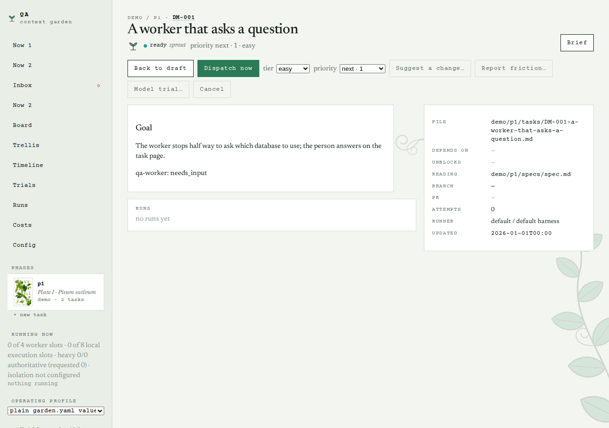
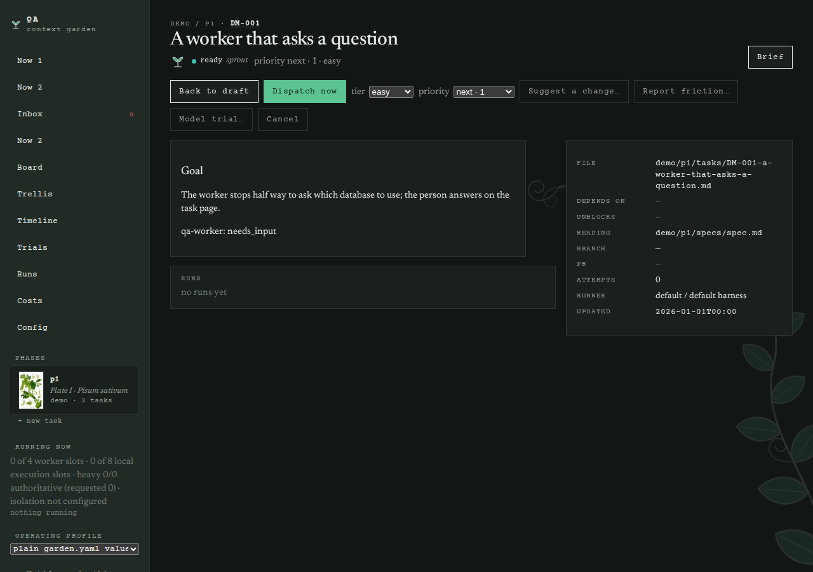
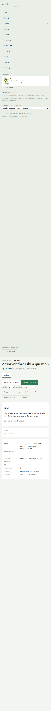
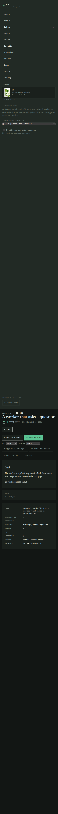

# Walkthrough of the live web app — demo/p1, 2026-09-08

Each page below has its purpose, one line on what to look at, a full-page screenshot, the served HTML and a plain-text rendering (tags stripped, in document order) that reads roughly as the page does top to bottom.

Read the `.txt` for the words and the order; read the `.html` for structure, controls, forms, empty states and error text.

Run page stderr is omitted (rerun `garden walkthrough` with --include-stderr to capture it); absolute home-directory paths are redacted to `~` throughout.

## Task: `/tasks/DM-001` (HTTP 200, 71 KB)

A task page: state, tier and priority controls, runs, the live log, the actions.

Look at: Are the controls and the run history legible, and is it clear what happens next?

Files: `task-1280-light.png`, `task-1280-dark.png`, `task-390-light.png`, `task-390-dark.png`, `task.txt`, `task.html`
