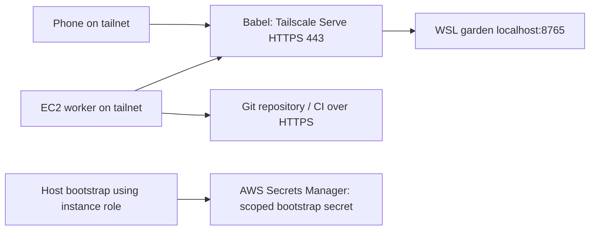

# EC2 worker environment: operator setup

This is the setup used for the phase-05 AWS worker trial on 2026-09-07. It is an
operational record and reproduction guide, not a claim that remote EC2 workers are
already deployed. Account-specific resource IDs and secret values belong in the
operator's private configuration, not this document.

## Verified setup and remaining work

| Component | State at this checkpoint |
| --- | --- |
| AWS network, worker role/profile, bootstrap-secret resource | Created by CloudFormation; stack CREATE_COMPLETE |
| Routine provisioning role | Assumed successfully; matching EC2 launch dry-run returned DryRunOperation |
| Budget | One $80 custom-period AWS Budget created; scoped read verified |
| Babel HTTPS access | Windows Tailscale Serve proxies to the WSL garden on localhost:8765; Now and Inbox returned 200 |
| Tailnet access policy | Saved and read back: worker tag can reach only Babel TCP 443 |
| Worker enrollment key | Staged privately outside Git; unconsumed |
| EC2 instances | None launched during setup |
| Remote protocol and EC2 provider | Repairs under review in [PR221](https://github.com/joshmarcus/context-garden/pull/221) and [PR295](https://github.com/joshmarcus/context-garden/pull/295) |
| Worker image, authenticated enrollment and actual end-to-end canary | Still required; not proven by the infrastructure dry-run |

The current controller runs in WSL on the Windows machine Babel. AWS workers will
initiate HTTPS connections to it through Tailscale. The controller does not need
inbound SSH access to workers.



## AWS identity and infrastructure

Use named profiles so routine commands cannot accidentally select the bootstrap
identity. Here `garden-login` is the non-root login and `garden-provisioner` assumes
`ContextGardenProvisioner`:

```sh
aws sts get-caller-identity --profile garden-provisioner
```

A one-time, explicitly owner-authorized root/default bootstrap created the network,
worker IAM resources and budget, and corrected the scoped launch policy. That was a
bounded setup exception. Root credentials remain on the operator account; they are
never copied to images, hosts, briefs, claim payloads or bootstrap user-data.
Routine provisioning returns to `garden-provisioner`.

The stack `context-garden-phase05-infrastructure` contains:

- A dedicated us-east-1 VPC (`10.86.0.0/24`) and subnet (`10.86.0.0/26`).
- Internet gateway, route table and default route. The subnet assigns a public IPv4
  address for outbound connectivity. This is a public-route subnet with restricted
  ingress, **not a private subnet**.
- A security group with no inbound rules and outbound TCP 443 only. There is no SSH
  ingress, NAT gateway, load balancer or Elastic IP in this setup.
- `ContextGardenWorker` EC2 role and instance profile. The role can retrieve only
  the designated bootstrap secret; it has no controller provisioning permissions.
- A Secrets Manager resource named `context-garden/phase05/bootstrap`. Creating the
  secret resource did not populate working enrollment credentials. The secret is
  retained on stack deletion and can continue to incur storage cost.

Routine launch authorization is restricted to us-east-1, approved tagged network
resources, IMDSv2, approved instance types and the specific worker instance profile.
Required tags `ManagedBy=context-garden` and `Pool=phase05` must accompany the
instance, volumes and network interfaces. The generic lifecycle's own ownership
and operation tags remain separate and cannot be overridden by injected policy tags.

The initial plan pins Canonical Ubuntu 24.04 amd64 AMI
`ami-025d99823a4caad37` (owner 099720109477, dated 2026-09-04). Authorization uses the
exact verified AMI ARN. An earlier `ec2:Owner` condition failed for this public image;
we narrowed authorization to that image rather than broadening general image access.
This stock OS image is **not yet a prepared worker image**. A future image change
requires a fresh reviewed pin and corresponding scoped IAM update.

Before enabling a launch, repeat the scoped dry-run with the exact planned image,
subnet, security group, instance profile, IMDS settings and all required resource
tags. `DryRunOperation` verifies authorization only; it does not create an instance,
prove bootstrap, reserve capacity or validate application behavior.

## Tailscale and the HTTPS endpoint

Babel and the owner's phone are connected to the same tailnet. Tailscale Serve on
Windows exposes the local garden as `https://<babel-magicdns-name>` and proxies to
`http://localhost:8765`. The HTTPS origin is included in `web.trusted_origins`; unrelated
browser origins remain rejected. Phone access requires an active Tailscale connection.
No public Funnel endpoint was enabled. The pre-existing policy permission to enable
Funnel was preserved; that permission alone does not expose a service publicly.

The original tailnet rule allowed all users and devices to reach everything. Adding
a restrictive rule alongside it would have left that access intact: Tailscale grants
are additive. We replaced it with these two grants and defined the worker tag:

```json
{
  "tagOwners": {
    "tag:garden-worker": ["joshmarcus@github"]
  },
  "grants": [
    {
      "src": ["joshmarcus@github"],
      "dst": ["*"],
      "ip": ["*"]
    },
    {
      "src": ["tag:garden-worker"],
      "dst": ["100.92.173.44"],
      "ip": ["tcp:443"]
    }
  ]
}
```

`100.92.173.44` is Babel's verified tailnet IPv4 at this checkpoint. Substitute the
actual owner identity and controller address when adapting this setup. Merge these
sections into the existing policy while preserving intended SSH/node-attribute rules;
do not replace unrelated settings blindly. Remove any remaining rule granting the
worker tag broader access.

Workers must enroll with `tag:garden-worker`, not as the owner's personal device.
The requested first-host auth key is single-use and ephemeral. It is stored outside
the repository in an owner-only secret directory; its file mode was checked and
restored to 0600 after the editor saved it. Do not put the key in chat, command-line
arguments, user-data, logs or source control. An ephemeral Tailscale device does not
terminate its EC2 instance or stop AWS billing.

Tailnet reachability and garden API authentication are separate. The worker also
needs its own garden bearer token, configured through `workers.hosts[].token_env`.
The protocol uses `/api/runs/claim`, `/api/runs/<id>/heartbeat` and
`/api/runs/<id>/finish`. There is no `/api/workers/enroll` endpoint in this implementation.

## Budget and first-host limits

The owner authorized **$80 total** for AWS setup and worker trials until changed.
It is not a monthly allowance and not $80 per worker.

AWS Budget `context-garden-80-total-trial` uses one custom period from 2026-09-07 to
2027-09-07, with no monthly reset. It is account-wide and conservatively excludes
credits/refunds. The provisioning role can read it. No email/SNS subscribers were
configured; operator monitoring is responsible for observing spend. Billing data is
delayed, so neither this budget nor an application estimate is a hard billing cap.
The end of that reporting period does not renew the owner's allocation.

The disabled canary plan is deliberately smaller:

- One `t3.xlarge`, maximum 30 minutes, $2 admission ceiling.
- Standard CPU credits, avoiding unlimited-credit overage by default.
- 40 GiB encrypted gp3 root volume with deletion on termination.
- Zero idle hosts. Desired capacity remains zero until the prerequisites are met.
- A fake harness and disposable repository, with no model-account or production
  repository write credentials copied from the operator.

The setup estimate was about $0.088 for half an hour of compute, public IPv4 and 40 GiB
gp3, before secret/API/transfer/tax charges. This is a dated planning estimate, not a
quote. Reprice before launch, include retained resources, and reserve cleanup headroom
inside the aggregate $80 allocation.

## Before the first real worker

1. Approve and deploy the current remote protocol using exact-head CI and the release
   protocol. A separate-process served-HTTP fixture is useful evidence, but is not a
   live EC2 canary.
2. Prepare a pinned environment image/bootstrap with the worker, git, secret retrieval
   and Tailscale dependencies. The EC2 provider's prebuilt contract requires an actual
   executable on that AMI; a path string does not prove it exists. The environment
   adapter must validate versions and start a supervised unprivileged worker with disk
   temp. Enforce workload isolation from IMDS and bootstrap credentials.
3. Populate the scoped bootstrap secret securely and configure the host's garden API
   token. Verify the worker tag, controller reachability and actual authenticated
   claim/heartbeat/finish behavior. Do not mark an instance ready just because EC2 says
   running or a generic page responds 200.
4. Install an independent termination deadline before enabling the one-host canary.
   Observe the full work/check/review and lease-recovery path with the fake harness.
5. Terminate the host, observe termination, and inventory remaining volumes, network
   interfaces, addresses and the retained secret. Record unresolved resources and
   costs. A successful terminate request is not proof cleanup has finished.

The provider and environment-profile contracts remain pluggable: EC2 handles cloud
lifecycle, while a garden worker or workplace development-host adapter supplies its
bootstrap and service health behavior. Persistent development workspaces require an
explicit storage-release decision.

## Production Codex runtime

The production branch of `scripts/managed-worker-bootstrap` installs the complete
official Codex 0.153.4 Linux package after checking its pinned SHA256. A standalone
`codex` executable is insufficient: Code Mode also needs `codex-code-mode-host`.
The package layout under `/opt/codex-0.153.4` retains its manifest, tool host,
packaged `rg`, and sandbox/shell resources. Both CLI entry points are linked from
`/usr/local/bin`; vendor directories remain readable and traversable by the
unprivileged worker even though bootstrap uses a private umask. Dedicated model
credentials remain private and writable by that worker for normal token refresh.

The controller accepts a product repository URL or local checkout. For remote
claims it resolves the controller checkout before fetching the branch head used
by the publication lease. The worker still receives the credential-free clone URL,
not the controller's checkout path or Git credentials.

Verify a real model tool call and a returned artifact after installation. An
authenticated model response alone does not establish that its execution tools
are available, and a live corrective install does not establish a fresh-image
replay of the final bootstrap.

## References

- [Tailscale grants syntax](https://tailscale.com/docs/reference/syntax/grants)
- [Tailscale device tags](https://tailscale.com/docs/features/tags)
- [AWS Budget API](https://docs.aws.amazon.com/aws-cost-management/latest/APIReference/API_budgets_Budget.html)
- [Worker protocol](worker-protocol.md)
