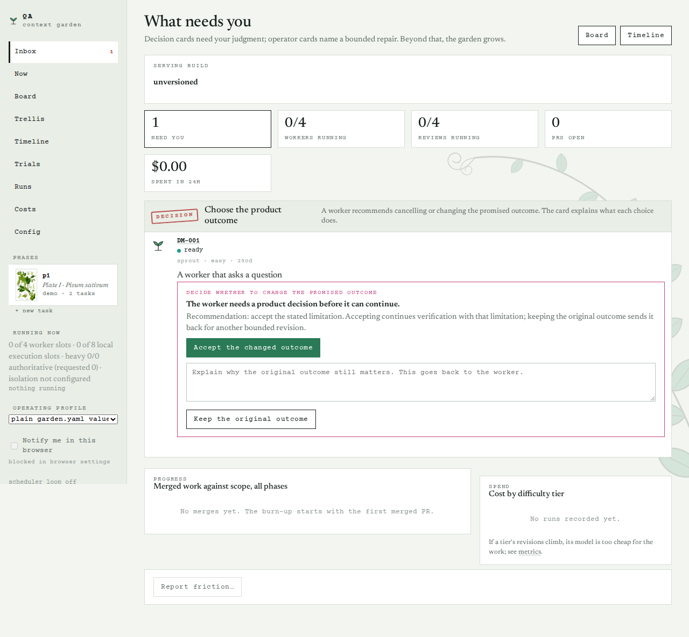
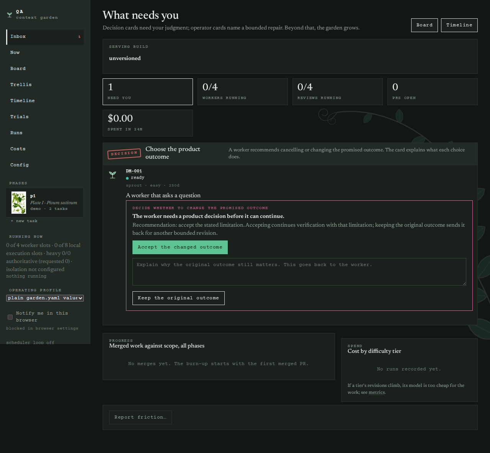
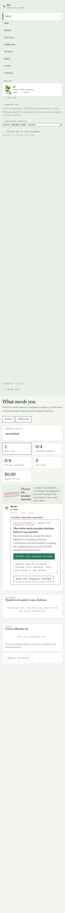
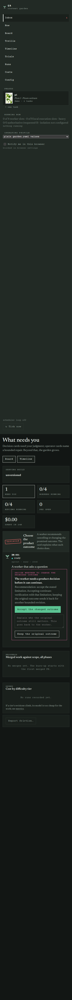
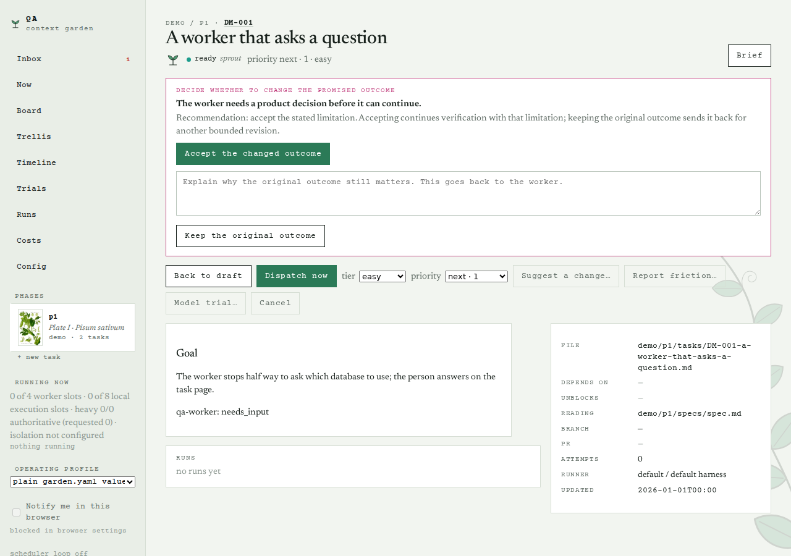
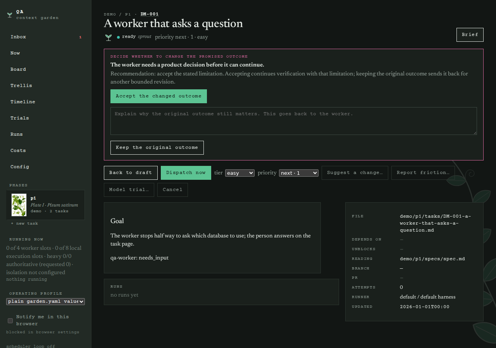
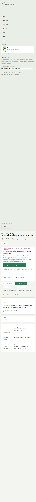
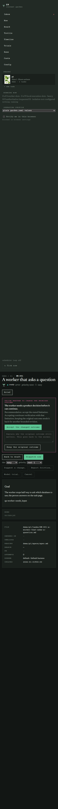

# Walkthrough of the live web app — demo/p1, 2026-09-08

Each page below has its purpose, one line on what to look at, a full-page screenshot, the served HTML and a plain-text rendering (tags stripped, in document order) that reads roughly as the page does top to bottom.

Read the `.txt` for the words and the order; read the `.html` for structure, controls, forms, empty states and error text.

Run page stderr is omitted (rerun `garden walkthrough` with --include-stderr to capture it); absolute home-directory paths are redacted to `~` throughout.

## Inbox: `/` (HTTP 200, 69 KB)

The first page: everything that needs the operator now.

Look at: Can a person immediately tell what needs action?

Files: `inbox-1280-light.png`, `inbox-1280-dark.png`, `inbox-390-light.png`, `inbox-390-dark.png`, `inbox.txt`, `inbox.html`

## Task decision: `/tasks/DM-001` (HTTP 200, 72 KB)

A task page with an active worker decision or needs-you card.

Look at: Does the page explain the decision and give the person a clear recovery action?

Files: `task-decision-1280-light.png`, `task-decision-1280-dark.png`, `task-decision-390-light.png`, `task-decision-390-dark.png`, `task-decision.txt`, `task-decision.html`
