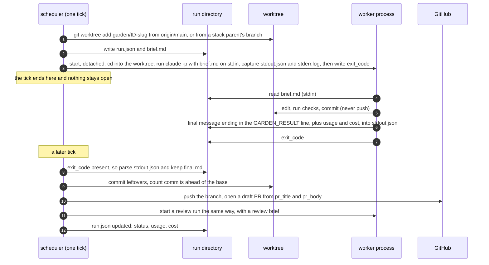

# How the scheduler talks to a worker

The scheduler is a Python function that runs for a few seconds every `tick_interval`.
A worker is an agent CLI that runs for minutes, started by the scheduler but not
attached to it. This page walks through everything that passes between them.

## The short version

There is no socket, no RPC and no shared memory. The two sides share a filesystem and use
exactly these channels:

| direction | channel | carries |
|---|---|---|
| scheduler to worker | the worker's **stdin** | the brief, once, at start (`runs/<task>/<run>/brief.md`) |
| scheduler to worker | the **working directory** | a git worktree on the task's branch, based on the right base |
| scheduler to worker | two **environment variables** | `GARDEN_TASK_ID`, `GARDEN_RUN_ID` (informational) |
| worker to scheduler | **stdout** | the harness's structured output: the final message, token usage, cost, session id |
| worker to scheduler | the **worktree** | commits on the task branch (never pushed by the worker) |
| worker to scheduler | one **file**, `exit_code` | the completion signal |

The worker's final message ends with one line, `GARDEN_RESULT: {...}`, and that line is
the whole result contract. Everything else the world sees (the pushed branch, the pull
request, the review comments) is done by the scheduler after the fact, from what it finds
in the run directory and the worktree.

## The sequence



## Step by step

### 1. Deciding what to run (scheduler, in `dispatch`)

Before anything is started, the scheduler settles every choice a worker might otherwise
have had to make:

- **Runner**: the task's `runner:`, else the product's, else the garden's (`local`,
  `ssh` or `manual`).
- **Harness and model**: the task's `harness:`, else the product's, else the garden's;
  the model is the task's explicit `model:` or the harness's map from the task's
  `difficulty` (`easy`, `medium`, `hard`) to a model name.
- **Branch and base**: the branch is `garden/<id>-<slug>` (kept across runs). The base is
  the product's base branch, or, when stacking applies, the branch of the one dependency
  whose PR is still open.
- **Worktree**: `.garden/worktrees/<id>` is created from `origin/<base>` (fetched first)
  or reused if it already exists on that branch. Remote runners skip this; the host makes
  its own.
- **Paths in the brief** are relative to the worktree the worker starts in; the brief never names the garden's own checkout, so a worker has nowhere else to go.
- **The brief**: `build_brief()` assembles the operating rules, the principles digest, the
  product overview, the phase goals, the task body and the reading list (inlined when
  small, listed when large), plus the "Revision round" feedback for revise runs, the
  "Stacked branch" note for stacked runs, and every earlier question and answer.
- **The run record**: `RunStore.new_run()` creates `.garden/runs/<id>/<timestamp>-<mode>/`
  with `run.json` holding the choices above.

### 2. Starting the process (the runner, in `start`)

The local runner writes the brief to `brief.md` in the run directory and starts one shell
command, detached in its own session (`start_new_session=True`, stdin closed), so it
survives the scheduler exiting:

```sh
cd /garden/.garden/worktrees/WID-003 && timeout 5400 \
  claude -p --output-format json --model sonnet \
    --permission-mode acceptEdits --allowedTools Bash,Read,Edit,Write,Glob,Grep,MultiEdit \
    'Carry out the brief that follows. It is the complete specification of your job.' \
  < /garden/.garden/runs/WID-003/20260904T120000Z-work/brief.md \
  > /garden/.garden/runs/WID-003/20260904T120000Z-work/stdout.json \
  2> /garden/.garden/runs/WID-003/20260904T120000Z-work/stderr.log; \
echo $? > /garden/.garden/runs/WID-003/20260904T120000Z-work/exit_code
```

The exact command is saved as `command.txt` next to the brief. The environment is the
scheduler's, minus `CLAUDECODE` (so a garden can be driven from inside another Claude Code
session), plus `GARDEN_TASK_ID` and `GARDEN_RUN_ID`. The shell's pid is stored in
`run.json`. For Codex the inner command is `codex exec --json --skip-git-repo-check
--full-auto -m <model> --output-last-message final.md -`, with the same wrapper; a custom
harness is whatever `command:` template the config gives, with `{model}` and `{final}`
filled in.

`start` returns at once. The scheduler records the `running` transition, bumps
`attempts` and `last_dispatched_at` on the task file, saves `state.json`, and the tick
moves on.

### 3. While the worker runs

Nothing is connected. The scheduler may not even be running: `garden tick` from cron
exits, `garden serve` may be restarted, the laptop may sleep. The run's existence is the
`run.json` with `status: running`, and its liveness is checked on demand:

- `exit_code` exists: the process finished.
- otherwise the pid is probed (`kill -0`, with a zombie check on Linux); a pid that is
  gone means the process died without the wrapper writing the file (a hard kill, a
  reboot), which the scheduler treats as a failed run.
- a run older than `timeout_minutes` + 5 is killed by process group and marked
  `timeout`; the `timeout` in the command line is the first line of defence at exactly
  `timeout_minutes`.

The web UI's "Running now" list and `garden runs` read the same `run.json` files. The
worker, meanwhile, sees a normal repository checkout on a branch and a prompt that ends
with the operating rules: commit in small steps, do not push, do not open a PR, do not
edit `tasks/`, run the project's checks, and finish with the result line.

### 4. What the worker sends back

The last line of the worker's final message is the contract:

```
GARDEN_RESULT: {"status": "done" | "needs_input" | "blocked" | "wont_do" | "no_change",
                "summary": "1-3 sentences", "question": "only for needs_input",
                "reason": "only for wont_do / no_change",
                "pr_title": "...", "pr_body": "markdown", "notes": "...",
                "discovered": [{"title", "body", "difficulty", "blocking"}]}
```

- `done`: the branch is ready; `pr_title` and `pr_body` are used verbatim.
- `needs_input`: the worker committed what it had and stopped on a decision only a person
  can make; `question` is the one thing it needs.
- `blocked`: it cannot proceed at all; the task fails with the reason in its log.
- `wont_do`: the worker judges the task should not be done; `reason` says why. Not a failure:
  the task moves to `waiting_human` and the person accepts (it ends in the terminal `wont_do`
  status and any open PR is closed with the reason) or rejects (the reasoning goes back into a
  revise round with the person's note).
- `no_change`: a revise round found nothing to change (e.g. the failing check was the
  environment, not the diff); `reason` says why. The task moves to `waiting_human`; the person
  accepts (the round proceeds to the PR or the review as if it had pushed, with no new work
  run) or rejects (as above).
- `discovered`: work it noticed but did not do; each item becomes a task file.

A `wont_do` or a `no_change` is a decision for the person, not a failure: the inbox card and
the task page quote the `reason` and show the worker's final message in full, with Accept and
Reject (plus a note). `garden accept ID` / `garden reject ID "note"` do the same from the CLI,
and `garden set-status ID wont_do --reason "…"` records a `wont_do` directly.

The harness wraps that message in its own format: `claude -p --output-format json` prints
one JSON object with `result` (the final text), `usage`, `total_cost_usd`, `session_id`
and `is_error`; `codex exec --json` prints JSON lines with `item.completed` messages and a
`turn.completed` usage record. `Harness.parse()` normalises both, and any plain-text CLI,
into `final_text`, `usage`, `cost_usd`, `session_id` and `error`; then `parse_result()`
scans the final text backwards for the marker and tolerates a fenced or trailing-junk
line by taking the outermost braces.

### 5. Reaping (scheduler, in `reap` and `finalize`)

On the next tick after `exit_code` appears, the scheduler:

1. Reads the exit code, calls the runner's `collect` (which calls `Harness.parse`), and
   writes the parsed result, usage, cost and session id back into `run.json`. It keeps
   the final message as `final.md` if the harness did not already write one. A
   `run_finished` event records the cost.
2. Decides from the exit code and the result line (the table is in
   `docs/architecture.md`): retry or fail, `waiting_human`, or carry on.
3. Files discovered work as task files in the same phase.
4. Commits anything the worker left uncommitted (`<id>: leftover changes from worker run
   ...`), counts commits ahead of the base, and fails the run if there are none.
5. Pushes the branch. From here on the branch exists outside the machine.
6. Runs `checks.pre_pr` in the worktree (tests, lint: no model). A failure becomes
   feedback and the task goes to `changes_requested` before any PR exists.
7. Opens the PR (draft by default, with a footer naming the task, any stack parent and
   discovered ids), or for a revise run updates the title and body of the existing PR
   and leaves a comment. The task moves to `awaiting_triage` or `in_review`.
8. Starts the automated review run, and any personas listed in `review.personas`.

The scheduler never reads the worker's stderr for anything but an error message when
there is no output, and never inspects the worker's transcript. The result line, the
commits and the harness's usage numbers are all it uses.

### 6. The review run answers the same way

A review is a worker with a different brief: the task brief without the operating rules,
the PR title and body, and the diff against the base (inlined under
`review.max_diff_chars`, otherwise read from git in the worktree). It ends with
`GARDEN_REVIEW: {"verdict", "summary", "description_ok", "description_feedback",
"findings": [...]}`. Reaping it posts the verdict as a PR comment; `request_changes`
turns the blocking findings and the description feedback into the next revise brief.
Persona reviews (`GARDEN_PERSONA:`) and trial comparisons (`GARDEN_COMPARE:`) use the same
transport and their own marker.

### 7. Pausing on a question, and resuming

When a worker reports `needs_input`, the scheduler stores the question, the harness's
`session_id`, the host it ran on and the harness name, and moves the task to
`waiting_human`. The task holds no slot. The inbox, `garden inbox`, the TUI and `garden
digest` all show the question.

`garden answer WID-003 "SQLite, one file per import"` (or the inbox form) appends the pair
to the task's `qa` list and dispatches a `resume` run. With a harness that can resume
(`claude -p --resume <session>`, or `codex exec resume <id>` when enabled), the command is
the same as before except that the prompt on stdin is only the resume note: the question,
the answer, and a reminder of the rules and the result line. The session picks up where it
stopped, with its earlier context intact, in the same worktree. A harness that cannot
resume gets a fresh run whose brief carries every previous question and answer under
"Answers from the human". Resume runs do not count as attempts.

### 8. Revise runs

Feedback from the human's triage note, from review comments on GitHub, from a red CI
rollup, from the automated review or from a rebase conflict all land in the same place,
`pending_feedback` in `state.json`. The next dispatch starts a `revise` run: the same
worktree and branch, the same brief plus a "Revision round" section and the feedback
itself (only what is new since the last dispatch). The result line, push and PR update
follow the same path; the revise run's `pr_body` replaces the PR description.

## Variants of the transport

**ssh runner.** The scheduler generates a shell script (`remote.sh`) that embeds the brief
in a heredoc and pipes it to `ssh <host> sh -s`. On the host, the script refreshes that
host's clone of the product repo, creates or reuses a worktree under
`<repo>/.garden-worktrees/<id>` on the task branch, runs the harness with the brief on
stdin, commits leftovers and pushes the branch itself (the host has push access; the
scheduler's machine may not). The harness's stdout comes back over the ssh connection into
the same `stdout.json`, and the same `exit_code` file is written locally. On reap the
scheduler fetches the branch, requires commits ahead of the base, and materialises a
local worktree from `origin/<branch>` so reviews and revise runs have one. The
least-loaded host with a clone of the product and a free `max_parallel` slot is chosen at
dispatch; a resumed session goes back to the host it started on.

**manual runner.** A person is the worker. `garden take WID-003 --worktree` dispatches a
run with no pid, prints the brief path and creates the worktree; the `garden-take` skill
does this from inside an interactive Claude Code session. `garden finish WID-003 --result
'{...}'` writes `result.json` and `exit_code` into the run directory and calls the same
`finalize` as a detached run, so the push, checks, PR and review are identical. A manual
run never times out and never occupies a scheduler slot.

**the planner.** `garden plan` is the one model call that is not detached: it runs the
harness synchronously from the garden root with the planning prompt on stdin and imports
the JSON array it prints as task files.

## What each side never does

| the scheduler never | the worker never |
|---|---|
| calls a model, or reads a transcript | pushes, opens a PR, or comments on one |
| holds a connection to a worker | edits files under `tasks/` |
| edits code in a worktree (it only commits leftovers before pushing) | reads the whole garden; it gets the brief and the reading list |
| retries without a cap | waits for the scheduler; it finishes and exits |

## When things go wrong

| failure | what the scheduler sees | what it does |
|---|---|---|
| the harness crashes | non-zero `exit_code`, no result line | retry while `attempts < max_attempts`, then `failed` with the last stderr lines in the task log |
| the worker forgets the result line | exit 0, no `GARDEN_RESULT` | same as a crash; the final message is kept in `final.md` |
| the worker did nothing | `done` with zero commits ahead of the base | run failed; retry or fail |
| the worker runs too long | elapsed time past `timeout_minutes` + 5 | kills the process group, marks the run `timeout`, retries or fails |
| the machine rebooted mid-run | pid gone, no `exit_code` | treated as a finished run with no output: retry or fail |
| the push is rejected | git error after the commits were counted | `failed` with the error in the log; the commits stay in the worktree |
| GitHub is unreachable | `gh` and the token both unavailable, or the API errors | the task moves to `in_review` with a note to open the PR by hand and register it with `garden pr ID URL` |
| the answer arrives but the session is gone | `session_id` set, resume command fails or the harness cannot resume | a fresh run with the Q&A in its brief |
| two ticks overlap | both read the same `run.json` | the run is reaped by whichever finishes first; the second sees the run already marked done and finds no active run |

## Where to look

- `garden log WID-003` prints the task's `## Log`, one line per transition, with cost.
- `garden runs WID-003` lists every run with mode, status, model, minutes, tokens and
  cost; the run directory holds the brief and raw output.
- `garden events WID-003` is the task's timeline from `events.jsonl`; the web task page
  shows the same with the last run's log.
- `garden brief WID-003 --stats` prints exactly what the next worker would receive and
  how big each section is.
