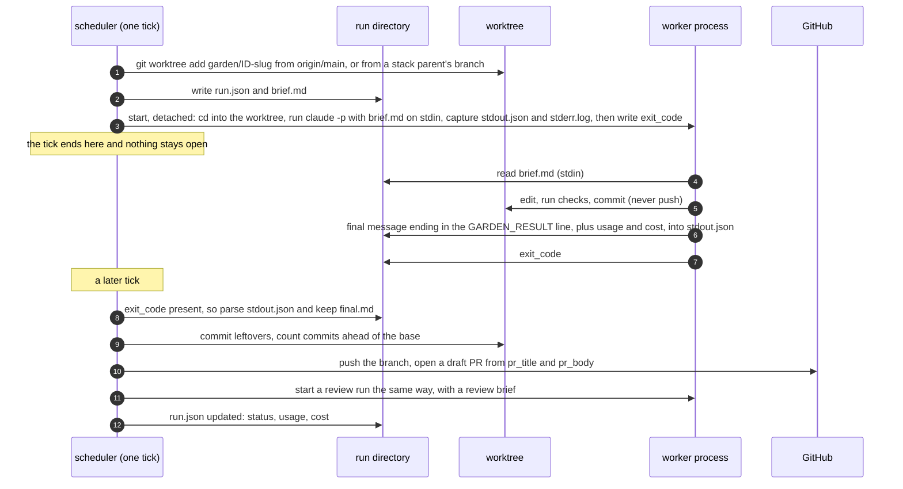

# How the scheduler talks to a worker

The scheduler is a Python function that runs for a few seconds every `tick_interval`.
A worker is an agent CLI that runs for minutes, started by the scheduler but not
attached to it. This page walks through everything that passes between them.

## The short version

There is no socket, no RPC and no shared memory. The two sides share a filesystem and use
exactly these channels:

| direction | channel | carries |
|---|---|---|
| scheduler to worker | the worker's **stdin** | the brief, once, at start (`runs/<task>/<run>/brief.md`) |
| scheduler to worker | the **working directory** | a git worktree on the task's branch, based on the right base |
| scheduler to worker | two **environment variables** | `GARDEN_TASK_ID`, `GARDEN_RUN_ID` (informational) |
| worker to scheduler | **stdout** | the harness's structured output: the final message, token usage, cost, session id |
| worker to scheduler | the **worktree** | commits on the task branch (never pushed by the worker) |
| worker to scheduler | one **file**, `exit_code` | the completion signal |

The worker's final message ends with one line, `GARDEN_RESULT: {...}`, and that line is
the whole result contract. Everything else the world sees (the pushed branch, the pull
request, the review comments) is done by the scheduler after the fact, from what it finds
in the run directory and the worktree.

## Required review evidence

A task can ask the scheduler to produce review evidence with `requires:` frontmatter, or
with the same concise phrases in an acceptance criterion. For example:

```yaml
requires:
  - persona-review -p designer
  - persona-review -p usability-expert
  - captures
  - check: unit
```

`persona-review -p <name>` starts that PR persona review when the PR opens. `captures`
adds the UI check even when the diff did not itself select it. `check: <name>` selects a
named `checks.pre_pr` entry; task files name configured checks and never inject commands.
Checks finish before the PR opens. Required personas post their comments before the
automated review is dispatched, and their state is shown on the task page. Failed required
checks enter the normal mechanical changes-requested path with their diagnostic in the
revise brief.

## The sequence



## Step by step

### 1. Deciding what to run (scheduler, in `dispatch`)

Before anything is started, the scheduler settles every choice a worker might otherwise
have had to make:

- **Runner**: the task's `runner:`, else the product's, else the garden's (`local`,
  `ssh` or `manual`).
- **Harness and model**: the task's `harness:`, else the product's, else the garden's;
  the model is the task's explicit `model:` or the harness's map from the task's
  `difficulty` (`easy`, `medium`, `hard`) to a model name.
- **Branch and base**: the branch is `garden/<id>-<slug>` (kept across runs). The base is
  the product's base branch, or, when stacking applies, the branch of the one dependency
  whose PR is still open.
- **Worktree**: `.garden/worktrees/<id>` is created from `origin/<base>` (fetched first)
  or reused if it already exists on that branch. Remote runners skip this; the host makes
  its own.
- **Paths in the brief** are relative to the worktree the worker starts in; the brief never names the garden's own checkout, so a worker has nowhere else to go.
- **The brief**: `build_brief()` assembles the operating rules, the principles digest, the
  product overview, the phase goals, the task body and the reading list (inlined when
  small, listed when large), plus the "Revision round" feedback for revise runs, the
  "Stacked branch" note for stacked runs, and every earlier question and answer.
  Reading-list snippets are read from the *target checkout* — the worktree above, which is
  prepared before the brief is built — so a file a dependency created or a stacked parent
  changed is inlined as the worker will see it, not from a stale base, and a path that
  truly does not exist there is listed as "not found when the brief was built".
- **The run record**: `RunStore.new_run()` creates `.garden/runs/<id>/<timestamp>-<mode>/`
  with `run.json` holding the choices above.

### 2. Starting the process (the runner, in `start`)

The local runner writes the brief to `brief.md` in the run directory and starts one shell
command, detached in its own session (`start_new_session=True`, stdin closed), so it
survives the scheduler exiting:

```sh
cd /garden/.garden/worktrees/WID-003 && timeout 5400 \
  claude -p --output-format json --model sonnet \
    --permission-mode acceptEdits --allowedTools Bash,Read,Edit,Write,Glob,Grep,MultiEdit \
    'Carry out the brief that follows. It is the complete specification of your job.' \
  < /garden/.garden/runs/WID-003/20260904T120000Z-work/brief.md \
  > /garden/.garden/runs/WID-003/20260904T120000Z-work/stdout.json \
  2> /garden/.garden/runs/WID-003/20260904T120000Z-work/stderr.log; \
echo $? > /garden/.garden/runs/WID-003/20260904T120000Z-work/exit_code
```

The exact command is saved as `command.txt` next to the brief. The environment is
**scrubbed**, not inherited: of the scheduler's variables the worker (and the product's
`setup.command`, which runs in the worktree first) keeps only an allowlist
(`runner.base.PASS_ENV`: `PATH`, the locale, proxy and CA settings, and the
harness's own `ANTHROPIC_*`/`CLAUDE_*`/`OPENAI_*`/`CODEX_*`), plus whatever
`worker_env.pass` in `garden.yaml` names, plus the product's `setup.env`; then
`GARDEN_TASK_ID`, `GARDEN_RUN_ID` and the `GARDEN_ROOT` sentinel are set. No GitHub
token, cloud credential or ssh agent reaches the worker: it commits in its worktree and
the scheduler pushes. **`HOME` is *not* on the allowlist**: the worker runs under an
isolated scratch home beside its worktree (`.garden-home-<id>`), not the operator's, so it
cannot read the gh token, git credentials or ssh keys out of `~` (merely unsetting `HOME`
would not do — glibc and `expanduser` fall back to the passwd entry, the operator's real
home, so it is *set* to somewhere empty). A tool that genuinely needs the operator's home
gets it back with `worker_env.pass: [HOME]`. (`CLAUDECODE` is dropped so a garden can be
driven from inside another Claude Code session.) The shell's pid is stored in `run.json`.
For Codex the inner command is `codex exec --json --skip-git-repo-check
--full-auto -m <model> --output-last-message final.md -`, with the same wrapper; a custom
harness is whatever `command:` template the config gives, with `{model}` and `{final}`
filled in.

An isolated `HOME` would also hide each harness's own saved login: claude keeps
`.credentials.json` under `CLAUDE_CONFIG_DIR` (default `~/.claude`) and codex keeps its
login in `CODEX_HOME` (default `~/.codex`). Each dispatch builds fresh directories below
the scratch home, copying only those credential files from the operator's default locations
or `worker_env.config_dirs` sources in `garden.yaml` (e.g.
`{CLAUDE_CONFIG_DIR: /srv/claude-creds}`). Settings and instructions never carry over.
A custom harness reads whatever variable its own CLI defines; name that variable under
`worker_env.config_dirs` too. `garden doctor` checks each configured harness is actually
logged in through this exact scrubbed environment (`Harness.check_login`): a trivial
one-line prompt, not an ambient "auth status" call, so the check fails the same way a real
dispatch would if the private HOME hid the credentials. `Harness.parse` tags an output
that looks like a login failure (`"not logged in"`) with `env_error: true, env_kind:
"auth"`, so this is told apart from a worker's own failure and pauses the harness (an
environment stop) rather than counting toward the task's attempts.

`start` returns at once. The scheduler records the `running` transition, bumps
`attempts` and `last_dispatched_at` on the task file, saves `state.json`, and the tick
moves on.

### 2a. The worktree fence

A worker may edit and commit only inside its own worktree. That boundary is the
**runner's**, not the brief's: it holds whatever the brief says, whatever a worker reads
on disk, and whatever a person types into an answer. Nothing a worker is told can lift it.

It is enforced in two layers:

- **First line — the harness denies the write.** For `claude`, the runner passes
  `--settings` with `permissions.deny` rules for the live garden and the product clone
  (and, when the harness config sets `sandbox: true`, an OS-level sandbox that confines
  every process's writes to the worktree — opt-in and untested, see the note below). Deny
  rules are evaluated before the `acceptEdits` mode, so an edit *inside* the worktree still
  needs no prompt while an edit *outside* it is refused — and in `-p` mode there is no one
  to approve a prompt, so a refused edit simply fails. The forbidden directories travel on
  the run as `fence_paths`, set at dispatch.
- **The garden's own config and side-store are hash-checked too.** The two guarded repos
  are git checkouts, but the garden's `garden*.yaml` (config) and `.garden/state.json` (the
  scheduler's side-store, where an approve verdict lives) are gitignored or otherwise the
  scheduler's own, so the HEAD/working-tree snapshot above would miss a worker writing to
  them. At dispatch the fence also hashes each of these files into the run directory (keeping
  a copy of the config files). On reap, a hash that changed *and whose path the worker's
  transcript names* is an escape: a `garden*.yaml` is restored from its snapshot; `state.json`
  is the scheduler's to rewrite every tick and is not reverted, but the run still fails and
  the Inbox card names it for a person to inspect. A change the worker did not name is the
  scheduler's own `state.json` write, or an operator editing config by hand — left alone.
  This is what stops a worker forging its own approve verdict into `state.json` and, with
  automerge on, self-merging.
- **Belt and braces — the runner reverts what the worker itself wrote.** At dispatch the
  scheduler snapshots the HEAD and working tree of the live garden and the product clone.
  On reap, `finalize` compares them and reverts a change *only when the worker's own
  transcript names the path* — `claude`'s output carries every `Edit`/`Write` `file_path`,
  every `Bash` command it ran, and its final message, so a path the worker touched appears
  there by its absolute form. A named write is reverted (commits dropped with a soft reset
  that preserves unrelated in-flight edits, files restored or removed) and the run is marked
  **failed** with a card in the Inbox quoting exactly what was touched. Everything else
  outside the worktree is *left in place*: task files and `.garden/` are the scheduler's
  own; a config file a person edited by hand while the run was live, or a HEAD the
  scheduler's own `git fetch` advanced, is not the worker's and must not be reverted (a
  moved HEAD alone is not an escape). Such un-attributed changes are noted on the card for a
  person to check, never undone. A person answers the card; the answer cannot un-fail the
  run or reach back into the garden.

> The `sandbox: true` block is opt-in and has not been exercised against a real harness. It
> emits an OS-level sandbox stanza (`filesystem.allowWrite` = the worktree and `$TMPDIR`,
> `denyWrite` = everything else) that a given `claude` build must actually support; before
> flipping it, confirm the installed CLI honours `--settings` sandbox config on the host OS.
> Until then the deny rules and the belt-and-braces revert are the fence.

This closes the hole CG-054 and CG-058 left: those keep the brief and `garden` commands
away from the live garden; the fence keeps a worker's *writes* away from it even when the
brief never named it and a person told the worker to go there.

### 3. While the worker runs

Nothing is connected. The scheduler may not even be running: `garden tick` from cron
exits, `garden serve` may be restarted, the laptop may sleep. The run's existence is the
`run.json` with `status: running`, and its liveness is checked on demand:

- `exit_code` exists: the process finished.
- otherwise the pid is probed (`kill -0`, with a zombie check on Linux); a pid that is
  gone means the process died without the wrapper writing the file (a hard kill, a
  reboot), which the scheduler treats as a failed run.
- a run older than `timeout_minutes` + 5 is killed by process group and marked
  `timeout`; the `timeout` in the command line is the first line of defence at exactly
  `timeout_minutes`.
- a run that has produced no output and touched no file in its worktree for
  `idle_minutes` is shown as "idle N min" on the running card; past `idle_kill_minutes`
  it is killed by process group and marked `timeout`, so a worker gone silent is stopped
  well before `timeout_minutes`. "Activity" is the newest mtime under the worktree (its
  `.git` aside) and the growth of the run's `stdout.json`/`stderr.log`; `idle_kill_minutes: 0`
  disables the stop.

The web UI's "Running now" list and `garden runs` read the same `run.json` files. The
worker, meanwhile, sees a normal repository checkout on a branch and a prompt that ends
with the operating rules: commit in small steps, do not push, do not open a PR, do not
edit `tasks/`, run the project's checks, and finish with the result line.

### 4. What the worker sends back

The last line of the worker's final message is the contract:

```
GARDEN_RESULT: {"status": "done" | "needs_input" | "blocked" | "wont_do" | "no_change",
                "summary": "1-3 sentences", "question": "only for needs_input",
                "reason": "only for wont_do / no_change",
                "pr_title": "...", "pr_body": "markdown", "pr_comment": "optional",
                "verified": [{"criterion", "evidence"} | {"criterion", "not_done", "reason"}],
                "friction": ["short item"], "notes": "...",
                "discovered": [{"kind", "title", "body", "difficulty", "blocking"}]}
```

- `done`: the branch is ready; `pr_title` and `pr_body` are used verbatim.
- `pr_body` is the permanent description of the change for a reader without the task file:
  what it does, why, how it was verified, follow-ups. It never narrates the process — rounds,
  rebases, reviews, checks, prior attempts — and on a revise round it is omitted unless the
  description itself must change (the current one then stays). Process narration goes in
  `pr_comment`, posted as a PR comment.
- `verified` speaks to each acceptance criterion by name: one entry per criterion, in order,
  with `evidence` (the test that proves it, the command and its output, or the page and what
  it shows), or `not_done` with a `reason`. The scheduler builds the PR body's `## Verification`
  section from this list (`garden.criteria`), so the worker does not write one itself; the
  automated review is shown the same list to check each claim against the diff, and
  `garden metrics` reports criteria met on the first review per tier. A criterion with no
  evidence is a finding, not a pass.
- `friction` is a list of short items (missing context, a confusing spec, tooling pain). The
  scheduler posts them as one marked PR comment and appends them to the phase's friction
  record; `garden friction` harvests them for the next planning round. Friction never goes in
  `pr_body`.
- `needs_input`: the worker committed what it had and stopped on a decision only a person
  can make; `question` is the one thing it needs.
- `blocked`: it cannot proceed at all; the task fails with the reason in its log.
- `wont_do`: the worker judges the task should not be done; `reason` says why. Not a failure:
  the task moves to `waiting_human` and the person accepts (it ends in the terminal `wont_do`
  status and any open PR is closed with the reason) or rejects (the reasoning goes back into a
  revise round with the person's note).
- `no_change`: a revise round found nothing to change (e.g. the failing check was the
  environment, not the diff); `reason` says why. The task moves to `waiting_human`; the person
  accepts (the round proceeds to the PR or the review as if it had pushed, with no new work
  run) or rejects (as above).
- `discovered`: things it noticed but did not do. Each item has a `kind` (default `task`):
  a `task` becomes a draft task file, unless its title (normalised) or its body's file and
  error already match an open task in this phase or the next one, in which case it is noted
  on that task ("also found by") instead of filing a near-duplicate, with a
  `discovered_duplicate` event; a `duplicate` (`of`/`duplicates`) or `cancel`
  (`task`) becomes a decision card for a human — Accept cancels the named task with the
  provenance in its log (and, for a `duplicate`, repoints any dependents onto the kept `of`
  task so they are not left blocked behind a cancelled one), Reject dismisses the card and
  logs the disagreement; a `note` (`note`) is filed to the phase's friction record and makes
  no card. Decision and note kinds never file work.

A `wont_do` or a `no_change` is a decision for the person, not a failure: the inbox card and
the task page quote the `reason` and show the worker's final message in full, with Accept and
Reject (plus a note). `garden accept ID` / `garden reject ID "note"` do the same from the CLI,
and `garden set-status ID wont_do --reason "…"` records a `wont_do` directly.

The harness wraps that message in its own format: `claude -p --output-format json` prints
one JSON object with `result` (the final text), `usage`, `total_cost_usd`, `session_id`
and `is_error`; `codex exec --json` prints JSON lines with `item.completed` messages and a
`turn.completed` usage record. `Harness.parse()` normalises both, and any plain-text CLI,
into `final_text`, `usage`, `cost_usd`, `session_id` and `error`; then `parse_result()`
scans the final text backwards for the marker and tolerates a fenced or trailing-junk
line by taking the outermost braces.

### 5. Reaping (scheduler, in `reap` and `finalize`)

On the next tick after `exit_code` appears, the scheduler:

1. Reads the exit code, calls the runner's `collect` (which calls `Harness.parse`), and
   writes the parsed result, usage, cost and session id back into `run.json`. It keeps
   the final message as `final.md` if the harness did not already write one. A
   `run_finished` event records the cost.
2. Decides from the exit code and the result line (the table is in
   `docs/architecture.md`): retry or fail, `waiting_human`, or carry on.
3. Files discovered work as task files in the same phase.
4. Commits anything the worker left uncommitted (`<id>: leftover changes from worker run
   ...`), counts commits ahead of the base, and fails the run if there are none.
5. Pushes the branch. From here on the branch exists outside the machine.
6. Runs `checks.pre_pr` in the worktree (tests, lint: no model). A failure becomes
   feedback and the task goes to `changes_requested` before any PR exists.
7. Opens the PR (draft by default, with a footer naming the task, any stack parent and
   discovered ids), or for a revise run updates the title and body of the existing PR
   and leaves a comment. The task moves to `awaiting_triage` or `in_review`.
8. Starts the automated review run, and any personas listed in `review.personas`.

The scheduler never reads the worker's stderr for anything but an error message when
there is no output, and never inspects the worker's transcript. The result line, the
commits and the harness's usage numbers are all it uses.

### 6. The review run answers the same way

A review is a worker with a different brief: the task brief without the operating rules,
the PR title and body, the diff against the base (inlined under `review.max_diff_chars`,
otherwise read from git in the worktree), and the author's per-criterion `verified` claims
under "Author's verification". It ends with `GARDEN_REVIEW: {"verdict", "summary",
"criteria": [{"criterion", "met", "reason"}], "description_ok", "description_feedback",
"findings": [...]}`. `criteria` speaks to each acceptance criterion by name, checking the
author's evidence against the diff; a criterion with no evidence, or one the author marked
not done without a reason the reviewer accepts, is `met: false` and a blocking finding.
Reaping it posts the verdict as a PR comment; `request_changes`
turns the blocking findings and the description feedback into the next revise brief.
Persona reviews (`GARDEN_PERSONA:`) and trial comparisons (`GARDEN_COMPARE:`) use the same
transport and their own marker.

### 7. Pausing on a question, and resuming

When a worker reports `needs_input`, the scheduler stores the question, the harness's
`session_id`, the host it ran on and the harness name, and moves the task to
`waiting_human`. The task holds no slot. The inbox, `garden inbox`, the TUI and `garden
digest` all show the question.

`garden answer WID-003 "SQLite, one file per import"` (or the inbox form) appends the pair
to the task's `qa` list and dispatches a `resume` run. With a harness that can resume
(`claude -p --resume <session>`, or `codex exec resume <id>` when enabled), the command is
the same as before except that the prompt on stdin is only the resume note: the question,
the answer, and a reminder of the rules and the result line. The session picks up where it
stopped, with its earlier context intact, in the same worktree. A harness that cannot
resume gets a fresh run whose brief carries every previous question and answer under
"Answers from the human". Resume runs do not count as attempts.

A resumed run is fenced exactly like a fresh one (see §2a): the answer becomes the prompt
on stdin, and no wording in it — "go fix it in the garden yourself" included — can let the
worker write outside its worktree. The runner denies the write, and `finalize` reverts and
fails the run if one slips through.

### 8. Revise runs

Feedback from the human's triage note, from review comments on GitHub, from a red CI
rollup, from the automated review or from a rebase conflict all land in the same place,
`pending_feedback` in `state.json`. The next dispatch starts a `revise` run: the same
worktree and branch, the same brief plus a "Revision round" section and the feedback
itself (only what is new since the last dispatch). The result line, push and PR update
follow the same path; the revise run's `pr_body` replaces the PR description. When the
automated review's only finding is the PR description (no blocking findings), the revise
round dispatches on the easy tier's model regardless of the task's own difficulty; any
blocking finding keeps the task's tier.

## Variants of the transport

**ssh runner.** The scheduler generates a shell script (`remote.sh`) that embeds the brief
in a heredoc and pipes it to `ssh <host> sh -s`. On the host, the script refreshes that
host's clone of the product repo, creates or reuses a worktree under
`<repo>/.garden-worktrees/<id>` on the task branch, runs the harness with the brief on
stdin, commits leftovers and pushes the branch itself (the host has push access; the
scheduler's machine may not). The harness and the setup command run under the same
allowlist as the local worker (`runner.base.PASS_ENV` plus `worker_env.pass` and
`setup.env`), applied in shell: every other variable of the remote login environment is
unset before they run, so a host's ambient tokens do not reach the worker either, and (as
locally) `HOME` is set to an isolated scratch home so the worker cannot read the host
login's gh token, git credentials or ssh keys — only the git fetch and push keep the login
environment, since the host does its own pushing.
The harness's stdout comes back over the ssh connection into
the same `stdout.json`, and the same `exit_code` file is written locally. On reap the
scheduler fetches the branch, requires commits ahead of the base, and materialises a
local worktree from `origin/<branch>` so reviews and revise runs have one. The
least-loaded host with a clone of the product and a free `max_parallel` slot is chosen at
dispatch; a resumed session goes back to the host it started on.

**manual runner.** A person is the worker. `garden take WID-003 --worktree` dispatches a
run with no pid, prints the brief path and creates the worktree; the `garden-take` skill
does this from inside an interactive Claude Code session. `garden finish WID-003 --result
'{...}'` writes `result.json` and `exit_code` into the run directory and calls the same
`finalize` as a detached run, so the push, checks, PR and review are identical. A manual
run never times out and never occupies a scheduler slot.

**the planner.** `garden plan` (and the synchronous kickoff review it runs first) is the one
model call that is not detached: it runs the harness synchronously with the planning prompt
on stdin and imports the JSON array it prints as task files. Goals, specs and docs are
inlined into that prompt verbatim, so the call itself is isolated like a worker's rather than
run as the operator: a scratch directory (never the garden root), the scrubbed worker
environment (no operator token, no operator `HOME`), the live garden denied as a write
target, and `GARDEN_ROOT` forced to a sentinel (`planner.run_planner`). A generated task's
brief still goes through the same gate `garden approve` uses (`brief_gaps`) before it can
reach `ready`, whatever `plan.auto_approve` says.

## What each side never does

| the scheduler never | the worker never |
|---|---|
| calls a model, or reads a transcript | pushes, opens a PR, or comments on one |
| holds a connection to a worker | edits files under `tasks/` |
| edits code in a worktree (it only commits leftovers before pushing) | reads the whole garden; it gets the brief and the reading list |
| retries without a cap | waits for the scheduler; it finishes and exits |
| lets an answer or a brief widen the fence | writes or commits outside its own worktree (the runner denies it; a slip is reverted, §2a) |

## When things go wrong

| failure | what the scheduler sees | what it does |
|---|---|---|
| the harness crashes | non-zero `exit_code`, no result line | retry while `attempts < max_attempts`, then `failed` with the last stderr lines in the task log |
| the worker forgets the result line | exit 0, no `GARDEN_RESULT` | same as a crash; the final message is kept in `final.md` |
| the worker did nothing | `done` with zero commits ahead of the base | run failed; retry or fail |
| the worker runs too long | elapsed time past `timeout_minutes` + 5 | kills the process group, marks the run `timeout`, retries or fails |
| the worker goes silent | no output or worktree change for `idle_kill_minutes` | kills the process group, marks the run `timeout`, retries or fails (shown as "idle N min" from `idle_minutes`) |
| the machine rebooted mid-run | pid gone, no `exit_code` | treated as a finished run with no output: retry or fail |
| the push is rejected | git error after the commits were counted | `failed` with the error in the log; the commits stay in the worktree |
| GitHub is unreachable | `gh` and the token both unavailable, or the API errors | the task moves to `in_review` with a note to open the PR by hand and register it with `garden pr ID URL` |
| the answer arrives but the session is gone | `session_id` set, resume command fails or the harness cannot resume | a fresh run with the Q&A in its brief |
| two ticks overlap | both read the same `run.json` | the run is reaped by whichever finishes first; the second sees the run already marked done and finds no active run |
| the worker wrote outside its worktree | a path the worker's transcript names changed in the live garden or the product clone since dispatch | that write is reverted (commits soft-reset, files restored), the run is marked `failed`, and the Inbox shows a card quoting what was touched; any change the transcript does *not* name (a person's hand-edit, a fetched HEAD) is left in place and noted on the card (§2a) |

## Where to look

- `garden log WID-003` prints the task's `## Log`, one line per transition, with cost.
- `garden runs WID-003` lists every run with mode, status, model, minutes, tokens and
  cost; the run directory holds the brief and raw output.
- `garden events WID-003` is the task's timeline from `events.jsonl`; the web task page
  shows the same with the last run's log.
- `garden brief WID-003 --stats` prints exactly what the next worker would receive and
  how big each section is.
